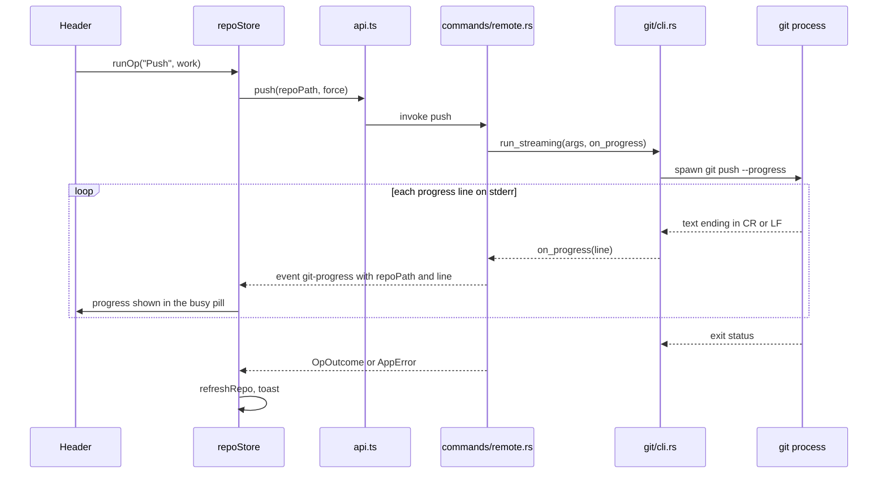
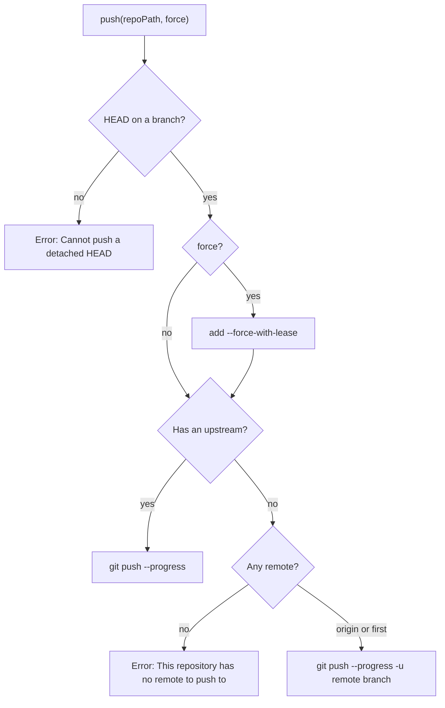

# How remotes work

Fetch, Pull and Push are the three buttons in the header that talk to the network. They run the real git command line, stream its progress into the header, and refresh the repository when they finish. For the user side, see [Remotes](../usage/Remotes.md).

## Why we need it

Syncing with a server is where GUI Git clients most often go wrong. Credentials, SSH keys, hooks such as husky or lint-staged, and signing all live in the user's setup. If the app did its own networking, all of that would have to be rebuilt and would still behave differently from the terminal.

A slow push also needs feedback. A button that shows nothing for thirty seconds looks broken. So we show git's own progress lines as they arrive.

## How it works

The header buttons call `repoStore.runOp(label, work, successMessage)` without a repository, so they always act on the active one. `runOp` wraps `run`, which sets `repoStore.busy`, clears `repoStore.progress`, shows an error toast on failure and refreshes the repository afterwards.

### The three commands

- **`fetch_all`** runs `git fetch --all --prune --progress`.
- **`pull`** runs `git pull --progress`. Its result goes through `outcome()`, so a pull that stops on merge conflicts returns `OpOutcome { conflicts: true }` instead of an error. `runOp` then shows a "stopped with conflicts" toast, makes the repository active and opens the Conflicts dialog. Pull adds no `--rebase` or `--ff` flag, so the user's `pull.rebase` and `pull.ff` config decide.
- **`push`** reads the current branch first. A detached HEAD is refused with a clear message. When the branch has no upstream, it picks `origin`, or the first remote if there is no `origin`, and adds `-u <remote> <branch>`. Option-click on Push asks for confirmation and then adds `--force-with-lease`, never a plain `--force`.

### Streaming progress

`cli::run_streaming` reads git's stderr in small chunks and scans every byte. Git redraws its progress line with a carriage return, so every `\r` or `\n` ends a line and calls `on_progress`. Only lines ending in `\n` are kept in the final error text, so a failure message is not buried under hundreds of "Receiving objects" redraws. Stdout is read on its own thread so neither pipe can fill up and block git.

`commands/remote.rs` turns each line into a `git-progress` event with `repoPath` and `line`. `onGitProgress` in `api.ts` listens for it, and `repoStore` keeps the line only when it belongs to the active repository. The header's busy pill shows it.

### The git environment

Every git command, not only remote ones, is built by `cli::command`:

- **The git binary** is the first of `/opt/homebrew/bin/git`, `/usr/local/bin/git` and `/usr/bin/git` that exists, else plain `git`.
- **`PATH`** comes from the user's login shell. A macOS app started from Finder gets a minimal `PATH`, which breaks hooks that need node or husky. `user_path()` asks `$SHELL -l -c` once, with a 3 second deadline and a fallback.
- **`GIT_TERMINAL_PROMPT=0`** makes git fail instead of waiting for a password on a terminal the GUI does not have. Authentication relies on the user's credential helper (for example the macOS keychain) or ssh-agent.
- **`GIT_EDITOR=true`** and **`GIT_SEQUENCE_EDITOR=true`** stop git from opening an editor.
- **stdin is closed**, so nothing can hang waiting for input. Only `run_with_stdin` (commit messages, hunk staging, blame of unsaved text) opens a pipe.

### Ahead and behind

The arrows in the header and status bar come from the status call (`head_info` in `git/status.rs`) and, per branch, from `refs::read`. Both use git2's `graph_ahead_behind` against the upstream. They update after fetch because `run` refreshes the repository.

## Where the code lives

| File | What it does |
| --- | --- |
| `src-tauri/src/commands/remote.rs` | `fetch_all`, `pull`, `push`, and the `git-progress` event |
| `src-tauri/src/git/cli.rs` | `command`, `run`, `run_streaming`, `user_path`, git binary lookup |
| `src-tauri/src/commands/mod.rs` | `OpOutcome`, `outcome`, `run_op`, `blocking` |
| `src/lib/api.ts` | `fetchAll`, `pull`, `push`, `onGitProgress` |
| `src/lib/stores/repo.svelte.ts` | `run`, `runOp`, `busy`, `progress` |
| `src/lib/views/Header.svelte` | Fetch, Pull, Push buttons, force push confirm, busy pill |
| `src/lib/ui/toast.svelte.ts`, `src/lib/ui/Toasts.svelte` | The success, info and error toasts that `run` and `runOp` show |

## Design decisions

**Use the git CLI, not libgit2, for the network.** git2 would need its own credential callbacks, SSH setup and hook runner, and would still miss user config. The CLI does all of it the way the user already knows.

**Fail fast on prompts.** `GIT_TERMINAL_PROMPT=0` means a missing credential gives a clear error in a toast instead of a frozen app. The alternative, an in-app password dialog, would mean storing or piping secrets, which we avoid.

**`--force-with-lease` behind Option-click.** A force push should be deliberate and safe. The lease refuses to overwrite commits you have not seen, and the confirm dialog is marked as dangerous.

**Conflicts are an outcome, not an error.** Pull, merge and rebase can stop halfway on purpose. Returning `OpOutcome` lets the UI guide the user to the conflicts instead of showing a red failure toast.

## Bugs we fixed

None are recorded yet for fetch, pull or push.

## Tests

- `src-tauri/src/git/tests.rs`: `run_streaming_push_and_fetch_against_local_remote` pushes and fetches against a local bare remote and checks that progress lines arrive; `run_streaming_failure_carries_git_message` checks that git's error reaches the user; `run_reports_failure_and_stdin_is_passed`; `status_head_ahead_and_behind_upstream`.
- `src-tauri/src/commands/tests.rs`: `merge_branch_reports_conflicts_and_failures` covers the `OpOutcome` path shared with pull.

When you change push, add a test for the upstream choice (origin, first remote, no remote) using a local bare repository, so no network is needed.

## Keeping this page in sync

- Update this page when `commands/remote.rs` or the environment in `git/cli.rs` changes.
- Update [Remotes](../usage/Remotes.md) and [Troubleshooting](../usage/Troubleshooting.md) when errors or buttons change.
- Retake `remote-buttons.png` and `git-progress.png` when the header buttons or the progress pill change.
- Related: [Backend](Backend.md), [How Branches and Tags Work](How-Branches-and-Tags-Work.md).
