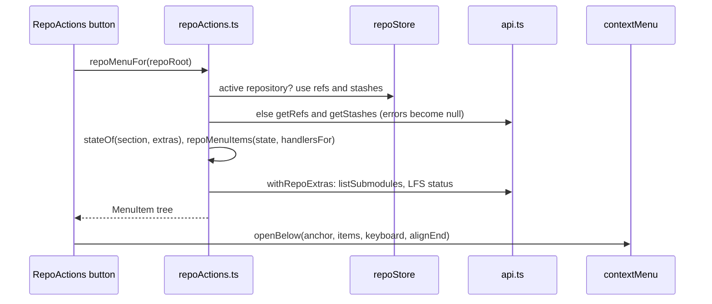
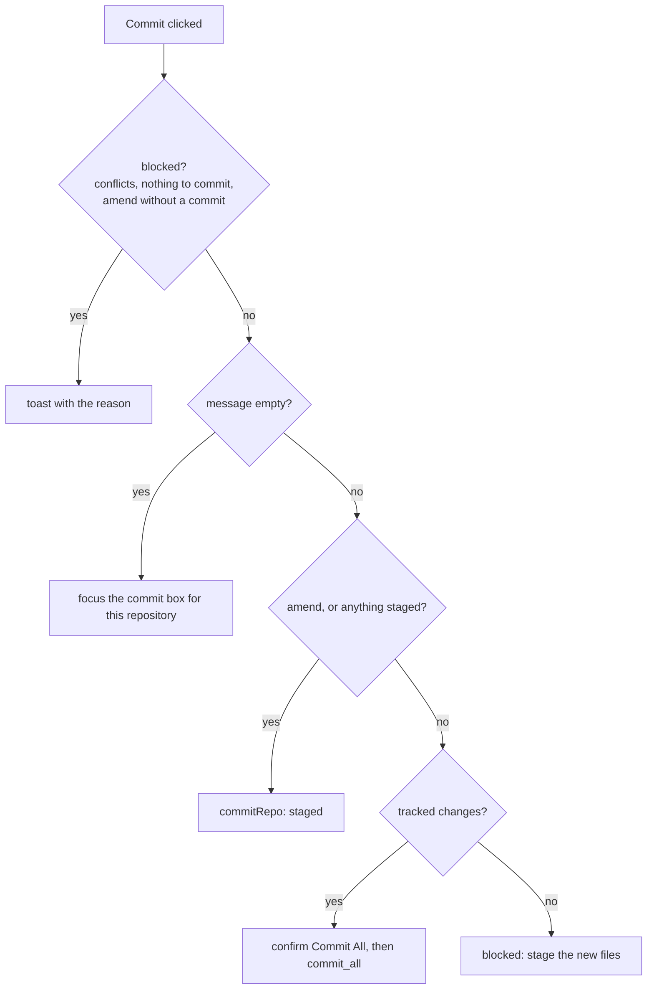
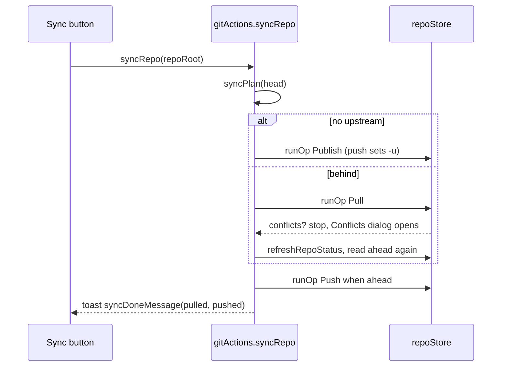

# How repository actions work

Each repository row in the Changes sidebar has VS Code's Source Control buttons: the branch with its marks, Sync or Publish, Commit, Refresh and a **...** menu with Commit, Changes, Pull and Push, Branch, Stash and Tags submenus. This chapter explains how they are built and how every action stays in the row's repository. The user side is in [Repository Actions](../usage/Repository-Actions.md).

## Why we need it

Before, a repository header had a few buttons that only showed on hover, and Fetch, Pull, Push and Stash lived in the window header, where they always acted on the **active** repository. With ten repositories in a workspace, pulling one meant switching to it first, which reloads its branches and history. The user asked for VS Code's layout: every repository carries its own actions, always visible, and they act on that repository only. The header buttons moved to the Git menu ([How the Git Menu Works](How-the-Git-Menu-Works.md)), which shares the same action functions.

## How it works

### Pure state, then menus

`RepoActions.svelte` renders the buttons. Everything it decides is pure and lives in `repoMenu.ts`, so it is tested without stores:

- `repoActionState(head, groups, operation, busy, extras)` flattens what the menu needs: branch, upstream, ahead and behind, staged, unstaged and tracked counts, conflicts, and the stash, tag and remote counts.
- `branchDecorations(groups)` gives VS Code's marks: `*` unstaged (untracked included), `+` staged, `!` conflicts. `branchTooltip` explains them.
- `repoMenuItems(state, handlers)` builds the whole **...** tree with labels, hints ("2 behind", "1 ahead"), `danger` flags and disabled states.

The menu opens on click, so its counts are read only then:

A count that could not be read is `null`, and `none(null)` is false, so an unknown count never disables an item. `withRepoExtras` (in `views/git/repoExtras.ts`) inserts the Submodules and LFS submenus before Show Log.

### Acting on the right repository

Every handler in `handlersFor` closes over `repoRoot`. The shared actions take it as their last argument: `pull`, `push`, `fetchRemote`, `fetchAll`, `stash`, `publishBranch`, `pushTags` and `syncRepo` in `views/gitActions.ts`, and the branch and stash actions in `sidebar/actions.ts`, which now take a `RepoTarget` (`repoRoot` plus that repository's refs, for name validation). Without one they fall back to the active repository, which is what the Git menu wants. They all end in `repoStore.run` or `runOp` with `repoPath`, so the busy state, toasts and refresh follow the row. git's progress lines only show for the active repository; others show the operation's name.

### The Commit button

`commitPlan(state, draft)` decides what the check mark does:

`commitRepo` in `repoActions.ts` is the one commit path for the row, the menu and the commit box. It reads the draft, asks `commitOptions.request` for the options, runs `commit` or `commit_all`, clears the draft, then pushes or syncs when asked. Clean rows pass `showCommit={false}`, so they never create a draft.

**Undo Last Commit** runs `undo_last_commit` (`git reset --soft HEAD~1`). It refuses the root commit, warns when the commit is already on the upstream, and puts the undone message back into an empty draft.

### Sync and Publish

`sync.ts` has two plans. `syncPlan` drives the commit box button and hides it when in step. `rowSync` drives the row button: hidden without a branch or with no commits yet, Publish without an upstream, and still offered when in step, where a click only pulls (VS Code does the same). `rowSyncBadge` gives "2↓ 1↑", `syncTooltip` the exact sentence.

Counting `ahead` again after the pull matters: a merge pull adds a merge commit to push.

### Pickers and tags

`repoPickers.ts` builds the lists for `dialogs.pick`: `checkoutPickItems` (Create entries pinned on top, then branches, remote branches and tags, the current branch disabled), `refPickItems`, `stashPickItems` and `tagPickItems`. Picked values are encoded as `local:name`, `remote:name` or `tag:name` so names with colons survive. `validateTagName` checks git's ref rules and duplicates before `create_tag` runs.

### Backend commands

New for these menus: `commit_all` (`commit --all`), `undo_last_commit`, `fetch` (no remote named, so git uses the branch's remote; optional `--prune`), `pull` with `rebase`, `push_tags` (to the upstream's remote or the default one), `stash_clear`, `create_tag` (annotated with `-a -F -` when a message is given) and `delete_tag`. `push` publishes a branch without upstream with `-u` to `origin` or the first remote (`default_remote`).

## Where the code lives

| File | What it does |
| --- | --- |
| `src/lib/views/changes/RepoActions.svelte` | The buttons and the container query that hides the branch name, then the counts |
| `src/lib/views/changes/repoMenu.ts` | State, marks, commit plan, the **...** tree, the Commit dropdown items |
| `src/lib/views/changes/repoActions.ts` | Handlers, `commitRepo`, `undoLastCommit`, pickers, tags, `repoMenuFor` |
| `src/lib/views/changes/repoPickers.ts` | Pick list items and `validateTagName` |
| `src/lib/views/changes/sync.ts` | Sync plans, tooltips, badge and toast text |
| `src/lib/views/gitActions.ts` | Fetch, pull, push, publish, sync, stash, show log, shared with the Git menu |
| `src/lib/views/git/repoExtras.ts` | Submodules and LFS submenus |
| `src-tauri/src/commands/status.rs` | `commit_all`, `undo_last_commit` |
| `src-tauri/src/commands/remote.rs` | `fetch`, `pull`, `push`, `push_tags`, `default_remote` |
| `src-tauri/src/commands/stash.rs`, `tag.rs` | `stash_clear`, `create_tag`, `delete_tag` |

## Design decisions

**Counts are read when the menu opens.** Keeping stash, tag and remote counts for every repository would mean a refs read per repository on every refresh. Reading them on click costs one call, and the active repository reuses the store's lists.

**Ask before Commit All.** VS Code's "smart commit" commits everything when nothing is staged. We keep the shortcut but confirm it, and never include untracked files, so a stray file cannot slip into a commit.

**Shared actions with an optional repository.** One `push` serves the Git menu (active repository) and the row (its own), so behavior and messages never drift apart.

**Delete Tag is local.** Deleting a tag on the server is rarer and harder to undo, so it stays a terminal job; the dialog says the pushed copy remains.

## Tests

- `src/lib/views/changes/repoMenu.test.ts`: marks and tooltips, state counts, commit plan, the dropdown, the menu tree, disabled rules (unknown counts, operations, detached HEAD) and handlers.
- `src/lib/views/changes/repoPickers.test.ts` and `sync.test.ts`: picks round-trip, tag names, sync plans, tooltips, badge and toast text.
- `src-tauri/src/commands/tests.rs`: `commit_all_stages_tracked_changes_but_not_untracked_files`, `undo_last_commit_keeps_changes_staged_and_refuses_the_first_commit`.
- `src-tauri/src/commands/remote.rs`: `pull_merges_or_rebases_as_asked`, `pull_rebase_reports_conflicts`, `fetch_with_prune_drops_deleted_remote_branches`, `fetch_all_remotes_reads_every_remote`, `push_tags_sends_local_tags`, `push_tags_without_upstream_uses_the_only_remote`, `push_publishes_a_branch_without_upstream`.
- `src-tauri/src/commands/stash.rs`: `stash_clear_drops_every_stash_and_pop_by_index_keeps_the_rest`; `tag.rs`: `creates_lightweight_and_annotated_tags`, `tags_a_given_commit_and_refuses_duplicates`, `deletes_a_tag`.

## Bugs we fixed

The repository row bugs and their fixes are in [Repository Actions Bugs We Fixed](Repository-Actions-Bugs-We-Fixed.md).

## Keeping this page in sync

- Update this page when an item, a disabled rule or a shared action in `gitActions.ts` changes, and add the case to `repoMenu.test.ts`.
- Update [Repository Actions](../usage/Repository-Actions.md) and retake `repo-actions-row.png` and `repo-actions-menu.png` when the row or the menu looks different.
- Record bug fixes in [Repository Actions Bugs We Fixed](Repository-Actions-Bugs-We-Fixed.md).
- Related: [How Changes and Commits Work](How-Changes-and-Commits-Work.md), [How Remotes Work](How-Remotes-Work.md), [How the Branches Popup Works](How-the-Branches-Popup-Works.md).
