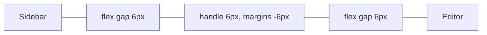

# How rounded panels work

This chapter explains how the **Rounded panels** setting turns the workspace into separate rounded panels, like the JetBrains Islands themes, in any color theme. The user side is in [Rounded Panels](../usage/Rounded-Panels.md).

## Why we need it

JetBrains IDEs since 2025.3 default to the Islands themes: tool windows and the editor float as rounded "islands" on the window color. Users asked for the same look. We first tied it to our Islands Light and Islands Dark themes, then made it a setting of its own, because the shape is a layout choice and people want it with their favorite colors too.

## How it works

```mermaid
flowchart LR
  S["settings.roundedPanels"] --> A["applyAppearance()"]
  A --> H["html data-rounded-panels"]
  H --> W["Workspace.svelte: gaps, frame, rounded sidebar, groups, Files panel"]
  H --> R["ResizeHandle.svelte: handle fills the gap"]
  H --> F["Header, StatusBar, activity bars: frame color"]
  H --> T["EditorTabs.svelte: pill tabs"]
  H --> P["TerminalPanel.svelte: rounded panel"]
```

The whole feature is one boolean attribute on `<html>` and CSS rules that only match while it is there. No component renders anything different, so turning it on or off never remounts an editor or a terminal.

### The setting

`roundedPanels` is a boolean preference in `settingsData.ts` (default `false`, parsed with `pickBoolean`). Settings > Appearance has a switch for it. `applyAppearance()` in `settings.svelte.ts` runs on every preference change and calls `root.toggleAttribute("data-rounded-panels", this.roundedPanels)`, next to `data-ligatures`.

### Gaps and corners

Two size tokens in `src/app.css` set the look: `--panel-gap` (6px) and `--panel-radius` (10px). In `Workspace.svelte`, `.body`, `.main` and `.editor-area` get `gap: var(--panel-gap)`, and `.body` gets padding on the sides and the bottom plus the frame color as its background. The sidebar, each `.editor-group`, the terminal `.panel` and the Files panel get `border-radius` and lose their divider borders. Editor groups and the terminal panel also get `overflow: hidden` so their contents are clipped to the corners.

The activity bars get a negative margin equal to the gap, so they stay flush with the window edge while the panels keep their gap.

### Resize handles in the gaps

A `ResizeHandle` is normally 5px wide with `margin: 0 -2px`, so it takes 1px of layout. With rounded panels it becomes exactly as wide as the gap and has a negative margin of one gap on each side. Together with the two flex gaps around it, the handle adds one gap of space and covers that gap exactly, so the space between panels is the drag area. Horizontal handles (the terminal panel) do the same with height.

### The frame color

The window behind the panels uses the color token `--frame`. Every theme must set it, and it must stand apart from `--panel`, or the gaps would be invisible.

- The built-in themes set it in `app.css`: `#ebecf0` for Git Manager Light, `#1e1f22` for Git Manager Dark.
- Catalog themes get it from `frameColor()` in `themes/catalog.ts`: the theme's `--bg` when its CIELAB distance from the panel color is at least 5 (`FRAME_DISTANCE`), else the panel darkened (dark themes) or greyed toward the text (light themes), and as a last resort moved further toward the text. High contrast dark themes with a black panel end up there.
- `legible()` in `deriveColors` now also checks the frame, so dim text and status colors stay readable on the header and status bar.

### Tabs

`EditorTabs.svelte` draws pill tabs with rounded panels on: the strip takes the editor background, each tab is 26px tall with a 6px radius, and the separators and the accent line on top are gone. The active tab uses `--selected` with an outline mixed from `--accent`. In an unfocused split group it uses `--selected-inactive` and `--border-strong`, like JetBrains.

## Where the code lives

| File | What |
| --- | --- |
| `src/lib/stores/settingsData.ts` | `roundedPanels` type, default and parsing |
| `src/lib/stores/settings.svelte.ts` | the store field and `data-rounded-panels` in `applyAppearance()` |
| `src/lib/views/SettingsDialog.svelte` | the Appearance switch |
| `src/app.css` | `--panel-gap`, `--panel-radius` and the built-in `--frame` |
| `src/lib/themes/tokens.ts`, `catalog.ts` | `--frame` as a color token, `frameColor()` |
| `src/lib/views/Workspace.svelte` | gaps, padding, frame, rounded panels |
| `src/lib/ui/ResizeHandle.svelte` | handles that fill the gaps |
| `src/lib/views/Header.svelte`, `StatusBar.svelte`, `ActivityBar.svelte`, `RightActivityBar.svelte` | frame color, no dividers |
| `src/lib/views/EditorTabs.svelte` | pill tabs |
| `src/lib/terminal/TerminalPanel.svelte` | the rounded bottom panel |
| `src/lib/views/files/FileView.svelte` | the file toolbar's rounded corners at the bottom |

## Design decisions

**An attribute, not a component prop.** CSS on one root attribute keeps every component unaware of the setting and avoids remounting editors and terminals. It is the same pattern as `data-ligatures` and `data-contrast`.

**Separate from the color theme.** Shape and color are independent choices. The Islands themes only bring the JetBrains colors; the setting brings the shape for every theme.

**A derived frame instead of `--bg`.** Many themes paint `--bg` and `--panel` the same, which would hide the gaps. A tested token keeps the look working in all 41 themes.

**The file toolbar is square at the top.** With the File toolbar at the Bottom, `FileView.svelte` gives the bar's two bottom corners `--panel-radius`, so they follow the panel's own corners. At the Top the bar sits right under the tabs, inside the panel, so it stays a square band joined to the tab strip. Rounding its top corners there was tried and made the bar look like a separate box.

**Off by default.** Existing users keep the classic look until they choose otherwise.

## Tests

- `settingsData.test.ts`: the default, `true`, and a non-boolean value falling back to off.
- `catalog.test.ts`: for every theme, `--frame` is at least 5 CIELAB units from `--panel` and `--text` keeps its contrast minimum on it; `--frame` is in all three `app.css` blocks.
- The look itself needs a visual check: `rounded-panels` and `rounded-panels-islands-light` in `scripts/screenshots.ts`.

## Keeping in sync

- A new top-level panel in the workspace needs its own rounded rule under `html[data-rounded-panels]` and must sit in a flex container with the panel gap.
- A new resize handle works as is if it is a `ResizeHandle` between two flex children of such a container.
- New UI on the frame (header, status bar, activity bars) should use `--frame` in rounded mode, not `--bg`.
