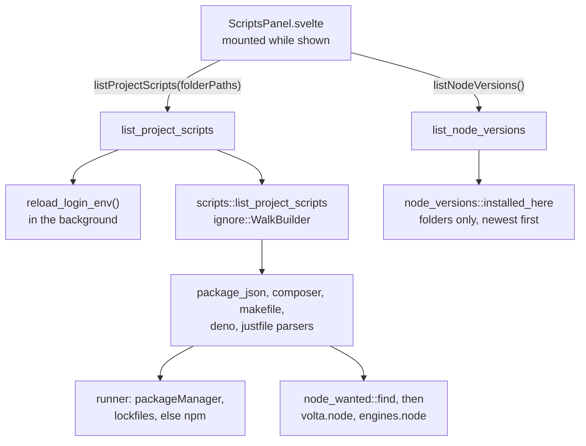
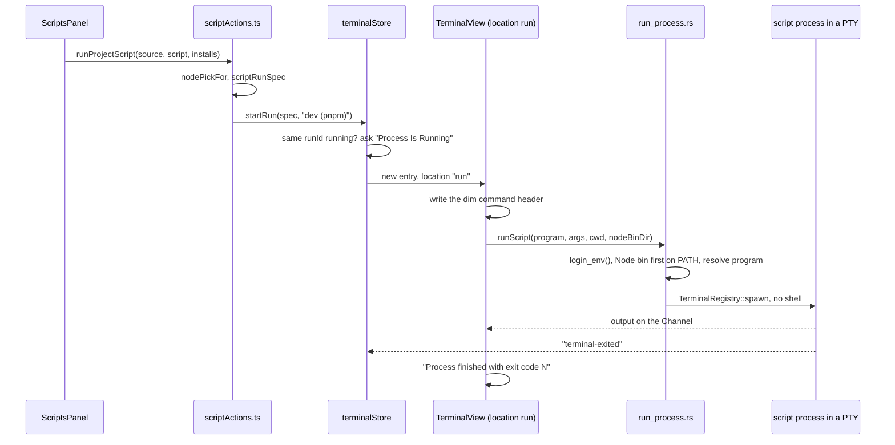

# How scripts work

The Scripts tool window lists the runnable scripts of the workspace folders and runs one as its own process in the bottom panel's Run tab, with the Node version the project asks for. It copies JetBrains' npm and Composer windows and its Run window. The user side is in [Scripts](../usage/Scripts.md).

## Why we need it

Every project starts its dev server or tests a little differently: `pnpm run dev`, `composer run-script test`, `make lint`. Two things make it harder in a desktop app:

- An app opened from Finder gets a bare `PATH` without Homebrew, nvm, pnpm or Composer, so `npm` is simply "not found".
- Version managers such as nvm pick the Node version in the shell's startup files, which a GUI app never runs.

## How it works

### Listing

`src-tauri/src/scripts/mod.rs` walks each workspace folder with the `ignore` crate: `.gitignore` is honored even outside a repository, hidden folders and `SKIPPED_DIRS` (`node_modules`, `vendor`, `target`, `dist`, `build`...) are skipped, at most 6 levels deep, 300 manifests and 1 MB per file. A manifest found twice through nested workspace folders is listed once. Results are sorted by workspace folder, then depth, then path. Nothing is cached: every call rescans.

Each parser returns scripts in file order with their 1-based line, for Jump to Source. `json.rs` is a small parser that keeps lines and reads JSONC. Makefiles list rule targets only (no variables, `define` blocks or special targets), and justfiles skip private recipes, settings and aliases.

For `package.json`, `package_json::runner` takes the `packageManager` field, else the nearest lockfile up to the workspace folder (`LOCKFILES`), else npm. `node_wanted::find` reads `.nvmrc`, `.node-version` or `.tool-versions` from the package folder up to the workspace folder. Without one, `volta.node` beats `engines.node`.

`node_versions.rs` lists installed versions by reading folders only; it never starts `node`. It checks each manager's default folder as well as its variable (`NVM_DIR`, `VOLTA_HOME`...), because a Finder-launched app has none of them. Homebrew's `opt/node@20` links are kept as the path, so they survive `brew upgrade`.

On the frontend, `pickNode` in `src/lib/scripts/nodeVersion.ts` matches the wanted spec against the installs: exact versions, `18`, `18.x`, `^`, `~`, comparators, `||`, hyphen ranges, `lts/*` and nvm's LTS names. The newest match wins. The choice per `package.json` (Auto, `"default"` for Shell Default, or a bin folder) lives in `scriptNodeVersions` in `state.json`, at most 200 entries.

### Running

A run is a `TerminalEntry` with `location: "run"` and a `RunSpec` (`runs.ts`), shown by `RunView.svelte` with the same `TerminalView` and PTY backend as a shell. Output, exit and input use the terminal commands ([How the terminal works](How-the-Terminal-Works.md)), but a run never closes by itself. Rerun replaces the entry in the same place, so the output starts fresh.

`run_process::prepare` builds the process: the login environment, the chosen Node `bin` folder put first on `PATH` (`path_with`), and the program resolved on that `PATH`. A missing program gives "pnpm was not found. Install it, or add its folder to PATH in your shell's startup file." A missing folder is an error too.

**The login environment.** `capture_login_env` runs `$SHELL -l -i -c "printf marker; /usr/bin/env -0"` with a 10 s timeout. `-i` loads `.zshrc`, where nvm and most `PATH` changes live. Whatever the startup files print comes before the marker and is skipped, and the shell's own variables (`PWD`, `SHLVL`, `TERM`...) are dropped. The result is cached in a static `Mutex`. `list_project_scripts` calls `reload_login_env` on a background thread, so opening or refreshing the panel picks up new tools and the first run rarely waits. When the read fails, `fallback_env` uses the app's environment with the Homebrew folders added.

## Where the code lives

| File | What it does |
| --- | --- |
| `src-tauri/src/scripts/` | Scanner, parsers, `node_wanted.rs`, `tests.rs` |
| `src-tauri/src/node_versions.rs` | Installed Node versions per manager |
| `src-tauri/src/run_process.rs` | Login environment, `PATH`, program lookup, `start_run` |
| `src-tauri/src/commands/scripts.rs` | `list_project_scripts`, `list_node_versions`, `run_script` |
| `src/lib/scripts/ScriptsPanel.svelte` | The panel, lazy loaded from `Workspace.svelte` |
| `src/lib/scripts/scriptsModel.ts` | Commands, rows, labels |
| `src/lib/scripts/scriptRun.ts`, `scriptActions.ts` | The `RunSpec` and starting a run |
| `src/lib/scripts/nodeVersion.ts` | Spec matching and the badge text |
| `src/lib/terminal/RunView.svelte`, `runs.ts` | The Run tab |

The MCP tools `list_scripts`, `run_script` and `stop_run` go through the same `scriptRun.ts` and `scriptActions.ts`, so they run a script exactly like the panel. See [How MCP and the CLI Work](How-MCP-and-CLI-Work.md).

## Design decisions

**No shell.** The first version typed `PATH=<bin>:"$PATH" pnpm run dev` into a new terminal. That depended on the shell's syntax (fish, PowerShell and cmd differ), and it gave no clean exit code, Rerun or Stop. Starting the program directly, like JetBrains, fixes all of these.

**The login shell's environment, read once**, like JetBrains. Reading it per run would add about a second to every start.

**Node first on `PATH`, not `nvm use`.** Putting the version's `bin` folder first works for every manager and needs no shell.

**Run With is not saved** (`runnerOverrides.svelte.ts`). It is a quick override, like an unsaved JetBrains run configuration. The Node choice is saved, because a project's Node needs rarely change.

**Running again asks.** Stopping a dev server by accident is costly, so the panel asks before restarting a running script. The Rerun button is an explicit restart, so it does not ask.

**Rescan on every mount.** The panel is mounted only while it shows, and the scan has hard limits (depth, file count and size), so a fresh scan is cheap and no cache can go stale.

## Tests

- `src-tauri/src/scripts/tests.rs` (`lists_scripts_across_a_workspace`, `serializes_for_the_frontend`, `stops_after_the_file_limit`, `finds_the_node_version_a_package_asks_for`), plus tests in each parser and in `node_wanted.rs`.
- `src-tauri/src/node_versions.rs`: every manager, newest first, Herd through `NVM_DIR` listed once.
- `src-tauri/src/run_process.rs`: the env marker, `PATH` order, program lookup and the missing-program message, a real run with its exit code, and `.cmd` files through `cmd.exe`.
- `src/lib/scripts/scriptsModel.test.ts`, `scriptRun.test.ts`, `nodeVersion.test.ts` and `src/lib/terminal/runs.test.ts`.

## Keeping this page in sync

- A new manifest kind needs a parser, a `ScriptKind`, a case in `scriptArgs` and a row in the usage page table.
- A new version manager needs a layout in `node_versions.rs` and a line in [Platforms and Signing](Platforms-and-Signing.md) when it is Windows only.
- Retake `scripts-panel.png`, `scripts-run-tab.png` and `scripts-node-version.png` after visible changes. See [Docs and Screenshots](Docs-and-Screenshots.md).

## Bugs we fixed

None yet.
