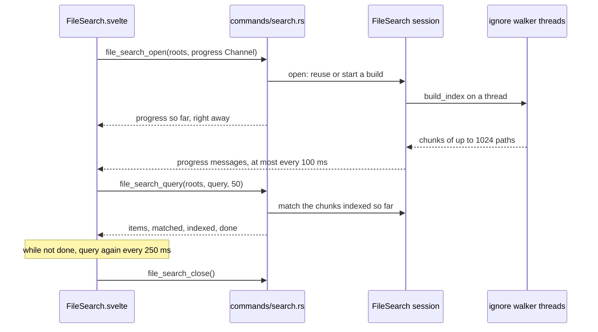
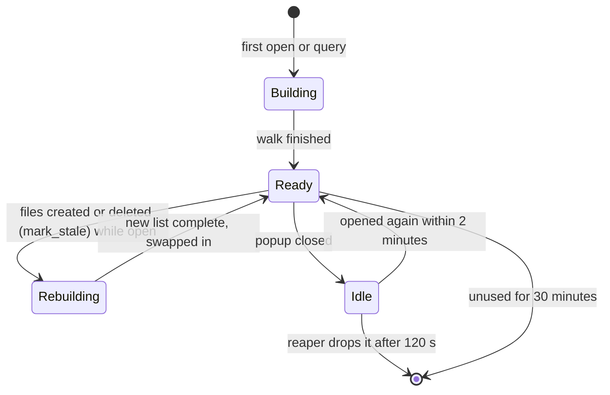

# How Search Everywhere works

Search Everywhere is the JetBrains-style popup with five tabs: All, Classes, Files, Symbols and Text. Three in-memory indexes in Rust answer it: a file list, a symbol index and a text search over the same files. The user side is in [Search Everywhere](../usage/Search-Everywhere.md). Replace in Files, which shares the Text tab, is in [How find and replace works](How-Find-and-Replace-Works.md).

## Why we need it

Workspaces hold many repositories and tens of thousands of files. Clicking through the Files panel does not scale, and people coming from JetBrains reach for double Shift and Cmd+O without thinking. The popup has to answer on the first key, even while a large folder is still being read, and it must cost no memory when nobody uses it.

## How it works

### The popup

`Workspace.svelte` feeds every key to `DoubleShift` (`search/doubleShift.ts`) in the capture phase, so double Shift is seen even when the editor or the terminal handles the key; two clean taps within 350 ms count. The tab keys (`workspaceShortcut`) and the Edit menu items go through `openFileSearch` in `views/workspaceActions.ts`, which does nothing while a dialog or the merge tool is up (the key is dropped, not queued).

Every tab starts with the focused editor's selection. `editorSelection` reads it from the CodeMirror state (`focusedEditor`, `sliceDoc`), not from the page, so decorations such as whitespace dots never leak in. `queryFromSelection` drops blank, multi-line and over-200-character selections. The popup selects the seeded text, so typing replaces it.

`fileSearch` (`fileSearchStore.svelte.ts`) says whether the popup shows and which tab it opens on (`openingTab`). `FileSearch.svelte` is mounted only while open, so its state starts fresh every time.

`tabRows` in `popupRows.ts` builds each tab's rows: the All tab's sections of `SECTION_LIMIT` (6) with a "N more" row, Recent Files for an empty query, and the Text tab's file and line rows. Every row is 26 px high, so `visibleRange` virtualizes the list without measuring, and `keepSelectedKey` keeps the selection while results grow.

Recent Files (`recentFiles`) is the active tab, then `navigation.recentFilePaths()` from the Back and Forward history, then the open tabs. A chosen row opens through `navigation.openFileAt`, which places the cursor and focuses the editor.

### The Rust session

All three indexes live in one `FileSearch` in `AppState`, built in `src-tauri/src/file_search.rs`.

The walker is ripgrep's `ignore` crate: parallel, respecting `.gitignore`, with hidden files, without following symlinked folders, and skipping `.git`, `SKIPPED_DIRS` (shared with the workspace scan) and nested workspace folders. Each walker thread hands over a `Chunk` (paths packed in one string) every 1024 files or 40 ms. The index stops at `MAX_FILES` (500,000) and says `truncated`.

A query never waits. `parse_query` splits off `:LINE:COL`, folder segments and a leading `/`, and `Scorer` ranks with nucleo-matcher (the fuzzy matcher of the Helix editor) in tiers: whole name or stem, then name prefix, then fuzzy name, then a match spread over the path ("srccart"). Above 16,384 files it matches on up to 8 threads. Every query bumps `query_seq`, and a running query stops as soon as a newer one exists.

The file watcher calls `mark_stale` when files are added, removed or renamed, and `mark_contents_changed` when source files are edited. A rebuild runs beside the current list and replaces it only when complete, so results never shrink while it runs. A small reaper thread drops the whole session `IDLE_DROP` (120 s) after the popup closes, or after `ABANDONED_DROP` (30 minutes) without use.

### Symbols

`src-tauri/src/symbols/` builds Classes and Symbols from the same file chunks when a tab first needs them (`symbol_search_open`). Workers read each source file up to 1 MB, skip minified ones, and run `extract`: per-language line scanners in the style of universal ctags, a lexer that knows strings, comments and brace depth plus a few keyword patterns. Declarations are looked for only where they can appear, so function bodies cost one lexer pass. Each definition is a 20-byte record; the cap is `MAX_SYMBOLS` (2,000,000). `Cart.add` matches the container and the name, and the exact name in the same case ranks first.

### Text

`text_search.rs` runs ripgrep's `grep-searcher` and `grep-regex` over the same file list on a few threads, streaming `TextSearchBatch` messages every 64 lines or 40 ms. It stops at 2,000 lines or 300 files, skips files over 5 MB or with a NUL byte, and cuts lines to 240 characters around the first match. Each search has a growing id (`nextSearchId`); a newer id or `text_search_cancel` stops the old one within a file.

The MCP tools (see [How MCP and the CLI work](How-MCP-and-CLI-Work.md)) use `build_once` and `query_once`: a file list walked for one call and dropped with it, outside the popup's session.

## Where the code lives

| File | What it does |
| --- | --- |
| `src/lib/search/FileSearch.svelte` | The popup: tabs, field, virtual list, Replace row |
| `src/lib/search/searchTabs.ts` | Tabs, their keys, `openingTab`, `stepTab`, `queryFromSelection` |
| `src/lib/search/doubleShift.ts` | Double Shift detection |
| `src/lib/search/fileSearchModel.ts` | File rows, highlighting, Recent Files, `splitLocation` |
| `src/lib/search/popupRows.ts` | Rows per tab, selection, virtual window |
| `src/lib/search/symbolSearchModel.ts`, `textSearchModel.ts` | Symbol and text rows |
| `src/lib/views/workspaceActions.ts` | `openFileSearch` |
| `src-tauri/src/commands/search.rs` | The `file_search_*`, `symbol_search_*`, `text_search*` and `replace_in_files*` commands |
| `src-tauri/src/file_search.rs` | Session, walker, file matching, reaper |
| `src-tauri/src/symbols/mod.rs`, `extract.rs` | Symbol storage, matching and the scanners |
| `src-tauri/src/text_search.rs` | Find in Files |
| `src-tauri/src/watcher.rs` | Calls `mark_stale` and `mark_contents_changed` |

## Design decisions

**In memory, and only while used.** An index on disk would go stale and take space per workspace. Walking is fast enough on demand, and the session is dropped two minutes after the popup closes.

**One file list for three searches.** All three follow the same skip rules, and the symbol and text searches read chunks as they arrive (`Index::wait_chunk`), so the tree is walked once.

**Never wait for indexing.** Queries match what is indexed so far, and the UI retries every 250 ms until `done`.

**Line scanners, not parsers.** Tree-sitter grammars for fifteen languages would add megabytes to the binary and to memory. Missing an oddly formatted definition is acceptable for a quick jump.

**Optimized in dev builds.** `Cargo.toml` builds the matcher and search crates with `opt-level = 3` even in debug, so `bun tauri dev` feels like the release.

## Tests

- `src-tauri/src/file_search.rs` (module tests): skip rules, the cap, ranking, folder segments, `:LINE:COL`, partial indexes, superseded queries and the session lifecycle.
- `src-tauri/src/symbols/tests.rs` and `extract_tests.rs`: skipped files, positions, ranking, scopes, compact storage, rebuilds and each language's scanner.
- `src-tauri/src/text_search/tests.rs`: options, ranges, skips, caps, batches, cancelling and the newest id.
- Vitest: `doubleShift.test.ts`, `searchTabs.test.ts`, `fileSearchModel.test.ts`, `popupRows.test.ts`, `symbolSearchModel.test.ts` and `textSearchModel.test.ts` in `src/lib/search/`.

## Keeping this page in sync

- A new tab or key: update `SEARCH_TABS`, `workspaceShortcut`, the Edit menu in `menuSpec.ts`, `help/shortcuts.ts`, [Search Everywhere](../usage/Search-Everywhere.md) and [Keyboard Shortcuts](../usage/Keyboard-Shortcuts.md).
- A new symbol language: `language_for` and a scanner in `extract.rs`, tests in `extract_tests.rs`, and the language list on the usage page.
- Retake the `search-everywhere-*.png` screenshots when the popup changes. See [Docs and Screenshots](Docs-and-Screenshots.md).

## Bugs we fixed

None yet.
