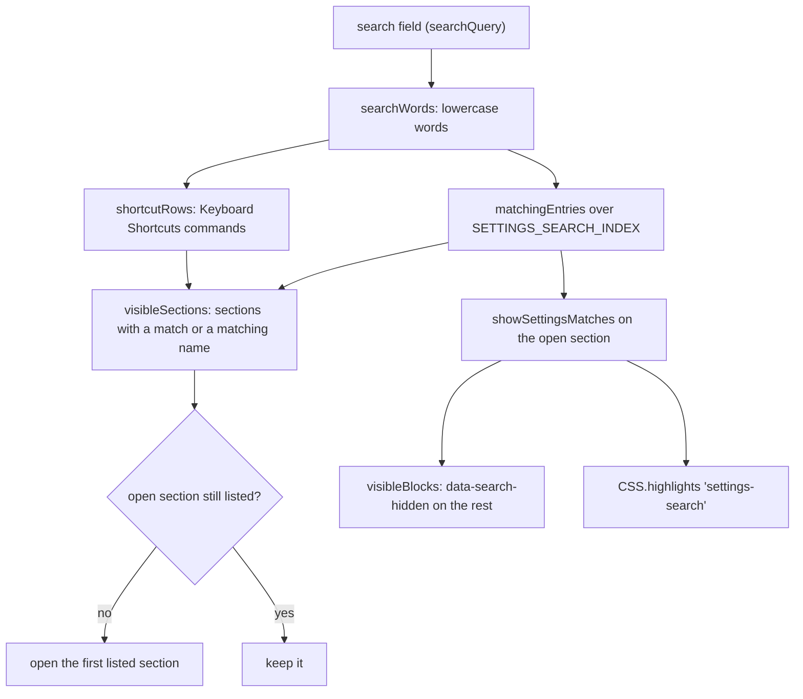

# How search in Settings works

This chapter explains the search field of the Settings dialog: how it finds sections and rows, and how the open section shows only its matches. The user side is in [Search in Settings](../usage/Settings-Search.md); the dialog itself is in [How settings work](How-Settings-Work.md).

## Why we need it

Settings has eleven sections and well over a hundred rows. Finding one setting meant guessing its section and scrolling. A search field that narrows the section list and points at the rows is quicker, and it also helps people who call a setting by another name (a "ruler" is our **Right margin line**).

## How it works

There are three parts: an index of what the dialog shows, a word matcher, and a filter that hides the other rows and highlights the matches.

### The index

`src/lib/views/settings/settingsSearch.ts` holds `SETTINGS_SEARCH_INDEX`: one entry per row and group title of each section, with:

- `label`: the text exactly as the dialog shows it, so the highlighter can find it.
- `keywords`: other words that find the row, such as synonyms and words from its hint.
- `parent`: for a row that only shows while another setting is on (Margin column, Cursor width, the File toolbar switches), the row to point at while it is hidden.

Rows drawn from lists (`FILE_TOOLBAR_SWITCHES` and the lists in `settingsRows.ts`) are added from those lists, so they cannot drift. The dialog renders from the same lists.

### Matching

`searchWords` lowercases the query and splits it on anything that is not a letter or digit. An entry matches when every word starts a word of its label, its keywords or its section's name (`textMatches`). Matching word starts, not any substring, keeps short words from lighting up half the dialog.

The Keyboard Shortcuts section has no index entries. Its commands come from the command registry, so the dialog asks `shortcutRows` (the same filter that list uses) how many commands match. When some do, the section stays listed and `KeyboardShortcuts.svelte` gets the query through its `filter` prop.

### Filtering and highlighting

`settingsHighlight.ts` finds the labels on screen (`.label > span:first-child`, `.group-title` and the About links), reads only their own text nodes (so a memory mark such as **+70 MB** is not part of the name), and builds a `Range` for each matched word start from `highlightSpans`. A label found only by its keywords is highlighted whole; a hidden sub-row highlights its parent instead. The ranges go into `CSS.highlights` under `settings-search`, styled with `::highlight(settings-search)`.

The rows that hold those labels are the matched blocks. `visibleBlocks` (pure, in `settingsSearch.ts`) walks the section's direct children in order and decides what stays:

- a matched row, and the sub-rows (`.sub-row`) right under a matched row;
- every row of a group whose title matched;
- a group title and its hint while any row of the group stays;
- any other block (the About header, the shortcut list) with the block before it, or always when it comes first.

The rest get a `data-search-hidden` attribute, which `.rows.searching` hides with `display: none`. The About links are filtered the same way inside their list. The rows are scrolled to the top for each new query or section. A `MutationObserver` runs it again when rows appear or disappear, for example when a switch shows its sub-row. When nothing matches anywhere, the rows are hidden and a short message says so.

## Where the code lives

| File | What it does |
| --- | --- |
| `src/lib/views/settings/settingsSearch.ts` | The index, `searchWords`, `textMatches`, `matchingEntries`, `highlightSpans`, `visibleBlocks` |
| `src/lib/views/settings/settingsHighlight.ts` | Hides the blocks that do not match, builds the ranges and sets or clears the highlight |
| `src/lib/views/settings/settingsRows.ts` | Row lists shared by the dialog and the index |
| `src/lib/views/SettingsDialog.svelte` | The search field, the filtered section list, Esc handling |
| `src/lib/views/settings/KeyboardShortcuts.svelte` | The `filter` prop that fills its own search |

## Design decisions

**A written index, not one read from the page.** Only the open section is rendered, so the page alone cannot tell which other sections match. Rendering every section to read it would mount the GitHub form, the shortcut list and the theme lists just to search. A small index in a `.ts` file costs nothing, can carry extra words, and is tested against the dialog.

**Hide with an attribute, highlight with the CSS Custom Highlight API.** Wrapping matches in `<mark>` or editing classes would change markup Svelte owns, and Svelte may rewrite a class it manages. A data attribute Svelte never sets and highlights that paint over existing text both go away with one call, so leaving the search restores the page exactly. Where the highlight API is missing, the rows are still filtered; only the color is lost.

**Show only the matches.** Highlighting alone left the matches spread over a long page. Hiding the rest puts every match on screen at once, while group titles and parent rows keep the context.

**Word starts.** Matching inside words found too much (`tab` in "detectable", `size` in "resize"). Starting at a word is how people type a setting's name.

**Keep the open section while it matches.** Jumping to the first section on every key press would move the page under the user. It only changes when the open section has nothing left.

**Focus the field on open.** The dialog is usually opened to change one thing, so typing right away is the fastest path. Esc empties the field before it closes the dialog.

## Tests

- `src/lib/views/settings/settingsSearch.test.ts`: reads `SettingsDialog.svelte` and checks that every literal row label, group title and About link is in the index for its section, that the index lists nothing the dialog does not show, that every `parent` exists, and that labels are unique per section. It also covers `searchWords`, `textMatches`, `matchingEntries`, `highlightSpans` and `visibleBlocks` (groups, sub-rows, other blocks, no match).

The hidden rows, the highlight color and the focus on open need a visual check in the app.

## Keeping this page in sync

- A new row or group title in `SettingsDialog.svelte` needs an entry in `SETTINGS_SEARCH_INDEX`; the test fails until it has one. Give it a `parent` when it only shows under another setting.
- A new label element (not `.label > span` or `.group-title`) must be added to `LABEL_SELECTOR` in `settingsHighlight.ts` and to the test's parser.
- A new kind of block directly in `.rows` must get a kind in `blockOf` (`settingsHighlight.ts`), or it follows the block before it.
- Update [Search in Settings](../usage/Settings-Search.md) when matching or the field changes. See [Docs and Screenshots](Docs-and-Screenshots.md).
