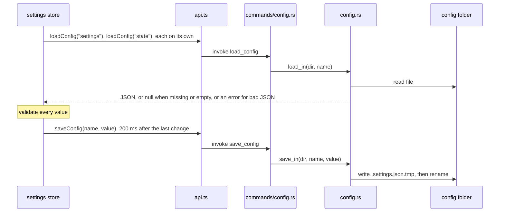
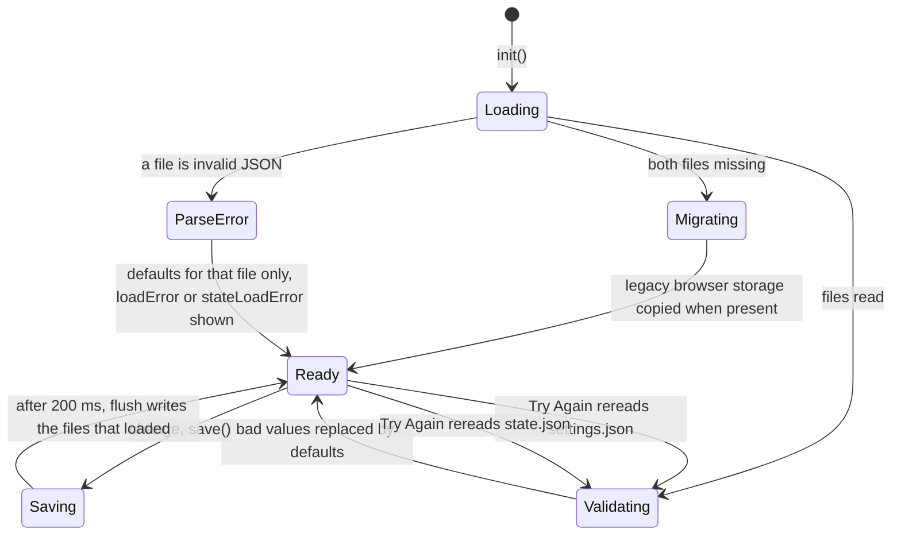

# How settings work

Settings live in `~/.gitmanager/`, much like VS Code's own folder: one file for preferences, one for app state. For the user side, see [Settings](../usage/Settings.md).

## Why we need it

People expect a desktop app to remember their theme, fonts, layout and folders, and power users want to edit, back up or copy settings by hand. Browser storage in the web view would be invisible and tied to the bundle id; a plain JSON file in a known place is honest and easy to fix. A hand-edited file can contain anything, so every value is checked on load, and a file we could not parse is not overwritten while you fix it.

## How it works

```text
~/.gitmanager/
  settings.json   preferences shown in the Settings dialog
  state.json      recent folders, workspaces, session, layout, update state
```

`config.rs` only knows two names, `settings` and `state`, in its `FILES` list. Any other name is an error, so the frontend can never read or write other paths (a test tries `../secrets`).



`load_in` returns `None` for a missing or empty file and `AppError::Invalid` for invalid JSON. `save_in` creates the folder on first save, pretty-prints, writes a temporary file and renames it, so a crash never leaves half a file.

### The store

`src/lib/stores/settings.svelte.ts` exports `settings`, a `SettingsStore` with one `$state` field per value. The pure load, validate and save decisions live in `src/lib/stores/settingsData.ts`, with `defaultPreferences` for every preference.



Validation lives in the pure functions `parsePreferences` and `parseState`:

- `pickBoolean` and `pickNumber` fall back to the default for a wrong type, and `pickNumber` clamps to a range (`FONT_SIZE_RANGE`).
- Enums such as `theme`, `updateChannel` and `tabSize` (`TAB_SIZES`) must match a known value.
- `normalizeFontFamily` removes characters that could break out of the CSS value and adds a `monospace` fallback.
- Unknown keys are kept and written back, so hand-added keys and keys from newer versions survive.

`init()` loads each file on its own. If one is invalid JSON, only that file falls back to defaults and `loadError` (settings.json) or `stateLoadError` (state.json) is set, and a toast says so. `save()` debounces writes by `SAVE_DELAY_MS` (200 ms). `flush()` writes only the files `writableConfigs` allows, so a file that failed to parse is never overwritten automatically. Try Again rereads that file (`reload()` or `reloadState()`). Reset to Defaults clears `loadError`, and Reset in the state.json banner (`resetState()`, confirmed) writes a fresh state.json.

`applyAppearance()` pushes the look into the document (`data-theme`, `--ui-size`, `--code-size`, `--font-mono`, `data-ligatures`), so a change applies everywhere at once.

### The dialog

`SettingsDialog.svelte` has the tabs Appearance, Editor, Merge and Log, Layout, Updates, Settings Files and About. It opens from the header gear, Cmd+, (in `App.svelte`), the welcome screen and the Spaces item in the status bar. `settings.openDialog(section)` picks the starting section; Spaces opens Editor. You can drag it by its title areas, and a double-click re-centers it. Changed from defaults lists `changedPreferences()`, or "Nothing yet".

`editorFontFamily` defaults to `DEFAULT_EDITOR_FONT`, VS Code's macOS default. `mouseWheelZoom` turns on Ctrl or Cmd plus wheel over an editor; `WheelZoom` in `editor/wheelZoom.ts` turns every 50 px of scrolling into a `ZOOM_STEP` (0.5 px).

## Where the code lives

| File | What it does |
| --- | --- |
| `src-tauri/src/config.rs` | Allowed files, `load_in`, atomic `save_in`, `home_dir` |
| `src-tauri/src/commands/config.rs` | `load_config`, `save_config`, `config_dir` |
| `src/lib/stores/settings.svelte.ts` | The store: load errors, debounced save, migration, `openDialog`, appearance |
| `src/lib/stores/settingsData.ts` | Pure validation, JSON shape, what may be saved, session steps |
| `src/lib/views/SettingsDialog.svelte` | The dialog, its tabs, dragging, Reset, Try Again, the state.json banner |
| `src/lib/editor/wheelZoom.ts` | Ctrl plus wheel font size steps |
| `src/app.css` | The light and dark color tokens that `data-theme` selects |

## Design decisions

**Two files, split by owner.** `settings.json` is what users edit; `state.json` is what the app remembers (recent folders, session, panel widths, `skippedVersion`). Mixing them would make hand edits risky.

**Validate on load, not on use.** Every value is correct once `init()` returns, so no component needs guards.

**Never overwrite a file that failed to parse.** Resetting it would silently destroy settings or history. The guard covers both files.

**Migrate once from browser storage.** Settings used to live in `localStorage` under `git-merger:settings`, from before the rename to Git Manager. `shouldMigrateLegacy` copies it only on a real first run.

## Bugs we fixed

**Editor fonts sat under Appearance.**
- **The issue:** editor font family and size were in the Appearance tab.
- **Why it happened:** the first layout grouped everything visual.
- **The fix and why we chose it:** the user asked for them in the Editor tab.

**The Settings dialog could not be moved.**
- **The issue:** the dialog was fixed in the middle of the window.
- **Why it happened:** it was a plain centered modal.
- **The fix and why we chose it:** at the user's request it became draggable, clamped so it can always be grabbed again.

**A typo in one settings file wiped the other.**
- **The issue:** when settings.json or state.json was not valid JSON, both fell back to defaults. The next save, often right at start, rewrote state.json, so recent folders, the session and panel sizes were lost.
- **Why it happened:** `init()` loaded both files in one `Promise.all` with a single `loadError`, and `flush()` always wrote state.json.
- **The fix and why we chose it:** each file loads on its own with its own error, so a typo only affects that file. `writableConfigs` never writes a file that failed to parse, the rule settings.json already had. A toast, a banner in Settings (Try Again, Reset) and a Welcome screen note explain what happened. The decisions moved into `settingsData.ts` so they are tested.

**Settings hints did not match what the app does.**
- **The issue:** the Current line blame hint said a click copies the hash, the Ignore whitespace hint said you could toggle it per file, and "Nothing yet" under Changed from defaults never showed.
- **Why it happened:** the blame click later started opening the Log, the merge tool toggle writes the global setting, and the list looped over every key, so its empty branch could never run.
- **The fix and why we chose it:** the hints now say a click opens the commit in the Log and Option-click copies its hash, and that the merge tool's Ignore whitespace button changes this setting too. The list loops over `changedPreferences()`, so the empty state works. Honest hints are cheaper than surprised users.

## Tests

- `src-tauri/src/config.rs`: `missing_files_load_as_none_and_the_folder_is_created_on_save`, `files_are_pretty_printed_and_kept_separate`, `unknown_names_and_bad_json_are_errors`.
- `src/lib/stores/settingsData.test.ts`: validation, `stateToJson`, `writableConfigs`, `shouldMigrateLegacy` and `sessionSteps`.
- `src/lib/stores/fontFamily.test.ts` and `src/lib/editor/wheelZoom.test.ts`.

When you add a setting, add it to `Preferences`, `defaultPreferences`, `parsePreferences` and `preferences()`.

## Keeping this page in sync

- Update this page when a setting is added or removed, or when `config.rs` changes how files are read or written.
- Update [Settings](../usage/Settings.md) with every new option and its default.
- Retake `settings-appearance.png`, `settings-editor.png`, `settings-editor-more.png`, `settings-merge.png`, `settings-layout.png`, `settings-files.png`, `settings-state-error.png` and `dark-theme.png` when a tab changes.
- Related: [How Updates Work](How-Updates-Work.md), [Frontend](Frontend.md).
