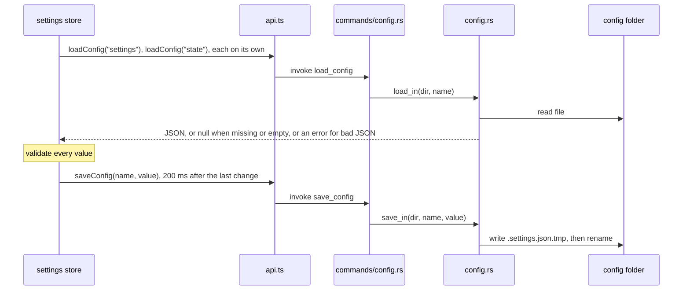
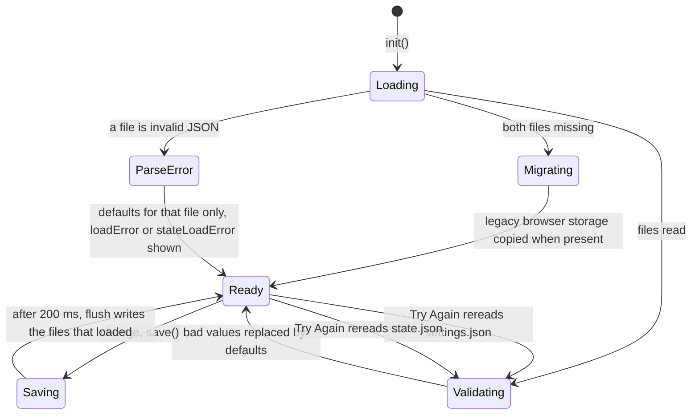

# How settings work

Settings live in `~/.gitmanager/`, much like VS Code's own folder: one file for preferences, one for app state. For the user side, see [Settings](../usage/Settings.md) and [Settings Files](../usage/Settings-Files.md). Every key with its default and range is in [Settings Reference](Settings-Reference.md).

## Why we need it

People expect a desktop app to remember their theme, fonts, layout and folders, and power users want to edit or copy settings by hand. Browser storage in the web view would be invisible; a plain JSON file in a known place is honest and easy to fix. A hand-edited file can contain anything, so every value is checked on load.

## How it works

`config.rs` only knows two names, `settings` and `state`, in its `FILES` list. Any other name is an error, so the frontend can never read or write other paths (a test tries `../secrets`).

`load_in` returns `None` for a missing or empty file and `AppError::Invalid` for invalid JSON. `save_in` writes a temporary file and renames it, so a crash never leaves half a file.

### The store

`src/lib/stores/settings.svelte.ts` exports `settings`, a `SettingsStore` with one `$state` field per value (`$state.raw` for the `mcpTools` record). The pure load, validate and save decisions live in `src/lib/stores/settingsData.ts`, with `defaultPreferences` for every preference.

Validation lives in the pure functions `parsePreferences` and `parseState`:

- Pickers per type: `pickBoolean`, `pickNumber` (clamped), `pickInteger`, `pickTenths`, `roundTo` and `pickOneOf` for enums.
- Special values have their own: `normalizeFontFamily` (nothing that could break out of the CSS value), `pickThemeId`, `parseMcpPort`, `pickToolStates` and `clampTerminalScrollback`.
- Unknown keys are kept and written back, so hand-added keys and keys from newer versions survive.

`init()` loads each file on its own; an invalid one falls back to defaults alone and sets `loadError` or `stateLoadError`. `save()` debounces writes by 200 ms, and `flush()` writes only the files `writableConfigs` allows.

### Applying a change

`setPreference(key, value)` sets the field, calls `applyAppearance()` and saves. `applyAppearance()` pushes the look into the document: the color theme (`applyColorTheme`, see [How Color Themes Work](How-Color-Themes-Work.md)), `--ui-size`, `--code-size`, `--code-line-height`, `--font-mono`, `data-ligatures` and `data-rounded-panels` (see [How Rounded Panels Work](How-Rounded-Panels-Work.md)). `data-theme` is now always set, also for System, which is watched with `matchMedia` (`systemDark`, `colorMode`).

Settings that need the backend or a running service are applied by `$effect`s in `App.svelte` once settings have loaded:

- `gitConsole` calls `gitConsoleSetEnabled` (see [How the Git Console Works](How-the-Git-Console-Works.md)).
- `mcpEnabled`, `cliEnabled`, `mcpPort` and `mcpTools` go to `mcpStore.configure`, and the memory log keys to `memoryLog.configure`, only in the main window, since a `git mergetool` window would compete for the port.
- `renderWhitespace` goes to `setRenderWhitespace` in `editor/whitespace.ts`, which updates open editors.

Others are read where they are used, such as `terminal/options.ts`.

### The dialog

`SettingsDialog.svelte` lists the sections of `SETTINGS_SECTIONS`: Appearance, Editor, Git (id `merge`), Layout, Terminal, GitHub, Automation, Updates, Settings Files and About. `settings.openDialog(section)` picks the start: Editor from the status bar's Spaces item, Terminal from Default Shell..., Automation from the MCP tools dialog, About from Git Manager > About, any section from the MCP tool `open_settings`.

Terminal loads the shell list when first shown; Automation refreshes the server status. Changed from defaults lists `changedPreferenceKeys()`, which compares records such as `mcpTools` by content.

## Where the code lives

| File | What it does |
| --- | --- |
| `src-tauri/src/config.rs`, `commands/config.rs` | Allowed files, `load_in`, atomic `save_in`; the commands |
| `src/lib/stores/settings.svelte.ts` | The store: load errors, debounced save, migration, `openDialog`, appearance |
| `src/lib/stores/settingsData.ts` | Pure validation, JSON shape, what may be saved, session steps |
| `src/lib/views/SettingsDialog.svelte` | The dialog and its sections, Reset, Try Again, the state.json banner |
| `src/lib/views/settings/ColorThemePicker.svelte` | The color theme lists |
| `src/lib/App.svelte` | Effects that pass settings to the backend |
| `src/app.css` | The built-in color tokens |

## Design decisions

**Two files, split by owner.** `settings.json` is what users edit; `state.json` is what the app remembers (recent folders, session, panel sizes, `skippedVersion`). Mixing them would make hand edits risky.

**Validate on load, not on use.** Every value is correct once `init()` returns, so no component needs guards.

**Never overwrite a file that failed to parse.** Resetting it would silently destroy settings or history. The guard covers both files.

**Migrate once from browser storage.** Settings used to live in `localStorage` under `git-merger:settings`. `shouldMigrateLegacy` copies them only on a real first run.

**Section ids outlive labels.** "Merge and Log" became **Git** when commit and console settings joined it, but its id stays `merge`, so code, screenshots and the MCP tool did not change.

## Bugs we fixed

**Editor fonts sat under Appearance.**
- **The issue:** editor font family and size were in the Appearance tab.
- **Why it happened:** the first layout grouped everything visual.
- **The fix and why we chose it:** the user asked for them in the Editor tab.

**The Settings dialog could not be moved.**
- **The issue:** the dialog was fixed in the middle of the window.
- **Why it happened:** it was a plain centered modal.
- **The fix and why we chose it:** it became draggable by its title areas, clamped so it can always be grabbed again; a double-click re-centers it.

**A typo in one settings file wiped the other.**
- **The issue:** when settings.json or state.json was not valid JSON, both fell back to defaults, and the next save rewrote state.json, losing recent folders and panel sizes.
- **Why it happened:** `init()` loaded both files with a single `loadError`, and `flush()` always wrote state.json.
- **The fix and why we chose it:** each file loads on its own, and `writableConfigs` never writes a file that failed to parse. A toast, a banner (Try Again, Reset) and a Welcome note explain it; the decisions moved into tested `settingsData.ts`.

**Settings hints did not match what the app does.**
- **The issue:** the Current line blame hint said a click copies the hash, the Ignore whitespace hint said you could toggle it per file, and "Nothing yet" never showed.
- **Why it happened:** the blame click later started opening the Log, the merge tool toggle writes the global setting, and the list looped over every key.
- **The fix and why we chose it:** the hints now say what the app does, and the list loops over the changed keys. Honest hints are cheaper than surprised users.

**The Show all branches hint said `git log --all`.**
- **The issue:** the hint promised the Log works like `git log --all`, which also follows tags and stashes.
- **Why it happened:** `log::page` pushes HEAD, `refs/heads` and `refs/remotes` only, and the hint was written loosely.
- **The fix and why we chose it:** the hint (and the MCP `git_log` description) now say `git log --branches --remotes` and that tags and stashes are not followed. Walking stashes would fill the graph with stash commits, so the hint changed, not the walk.

## Tests

- `src-tauri/src/config.rs`: `missing_files_load_as_none_and_the_folder_is_created_on_save`, `files_are_pretty_printed_and_kept_separate`, `unknown_names_and_bad_json_are_errors`.
- `src/lib/stores/settingsData.test.ts`: every validator, `parseState`, `stateToJson`, `writableConfigs`, `shouldMigrateLegacy`, `sessionSteps` and `changedPreferenceKeys`.
- `src/lib/stores/fontFamily.test.ts` and `src/lib/editor/wheelZoom.test.ts`.

## Keeping this page in sync

- Adding a setting: follow the checklist in [Settings Reference](Settings-Reference.md), and describe it in [Settings](../usage/Settings.md) or [Terminal, GitHub and Automation Settings](../usage/Settings-Terminal-and-Automation.md).
- Update this page when `config.rs` changes or a section is added, and retake the `settings-*.png` screenshots and `dark-theme.png` when a section changes.
- Related: [How Updates Work](How-Updates-Work.md), [Frontend](Frontend.md).
