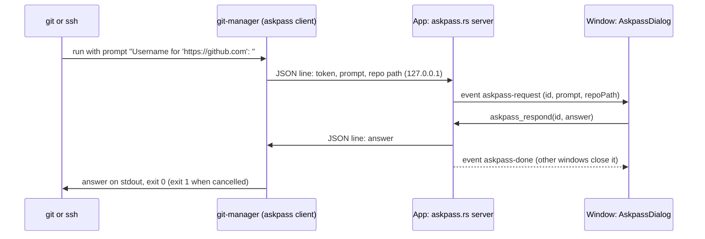

# How sign-in prompts work

This chapter explains how git's and ssh's questions (a username, a password, an SSH passphrase, a new host key) reach a dialog in the app. The user side is in [Sign-In Prompts](../usage/Sign-In-Prompts.md); running git is in [Backend](Backend.md).

## Why we need it

Writes go through the git CLI (`git/cli.rs`), with `GIT_TERMINAL_PROMPT=0` so git never waits for a terminal the app does not have. A remote that asked for a login therefore failed at once, and the user saw "could not read Username ... terminal prompts disabled" in a toast, with no way to answer. The user asked for a popup that asks what git needs.

## How it works

Git and ssh both support an **askpass** program: when they need an answer and have no terminal, they run the program named in `GIT_ASKPASS` or `SSH_ASKPASS` with the prompt as its only argument and read the answer from its stdout. Our own executable is that program.

### The server (src-tauri/src/askpass.rs)

- `install` takes the hooks that show a question (`commands/askpass.rs`): `ask` sends `askpass-request` to the windows showing the repository through `emit_for_path` (every window when none does), and `done` sends `askpass-done` to all.
- The first command that may ask starts a listener on a random loopback port with a random token (`getrandom`). Each connection carries one JSON line; a wrong token gets no answer.
- `ask_user` registers a channel under a new id, calls `ask`, and waits up to five minutes. `askpass_respond` from the page sends the answer (None for Cancel).
- `apply(command, repo_path)` sets `GIT_ASKPASS` and `SSH_ASKPASS` to `current_exe()`, `SSH_ASKPASS_REQUIRE=force` (OpenSSH 8.4 and later use askpass without a terminal only then), and `GM_ASKPASS_PORT`, `GM_ASKPASS_TOKEN` and `GM_ASKPASS_REPO`.

`apply` runs in `cli::run_streaming_with_env` and `cancel::run_streaming`, the runners of push, pull, fetch, clone, submodule updates and LFS. Background auto fetch uses `cli::run_raw`, so it never opens a dialog.

### The client

`lib.rs` calls `askpass::client_main` before anything else. With the two variables set, the executable connects, sends the prompt, prints the answer with a newline (git and ssh read up to it) and exits, before Tauri starts, so no window or Dock icon appears.

### The dialog

`askpassPrompt.ts` reads the prompt: git's "Username for" and "Password for" (with the host and user), ssh's "Enter passphrase for key", "user@host's password" and the yes/no question about a new host key. Anything else is a generic question, hidden when it mentions a password, token or PIN.

`askpass.svelte.ts` queues the questions of this window. For a username, `AskpassDialog.svelte` asks the password too and keeps it in memory for up to a minute: `rememberedPassword` answers git's following password question for the same host and user without showing a second dialog. The dialog stops key events from reaching window shortcuts and closes on Esc (Cancel).

## Where the code lives

| File | What it does |
| --- | --- |
| `src-tauri/src/askpass.rs` | Client, loopback server, `apply`, `respond` |
| `src-tauri/src/commands/askpass.rs` | `WindowHooks` (events) and `askpass_respond` |
| `src-tauri/src/lib.rs` | `client_main` at start, `install` in `setup` |
| `src-tauri/src/git/cli.rs`, `git/cancel.rs` | `apply` for commands the user starts |
| `src/lib/askpass/askpassPrompt.ts` | Reading prompts, remembering the password |
| `src/lib/askpass/askpass.svelte.ts` | The queue of questions |
| `src/lib/askpass/AskpassDialog.svelte` | The dialog, mounted once in `App.svelte` |

## Design decisions

**Our executable as the askpass program.** A separate helper binary would need its own signing and bundling on every platform. The app binary is already there, and leaving before Tauri starts keeps it quick.

**Loopback TCP with a token.** It works the same on macOS, Windows and Linux. The token lives only in the environment of the git process, so no other program can ask questions or read answers.

**Nothing is stored by us.** Git passes the login to the user's credential helper (the macOS keychain, Git Credential Manager), which already handles storage well. The app keeps a typed password only until git's next question, at most a minute.

**Only commands the user starts.** A login dialog that pops up from a background fetch would be confusing, so auto fetch keeps failing quietly.

## Tests

- `src-tauri/src/askpass.rs`: a prompt is answered through the server, a wrong token gets nothing, a cancelled prompt gets None, and `git credential fill` gets its username and password through the same environment and protocol.
- `src/lib/askpass/askpassPrompt.test.ts`: every prompt shape, and when a remembered password answers.
- `askpass-sign-in` in `scripts/screenshots.ts` runs it all against a local server that always answers 401.

## Keeping this page in sync

- Update this page and [Sign-In Prompts](../usage/Sign-In-Prompts.md) when the prompts read, the runners that call `apply` or the dialog change.
- Retake `askpass-sign-in.png`. See [Docs and Screenshots](Docs-and-Screenshots.md).
