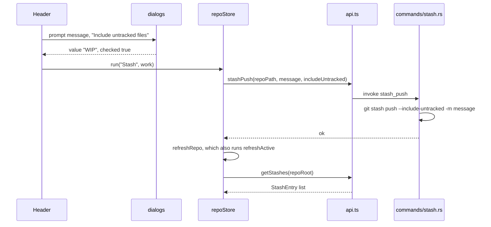
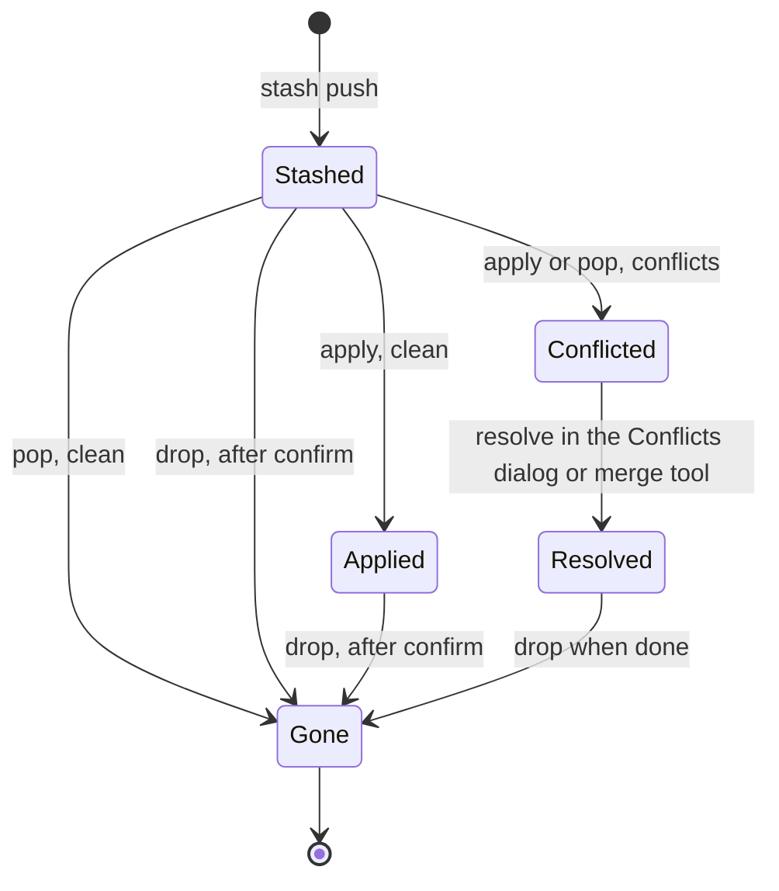

# How stashes work

A stash puts your uncommitted work aside so you can switch branches or pull, and brings it back later. In Git Manager you stash from the header and apply, pop or drop from the Branches panel, through a stash row's menu or its hover buttons. For the user side, see [Stashes](../usage/Stashes.md).

## Why we need it

People are often in the middle of something when they need a clean work tree: a quick fix on another branch, a pull that would touch the same files. Stashing is the safe way out. It has to be fast, it must not lose work, and bringing work back must handle conflicts like any other merge.

## How it works

Stashes follow the same pattern as branches: git2 reads the list, the git CLI does every change, and `repoStore` refreshes after each action.

### Reading the list

`get_stashes` calls `git::stash::list`, which uses git2's `stash_foreach`. It needs a mutable repository handle, which is why the command opens one with `&mut`. Each entry is a `StashEntry` with `index`, `message` and `shortId`, newest first. `repoStore.refreshActive()` loads stashes together with branches, only for the active repository, and the Branches panel shows them as the last section (`kind: "stash"` rows from `tree.ts`). If reading stashes fails, the list is empty and a "Could not read stashes" toast shows the error once, not on every refresh, until stashes load again.

### Changing stashes

| Action | Where | Command | git |
| --- | --- | --- | --- |
| Stash | Header button | `stash_push` | `stash push`, plus `--include-untracked` and `-m <message>` when given; an error when `refs/stash` did not change (nothing to stash) |
| Apply | Stash menu or row button | `stash_apply` with `pop: false` | `stash apply stash@{N}` |
| Pop | Stash menu or row button | `stash_apply` with `pop: true` | `stash pop stash@{N}` |
| Drop | Stash menu or row button | `stash_drop` | `stash drop stash@{N}` |

`stash_ref(stash_index)` builds the `stash@{N}` name. The prompt starts with "WIP", so a default stash reads "On main: WIP". If you clear the field, the message is left out and git writes its usual "WIP on main" text.

Apply and pop can conflict with changes in the work tree. They run through `run_op`, so conflicts come back as `OpOutcome { conflicts: true }`, not as an error:

On conflicts, `runOp` makes that repository active and opens the Conflicts dialog. When a pop stops on conflicts, git keeps the stash, so nothing is lost. The user resolves the files and drops the stash when they are happy.

Drop asks first with `dialogs.confirm({ danger: true })`, because a dropped stash is hard to recover. Apply and Pop do not ask: they never throw work away.

## Where the code lives

| File | What it does |
| --- | --- |
| `src-tauri/src/commands/stash.rs` | `get_stashes`, `stash_push`, `stash_apply`, `stash_drop`, `stash_ref` |
| `src-tauri/src/git/stash.rs` | `StashEntry` and the git2 reader |
| `src/lib/views/Header.svelte` | The Stash button, its prompt and the "nothing to stash" note |
| `src/lib/views/sidebar/actions.ts` | `stashMenu`, `applyStash`, `dropStash` |
| `src/lib/views/sidebar/tree.ts` | Stash rows in the Branches panel |
| `src/lib/views/sidebar/RowContent.svelte` | The Apply, Pop and Drop hover buttons of a stash row |
| `src/lib/stores/repo.svelte.ts` | `stashes`, `refreshActive`, `stashErrorRepo`, `run`, `runOp` |
| `src/lib/api.ts` | `getStashes`, `stashPush`, `stashApply`, `stashDrop` |

## Design decisions

**Address stashes by index.** Git's own commands take `stash@{N}`, so the index is the natural handle. Indexes shift when a stash is added or dropped, so the list is reloaded after every action, and menus act on the row you clicked in the fresh list. Addressing by commit id was rejected: `git stash drop` wants a stash ref, and mapping ids back to indexes adds work for no gain.

**Include untracked files by default.** New files are usually part of the work you want to set aside. Leaving them behind surprises people when they switch branches. The checkbox in the prompt lets you turn it off.

**Apply and pop share one command.** They differ only in the git verb and both can conflict, so one `stash_apply` with a `pop` flag keeps the code and the tests in one place.

**Writes through the git CLI.** git2 has stash functions, but the CLI keeps behavior identical to the terminal, including the user's config.

## Bugs we fixed

**Stash with nothing to stash said "Changes stashed".**
- **The issue:** stashing a clean repository showed a success note, but no stash appeared.
- **Why it happened:** `git stash push` prints "No local changes to save" and still exits with 0.
- **The fix and why we chose it:** `stash_push` compares `refs/stash` before and after and returns "No local changes to stash" as an error when nothing was added. When only new files exist and Include untracked files is off, it says to turn that on. We compare the ref rather than git's message because git translates its messages. The Stash button in `Header.svelte` shows that error as an info note, not a failure.

**Stash errors were hidden.**
- **The issue:** when git could not read the stash list, the Stashes section was just empty, with no hint that something was wrong.
- **Why it happened:** `refreshActive` caught the error of `getStashes` and returned an empty list without a message.
- **The fix and why we chose it:** the list still falls back to empty so the panel stays usable, but a "Could not read stashes" toast now shows the error. Refreshes run on every file change, so the store remembers the failing repository (`stashErrorRepo`) and shows the toast only once until stashes load again.

## Tests

- `src-tauri/src/commands/tests.rs`: `stash_push_apply_with_conflict_and_drop` stashes tracked and untracked work, commits a conflicting change, pops and checks that conflicts are reported and the stash is kept, then drops it and checks that applying a missing stash is an error; `stash_apply_clean_reports_no_conflicts` checks the clean path.
- `src-tauri/src/commands/stash.rs`: `stashing_nothing_is_an_error_not_a_success`.
- `src-tauri/src/git/tests.rs`: `stash_list_newest_first` checks the order and fields of `StashEntry`.

When you add a stash feature (for example stash of selected files, or showing a stash's diff), add a Rust test on a real repository from `test_support.rs`, and cover any new row logic in a `tree.test.ts`.

## Keeping this page in sync

- Update this page when `commands/stash.rs`, `git/stash.rs` or the stash actions in `sidebar/actions.ts` change.
- Update [Stashes](../usage/Stashes.md) for any change to the prompt or the menu.
- Retake `stashes.png` when the stash section or menu looks different.
- Related: [How Branches and Tags Work](How-Branches-and-Tags-Work.md), [How Conflict Resolution Works](How-Conflict-Resolution-Works.md).
