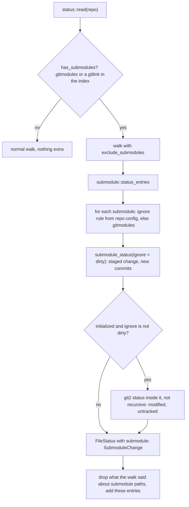
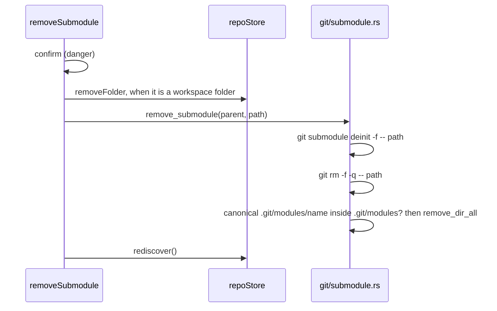

# How Submodules Work

Git Manager shows a submodule twice: as its own repository in the workspace, and as one entry in its parent's changes. Submodule commands run in the parent through the git CLI. For the user side, see [Submodules](../usage/Submodules.md).

## Why we need it

A submodule is a gitlink: an index entry with mode `160000` that holds a commit id instead of a blob, plus its URL in `.gitmodules`. Without special handling, a plain status walk either descends into every submodule (slow, and it reports the submodule's own files as the parent's changes) or shows nothing useful. Users also need the everyday commands (init, update, sync, add, remove) without remembering their flags.

## How it works

### Status in the parent

- `has_submodules` is a cheap check, so ordinary repositories skip the whole pass.
- The commit comparison uses `SubmoduleIgnore::Dirty`, then content is checked separately with a non-recursive git2 status (`content_changes`), which stops early once it knows the answer. Nested submodules and untracked folders are not walked.
- `submodule.<name>.ignore` from the repository config wins over `.gitmodules`, like git: `all` hides the entry, `dirty` skips the content check, `untracked` skips untracked files.
- The entry's `submodule` field is a `SubmoduleChange { newCommits, modifiedContent, untrackedContent }`. The UI turns it into "new commits, modified content" (`describeSubmoduleChange`).

### Diffs

`git/diff.rs` reads a gitlink side as the text `Subproject commit <id>`, like `git diff`; the work tree side is the commit checked out inside the submodule.

### Submodules as repositories

The workspace scan finds an initialized submodule as a nested repository. `mark_submodules` then sets `RepoInfo.submodule` when the enclosing repository has a `.gitmodules` and git2 finds a submodule at that relative path; the Changes sidebar shows a **submodule** badge. In `watcher.rs`, `git_dir_links` maps an absorbed submodule's git dir (inside the parent's `.git/modules`) back to the submodule, and `with_submodule_parents` adds a work tree change for the parent whenever a submodule changes, so the parent's entry stays current.

### Commands

| Command | git |
| --- | --- |
| `list_submodules` | git2 `repo.submodules()`: name, path, URL, branch, initialized, recorded and checked-out ids |
| `init_submodules(paths)` | `submodule init -- <paths>` |
| `update_submodules(remote, paths)` | `submodule update --init --recursive --progress [--remote] -- <paths>`, progress as "git-progress" |
| `sync_submodules` | `submodule sync --recursive` |
| `add_submodule(url, path, branch)` | `submodule add [-b branch] -- <url> <path>` |
| `remove_submodule(path)` | `submodule deinit -f`, `rm -f -q`, then delete `.git/modules/<name>` |

Every path goes through `checked_path`: relative, no `..`, not starting with `-`, and always after `--`. The functions take an `Envs` slice, which only the tests use.

### The UI

`submoduleActions.ts` holds the actions for **Git > Submodules**, the **Submodules** submenu of a repository row's **...** menu (added with the LFS submenu by `repoExtras.ts`, before Show Log), and the context menu of a submodule entry. After init, update, add and remove it calls `repoStore.rediscover()`, because nested repositories appeared or went away. `RepoSection.svelte` gives a submodule entry only a Stage button and no Discard or Shelve. `AddSubmoduleDialog.svelte` fills the path from the URL (`defaultSubmodulePath`) until the user edits it and checks it against existing submodule paths.

## Where the code lives

| File | What it does |
| --- | --- |
| `src-tauri/src/git/submodule.rs` | Status entries, list, `mark_submodules`, init, update, sync, add, remove |
| `src-tauri/src/commands/submodule.rs` | The six commands and `progress_emitter` |
| `src-tauri/src/git/status.rs` | Calls the submodule pass |
| `src-tauri/src/git/diff.rs` | The "Subproject commit" sides |
| `src-tauri/src/watcher.rs` | Git dir links and parent refresh |
| `src/lib/views/git/submodules/` | Actions, model, Add Submodule dialog |
| `src/lib/views/git/repoExtras.ts` | The Submodules and LFS submenus of the repository row |
| `src/lib/views/changes/RepoSection.svelte`, `CleanRepoList.svelte` | Entry badge, note, menu, and the repository badge |

## Design decisions

**One entry per submodule, like `git status`.** Users know this view from the terminal, and it keeps the parent's list short. The submodule's own files show in its own section.

**No discard for a submodule entry.** "Discarding" would mean checking out another commit inside another repository, possibly losing work there. Update Submodule says what it does.

**The one non-git write.** Git has no command that deletes `.git/modules/<name>`, and without that the same name cannot be added again. The delete only runs when the canonical path is strictly inside `.git/modules`.

**Tests allow `file://` only for themselves.** Modern git blocks `file://` submodule URLs. The tests pass `protocol.file.allow=always` through `GIT_CONFIG_COUNT` environment variables on their own invocations, never in a config file.

## Tests

- `src-tauri/src/git/submodule.rs`: `adds_updates_maps_status_and_removes_a_submodule` (add, status as one entry with content and new commits flags, `ignore=dirty` from the config, update back to the recorded commit, the "Subproject commit" diff, remove including `.git/modules`); `a_fresh_clone_inits_and_updates_its_submodules`; `workspace_scan_marks_submodules`; `refuses_paths_outside_the_work_tree`.
- `src-tauri/src/watcher.rs`: `a_changed_submodule_refreshes_its_parent` and the submodule parent lookup.
- `src/lib/views/git/submodules/submoduleModel.test.ts`: the change text, entry detection, path checks, finding an open repository.
- `src/lib/shelf/shelfModel.test.ts`: submodules are left out of Shelve Changes.

## Keeping this page in sync

- Update this page when `git/submodule.rs`, `commands/submodule.rs` or `src/lib/views/git/submodules/` change, or when the status pass changes.
- Update [Submodules](../usage/Submodules.md) for any change to the menus or the dialog, and retake `submodules-changes.png` and `submodules-add-dialog.png`.
- The commands are listed in [Commands and Events](Commands-and-Events.md).

## Bugs we fixed

None yet.
