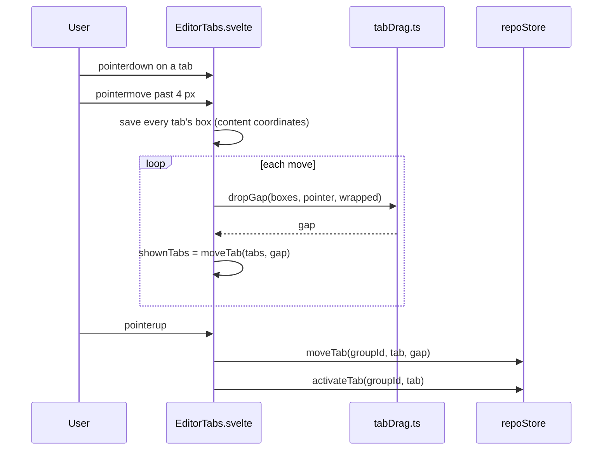

# How tabs are arranged

This chapter explains how a tab is dragged to a new place, how pinned tabs stay at the front, and how the strip wraps onto more rows. The user side is in [Pin, Reorder and Wrap Tabs](../usage/Pin-Reorder-and-Wrap-Tabs.md); opening and closing tabs is in [How the editor works](How-the-Editor-Works.md).

## Why we need it

With many files open, the order of the tabs matters. JetBrains IDEs and VS Code let you drag a tab to a new place and pin the tabs you always need, and the user asked for both. Pin Tab already existed, but it only kept a tab safe from the tab limit: the tab stayed wherever it was and Close All still closed it.

A long row of tabs also hides most of them behind a sideways scroll. VS Code has `workbench.editor.wrapTabs` to show every tab on more rows, so we added the same switch.

## How it works

### The rules, in tabs.ts

All the ordering rules are pure functions in `src/lib/stores/tabs.ts`, so they are tested without a window:

- `pinnedFirst(tabs)` puts pinned tabs first and keeps the order on each side. It returns the same array when nothing has to move, so Svelte sees no change.
- `setTabPinned` moves a tab to the end of the pinned tabs when it is pinned, and to the start of the others when it is unpinned.
- `openTab` puts a new tab right after the active one, but never among the pinned tabs.
- `moveTab(state, path, gap)` is the drop. A *gap* is a place between two tabs: 0 is before the first tab, `tabs.length` after the last, counted before the move.
- `otherPaths`, `pathsToRight` and `unpinnedPaths` leave pinned tabs out, so Close Others, Close to the Right and Close All keep them.

A drag never pins or unpins. `moveTab` keeps the gap on the tab's own side of the strip:

```mermaid
flowchart TD
  Drop["moveTab: tab dropped at gap g"] --> Count["p = number of pinned tabs"]
  Count --> Pinned{"is the tab pinned?"}
  Pinned -- yes --> Low["g limited to 0 .. p"]
  Pinned -- no --> High["g limited to p .. tabs.length"]
  Low --> Place["remove it, insert it at the gap"]
  High --> Place
```

An unpinned tab dragged to the far left stops after the last pinned tab. A drop next to the tab itself changes nothing and returns the same state.

### Keeping pinned tabs first everywhere

Many paths change a strip: Split editor turned off merges two groups, Reopen Closed Tab puts a tab back at its old index, and a saved session from an older version may have pinned tabs in the middle. Instead of fixing each path, `repoStore.applyGroups` runs `pinnedFirst` on every group before it stores the new groups, and the session restore does the same. Since `pinnedFirst` returns the same array when the order is right, this costs nothing in the common case.

### Dragging

`EditorTabs.svelte` drags with pointer events, like the Files panel, so it works however the window handles native drag and drop. The pure parts live in `src/lib/views/tabDrag.ts`.

- **The preview order.** While dragging, the strip renders `shownTabs`, the order the drop would make, instead of the stored tabs. `animate:flip` slides the other tabs to their new places. Nothing is stored until the drop, so Escape just throws the drag away.
- **Boxes from the start.** `dropGap` measures against the tab boxes saved when the drag started, not the sliding ones. Measuring the moving tabs would make the target jump back and forth while they animate.
- **Content coordinates.** The boxes and the pointer both add the strip's `scrollLeft`, so the gap stays right while the strip scrolls near its ends (`edgeScrollStep`, run each frame while dragging).
- **The lifted tab.** An effect sets the dragged tab's CSS `translate` so it stays under the pointer. It uses `offsetLeft` and `offsetTop`, which ignore the translate, and `translate` is a separate property from the `transform` that `flip` animates, so the two do not fight. In one row the tab only moves sideways and stays inside the strip.
- **The click after a drop.** The browser still sends a click after the pointerup, so a capture listener swallows that one click.

The window listeners exist only while a press or a drag does, and are removed on unmount.

### Pinned tabs in the strip

A pinned tab gets the `pinned` class. Its close button becomes an unpin button with the `pin` icon, always visible. A dot still shows unsaved changes, and hovering shows the pin again.

### Wrapping

`settings.wrapTabs` adds the `wrap` class to the strip. It turns on `flex-wrap`, lets the height grow from 34 px, and gives each tab its own 34 px height and a bottom line. The mouse wheel no longer scrolls the strip, and `dropGap` picks the row nearest the pointer before looking at `x`.

## Where the code lives

| File | What it does |
| --- | --- |
| `src/lib/stores/tabs.ts` | `pinnedFirst`, `moveTab`, `setTabPinned`, `openTab`, `unpinnedPaths` |
| `src/lib/stores/repo.svelte.ts` | `moveTab`, `closeAllTabs`, `applyGroups` and the session restore |
| `src/lib/views/tabDrag.ts` | `dropGap` and `edgeScrollStep` |
| `src/lib/views/EditorTabs.svelte` | the drag, the preview order, the pin button and the wrap styles |
| `src/lib/stores/settingsData.ts` | the `wrapTabs` preference (off by default) |
| `src/lib/views/SettingsDialog.svelte` | the Wrap tabs switch in Settings > Editor |

## Design decisions

**Pinned tabs always first.** JetBrains IDEs and VS Code both do this. A tab is pinned exactly when it sits in the pinned part of the strip.

**A drag only reorders.** Pinning is a choice you make with Pin Tab or the pin button. A drag that changed it would pin tabs you only wanted to move (see "Bugs we fixed"), so each tab stays on its own side of the line.

**Bulk closes keep pinned tabs.** Pinning says "I want this one". Close Others, Close to the Right and Close All skip them, as in VS Code; closing one tab on purpose still works.

**Move inside a group only.** Dragging to the other group would need a shared drag between two strips. The tab menu already has Move to Right Group and Move to Left Group.

**The dragged tab becomes active.** JetBrains selects a tab when you press on it. Activating it on the drop gives the same result without changing the tab on screen for a plain press.

## Bugs we fixed

**Dragging a tab before a pinned tab pinned it.** The issue: with one tab pinned, dragging another tab to its left pinned that tab too. Why: the first `moveTab` pinned any tab dropped among the pinned tabs, but people drag to reorder, not to pin. The fix: `moveTab` limits the gap to the tab's own side and never changes `pinned`. We kept pinning on the menu and the pin button instead of making drag-to-pin clearer, since a move that stops at the pinned tabs is easy to understand.

## Tests

- `src/lib/stores/tabs.test.ts`: `pinned tabs` (pinning moves, new tabs after pinned ones, `pinnedFirst`, bulk closes) and `moveTab` (gaps, no-op drops, an unpinned tab stops after the pinned ones, a pinned tab stays among them, flags kept).
- `src/lib/views/tabDrag.test.ts`: `dropGap` in one row and in wrapped rows, and `edgeScrollStep`.
- `src/lib/stores/settingsData.test.ts`: the `wrapTabs` default and validation.

The drag animation, the lifted tab and the wrapped rows need a visual check in the app.

## Keeping this page in sync

- Update this page and [Pin, Reorder and Wrap Tabs](../usage/Pin-Reorder-and-Wrap-Tabs.md) when the drag, pinning or wrapping change.
- A new bulk close must leave pinned tabs out, through `unpinnedPaths`.
- See [Docs and Screenshots](Docs-and-Screenshots.md).
