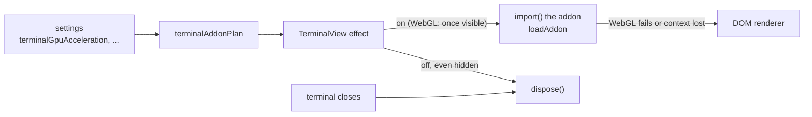
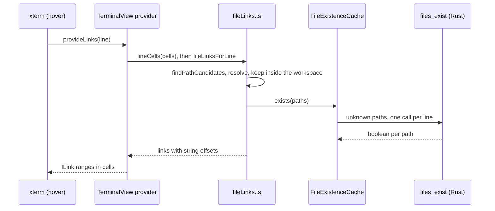

# How terminal features work

The parts that make the terminal feel like VS Code's and JetBrains': split terminals, find, clickable file paths, dropped files, rename, the visual bell and the optional xterm addons. The shell, the PTY and the placing of views are in [How the terminal works](How-the-Terminal-Works.md); the user side is in [Terminal Features](../usage/Terminal-Features.md).

## Why we need it

People coming from VS Code expect to split a terminal, search its output with Cmd+F and Cmd+click `src/app.ts:12:5` in a compiler error. Memory is a feature in Git Manager, so every optional part has a switch, loads only when it is on, and frees its memory when it is turned off or the terminal closes.

## How it works

### Optional addons

`terminalAddonPlan` in `options.ts` turns the settings into what one terminal loads: WebGL, Unicode 11, search and file links. `TerminalAddons` in `addons.ts` (shipped inside the lazy `xterm.ts` chunk) owns them per terminal, and each addon package is its own chunk, imported with `import()` the first time it is needed.

- **WebGL** (`@xterm/addon-webgl`): loaded when the terminal first shows, since it measures cells as it starts. A failed `loadAddon` (no WebGL2) or `onContextLoss` (too many contexts, a GPU reset) disposes it and marks the terminal as broken, so it stays on the DOM renderer until the setting is turned on again. Ligatures are CSS on the DOM renderer's rows, so ligatures on means no WebGL.
- **Unicode 11** (`@xterm/addon-unicode11`): registers its width table once per terminal and switches `term.unicode.activeVersion` between `"11"` and `"6"`. xterm cannot unregister a version, so off keeps the small table until the terminal closes.
- **Search** (`@xterm/addon-search`): waits until the find bar first opens; turning Find off closes the bar and disposes the addon with its highlights.

Unicode versions and search decorations are xterm's proposed API, so the terminal is created with `allowProposedApi: true`, as VS Code does. Option as Meta and smooth scrolling are plain options (`macOptionIsMeta`, `smoothScrollDuration`) written by `applyChangedOptions`.

### Find

`TerminalFindBar.svelte` sits over the terminal's top right corner; `TerminalView` keeps the query, the toggles and the results. `find.ts` maps the toggles to xterm's names, builds the highlight colors from the `--warning` and `--term-background` tokens (the addon needs opaque `#rrggbb`), counts ("3 of 12", "1000+") and decides the keys. Typing calls `findPrevious` with `incremental`, so the first match is the newest output, and Enter keeps going up, like VS Code's terminal. `keys.ts` returns `"find"` for Cmd+F (Ctrl+Shift+F elsewhere) only while the setting is on, so with it off the key is left alone.

### Clickable file paths

xterm asks the link provider only for the line under the pointer, so there is no scanning of the whole buffer. `findPathCandidates` finds `path`, `path:line`, `path:line:col` and `path(line,col)`, skips URLs (the web links addon has them) and adds git's `a/` and `b/` paths without the prefix. Relative paths resolve against the folder the shell last reported with OSC 7 (`parseOsc7`), else the start folder. Only paths inside an open workspace folder are checked, with `files_exist` in `file_ops.rs` (canonical path inside a root, not in `.git`, a regular file, at most 64 per call, never an error). The cache keeps answers only for what is on screen: `onScroll` clears it. `lineCells` maps string offsets to cells, because wide characters take two cells.

Each link starts without an underline. Hovering adds key listeners, and Cmd (Ctrl) down or up flips `decorations.underline` and `pointerCursor`, which xterm tracks, so the underline shows only with the modifier, like VS Code. Activating calls `navigation.openFileAt`.

### Split terminals

Every `TerminalEntry` has a `group`. Panel terminals with the same group form a split; a new split goes right after its source in the list, so a group's members stay together. `splitPanes.ts` holds the rules: `terminalGroups`, `groupMembers`, `normalizeSizes`, `sizesAfterSplit` (halves the source pane), `sizesAfterClose` (the neighbor takes the room) and `resizePanes` (a divider moves width between two panes, never below `MIN_PANE_WIDTH`). Sizes are fractions, kept per group for the session in `groupSizes`.

`TerminalPanel.svelte` renders one pane per member of the active terminal's group and registers it with `setPaneSlot`; `slotFor` sends a panel terminal to its pane, or to the view area while its group is hidden. `TerminalFrame` hides frames that are not shown, so an empty frame never covers a pane. Focus follows click: `focusin` on a view calls `focusPane`, which makes it the active terminal without stealing focus. `panelAfterLeave` hands over to a pane of the same group first.

### Drops, rename and bell

`TerminalHost` listens to `onDragDropEvent` only while a terminal exists and the setting is on. It finds the view under the point (`terminalKeyAt` reads `data-terminal-key`) and sends it a custom event; the view types `dropText` (POSIX single quotes, double quotes on Windows) with `paste`. The Files panel skips points over a terminal, so one drop is never handled twice. Rename in place sets the same session-only name as **Rename...**. `onBell` flashes a visible terminal or sets `bell` on the entry, shown as a dot until the terminal shows.

## Where the code lives

| File | What it does |
| --- | --- |
| `src/lib/terminal/addons.ts` | `TerminalAddons`: search, WebGL with fallback, Unicode 11 |
| `src/lib/terminal/find.ts`, `TerminalFindBar.svelte` | Find logic and the bar |
| `src/lib/terminal/fileLinks.ts` | Candidates, resolving, OSC 7, cells, `FileExistenceCache` |
| `src/lib/terminal/splitPanes.ts` | Groups and pane sizes |
| `src/lib/terminal/dropPaths.ts` | Quoting and the drop events |
| `src/lib/terminal/TerminalView.svelte`, `TerminalPanel.svelte`, `TerminalHost.svelte` | The glue |
| `src-tauri/src/file_ops.rs` (`existing_files`), `commands/file_ops.rs` (`files_exist`) | The existence check |

## Design decisions

**Lazy and disposable.** Each addon is its own chunk. With every switch off, a terminal loads only xterm, fit and web links, as before. Off frees memory at once, even for hidden terminals; WebGL waits until the terminal shows.

**One backend call per hovered line**, not a file system watcher or a list of every file: hovering is rare and cheap, and the answers go when the screen scrolls.

**Splits in groups, not a tree.** VS Code splits side by side in a row, which covers the common case; a row per group keeps the rules small and testable.

**Enter goes up in find**, like VS Code's terminal, since the newest output is at the bottom.

## Tests

- `src/lib/terminal/find.test.ts`, `fileLinks.test.ts`, `splitPanes.test.ts`, `dropPaths.test.ts`.
- `keys.test.ts` (find and split keys), `options.test.ts` (`terminalAddonPlan`, Option as Meta, smooth scrolling), `terminalTabs.test.ts` (the split rule of `panelAfterLeave`), `settingsData.test.ts` (the new keys and defaults).
- `files_exist_reports_only_files_inside_the_workspace` in `src-tauri/src/commands/tests.rs`.

WebGL fallback, hover underlines, drops from Finder and dragging the divider need a check in the real app.

## Keeping this page in sync

- Update this page, [Terminal Features](../usage/Terminal-Features.md) and [Settings Reference](Settings-Reference.md) when a switch, an addon or a rule changes.
- Retake `terminal-find.png` and `terminal-split.png` ([Docs and Screenshots](Docs-and-Screenshots.md)).

## Bugs we fixed

None yet.
