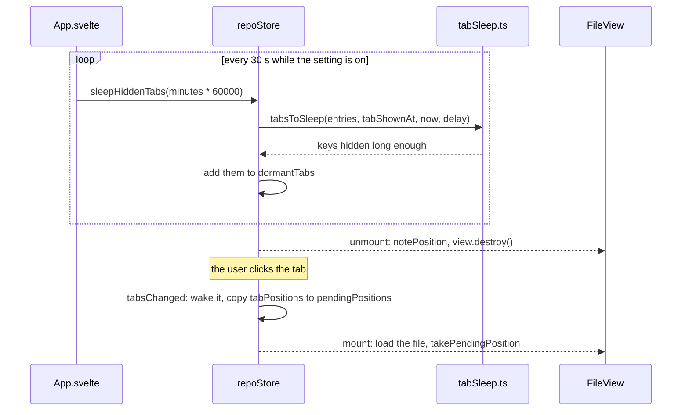

# How unloading hidden tabs works

This chapter explains how file tabs out of sight give their editors back to save memory. The user side is in [Unload Hidden Tabs](../usage/Unload-Hidden-Tabs.md); the tabs themselves are in [How the editor works](How-the-Editor-Works.md).

## Why we need it

`Workspace.svelte` keeps one `FileView` per file tab and only hides the inactive ones, so switching back is instant and keeps the cursor, scroll and unsaved edits. The price is a full CodeMirror editor, its DOM, blame and change marks for every tab: about 4 MB each, measured ([Measuring Setting Memory](Measuring-Setting-Memory.md)). People keep many tabs open and look at a few. Memory is a feature here (see [Architecture](Architecture.md)), so tabs nobody looks at should not hold it.

## How it works

The app already had a sleeping state: tabs restored at start are **dormant**. `repoStore.dormantTabs` holds their keys (`groupId` plus path), `Workspace.svelte` renders no `FileView` for them, and showing one creates its editor at the saved position. Unloading reuses exactly that state.

- **When a tab was last seen.** `repoStore.tabShownAt` maps each tab key to the last time it was on screen. `tabsChanged` stamps the active tab of every group, and every sweep stamps them again, so a tab that has been active for an hour starts counting when it is hidden, not an hour ago.
- **The decision.** `tabsToSleep` in `src/lib/stores/tabSleep.ts` is pure: a shown tab, or one seen for the first time, gets `now`; a hidden tab that is `eligible` and older than the delay is returned. Closed tabs are forgotten. Eligible means a file tab (`isFileTab`) without unsaved edits that is not dormant already.
- **Going to sleep.** `sleepHiddenTabs` adds the keys to `dormantTabs`. Svelte unmounts the `FileView`, whose cleanup calls `notePosition` (caret and the last measured top line) and destroys the view.
- **Waking up.** Clicking the tab makes it active; `tabsChanged` drops the key and copies the tab's `tabPositions` entry into `pendingPositions`, which the new editor reads with `takePendingPosition`, the same path Reopen tabs on start uses.

The Markdown view mode survives because `viewMode.ts` remembers it per file for the session.

## Where the code lives

| File | What it does |
| --- | --- |
| `src/lib/stores/tabSleep.ts` | `tabsToSleep`, `UNLOAD_TAB_MINUTES`, `TAB_SLEEP_CHECK_MS`, `pickUnloadTabMinutes` |
| `src/lib/stores/repo.svelte.ts` | `sleepHiddenTabs`, `tabShownAt`, waking in `tabsChanged` |
| `src/lib/App.svelte` | The 30 second interval, only while the setting is on |
| `src/lib/stores/settingsData.ts` | `unloadHiddenTabs` (true) and `unloadHiddenTabsMinutes` (15) |
| `src/lib/views/SettingsDialog.svelte` | The switch and the Unload after choices |

## Design decisions

**Reuse the dormant state.** A second way to tear down and rebuild an editor would need its own position and wake logic. Dormant tabs already had both and were tested by every restart.

**Never unsaved edits.** Keeping unsaved text outside an editor would need a second copy and a new path back into the editor. Skipping dirty tabs keeps work safe with no new code.

**Minutes, not a tab count.** A tab limit already closes tabs by count. Time keeps the tabs you switch between often loaded, whatever their number.

**A plain interval.** The check is a few map lookups every 30 seconds with no IPC, so it also runs while the window is in the background, where freeing memory helps the most.

**Undo history goes.** CodeMirror's history lives in the editor state. Keeping it would mean keeping the state, which is most of the memory.

## Tests

- `src/lib/stores/tabSleep.test.ts`: counting from the first hidden sighting, the shown tab never sleeps, tabs that cannot sleep, closed tabs forgotten, the minute choices.
- `src/lib/stores/settingsData.test.ts`: the defaults and their checks.

## Keeping this page in sync

- Update this page and [Unload Hidden Tabs](../usage/Unload-Hidden-Tabs.md) when dormant tabs, `FileView` positions or the tab kinds change.
- If another tab kind learns to sleep, add it to `eligible` in `sleepHiddenTabs` and to both pages.
- Retake `settings-unload-hidden-tabs.png` when the rows change.
