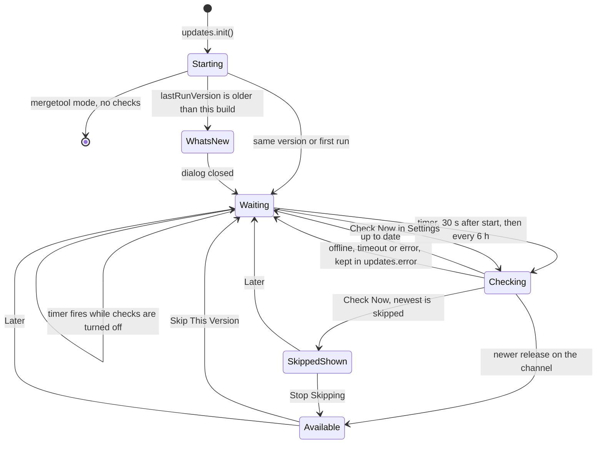
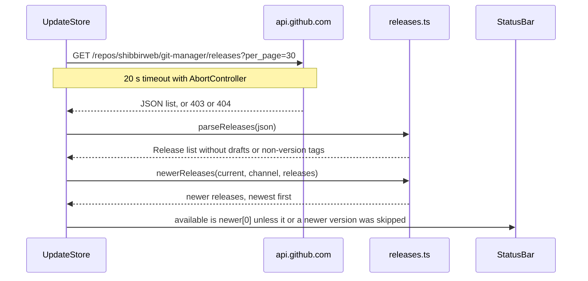
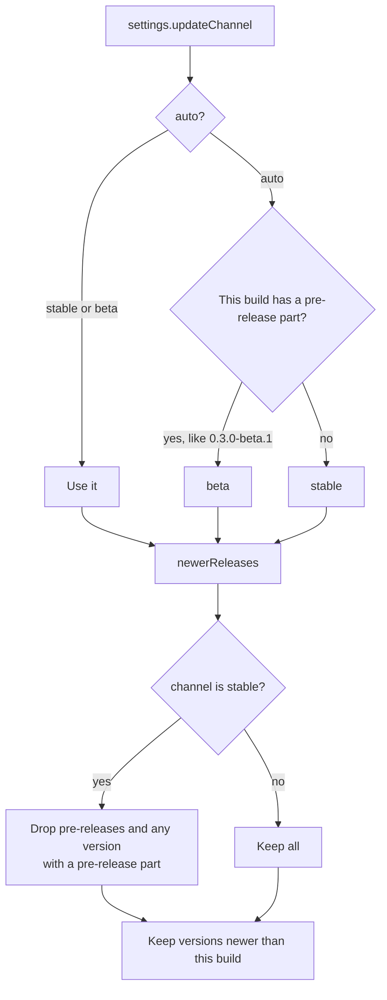

# How updates work

Git Manager checks GitHub for newer releases and tells you when one is out. It never downloads or installs anything by itself. After you update, it shows What's New from the changelog built into the app. For the user side, see [Updates](../usage/Updates.md).

## Why we need it

Without an update check, most people stay on their first version and miss fixes. Silent auto-install needs an update-signing key and more setup. A notify-only check gives most of the benefit without that: the app asks GitHub, shows the notes, and the Download button opens the release in the browser.

Testers also need betas without pushing betas on everyone. So releases have two channels, and a stable install is never offered a beta.

## How it works

Everything lives in `src/lib/update/`. `updates` (the `UpdateStore` singleton in `updates.svelte.ts`) is started by `App.svelte` with `updates.init()`, right after `settings.init()`.

### The check

`init()` reads this build's version with Tauri's `getVersion()`. If that fails, it stops and no check ever runs. In mergetool mode (`api.getLaunchMode()`), `init()` stops after reading the version: no timer, no What's New, and `lastRunVersion` is not touched. If `settings.lastRunVersion` is older, it opens What's New once. It saves the new `lastRunVersion` right away, whether or not the dialog opened, and arms the timer with `FIRST_CHECK_DELAY_MS` (30 seconds), so starting the app never waits on the network. After that `schedule()` re-arms every `CHECK_INTERVAL_MS` (6 hours). When `settings.checkForUpdates` is off, the timer still runs but skips the request.

`check(manual)` uses the web view's `fetch`. The CSP in `tauri.conf.json` allows it with `connect-src ... https://api.github.com`. A 403 becomes "GitHub rate limit reached". An automatic check that fails stays quiet: it only sets `updates.error`, which Settings, Updates shows as "Last check failed". A manual check shows a toast or opens the dialog.

### Channels

Betas are GitHub pre-releases (see [Releases and CI](Releases-and-CI.md)). The stable channel drops a release when GitHub marks it as a pre-release **or** its version has a pre-release part, so a beta published without the flag never reaches stable users.

Version order comes from `compareVersions` in `version.ts`, which follows semver precedence, so `0.3.0-beta.2` is older than `0.3.0`.

### The dialogs

`UpdateDialog.svelte` shows the notes of every newer release (with Beta badges and dates), a View on GitHub link and three buttons. **Download** calls `updates.download(release)`, which opens the `.dmg` link found by `parseReleases`, or the release page. **Skip This Version** stores `settings.skippedVersion`. `isSkipped` treats that version and anything older as skipped, so `available` (`announcedRelease`) hides the status bar item and automatic checks stay quiet. A manual Check Now still opens the dialog. When `updates.newestSkipped` is true, it shows "You skipped this version." and a **Stop Skipping** button (`updates.unskip()`) in place of Skip This Version. A release newer than the skipped one is announced as usual. **Later** just closes.

`WhatsNewDialog.svelte` imports `CHANGELOG.md?raw`, so the changelog is bundled at build time and works offline. A beta build shows the `Unreleased` section (betas ship those notes), a stable build shows its own dated section, and older entries can be expanded.

`ReleaseNotes.svelte` renders Markdown with `renderMarkdown` from `markdown.ts`. It escapes all HTML, emits only a fixed set of tags, and only turns `https` links into links. Clicks on them go through `updates.open`, which uses the opener plugin (`openUrl`, allowed by `opener:allow-open-url` in `capabilities/default.json`), so the page opens in the user's browser, never inside the app.

## Where the code lives

| File | What it does |
| --- | --- |
| `src/lib/update/updates.svelte.ts` | `UpdateStore`: timers, check, channel, skip, download, links |
| `src/lib/update/releases.ts` | `parseReleases`, `newerReleases`, `defaultChannel`, `isSkipped`, `announcedRelease`, `osLabel`, issue link helpers |
| `src/lib/update/version.ts` | `parseVersion`, `compareVersions`, `isNewer` |
| `src/lib/update/changelog.ts` | `parseChangelog`, `entryFor`, `releasedEntries` |
| `src/lib/update/markdown.ts` | Safe Markdown renderer |
| `src/lib/update/UpdateDialog.svelte` | Update available dialog |
| `src/lib/update/WhatsNewDialog.svelte` | What's New from the bundled changelog |
| `src/lib/update/ReleaseNotes.svelte` | Renders notes, opens links in the browser |
| `src-tauri/tauri.conf.json` | CSP that allows `https://api.github.com` |
| `src-tauri/capabilities/default.json` | `opener:allow-open-url` |

## Design decisions

**Notify only.** Tauri's updater could install updates, but it needs an update-signing key stored as a GitHub secret. Opening the release page needs no keys and can be revisited later.

**Ask GitHub from the web view, not from Rust.** A `fetch` needs no new Rust dependency or HTTP client, which keeps the binary small. The CSP entry keeps the app from talking to any other host.

**The changelog is the only source of notes.** Release notes on GitHub and What's New both come from `CHANGELOG.md`, so they can never disagree. See [Versioning and Changelog](Versioning-and-Changelog.md).

**Two filters for the stable channel.** Trusting only GitHub's pre-release flag would let one wrong click ship a beta to everyone.

**Quiet when offline.** An error toast every six hours on a plane would be noise.

## Bugs we fixed

**Skip This Version did not stick.**
- **The issue:** after skipping a version, a manual Check Now opened the update window and presented the same version as new again.
- **Why it happened:** only the status bar item looked at `settings.skippedVersion`. The dialog read the plain list of newer releases.
- **The fix and why we chose it:** `isSkipped` and `announcedRelease` in `releases.ts` treat the skipped version and anything older as skipped. Automatic checks never announce it. A manual check still opens the window, since you asked, but marks it "You skipped this version." and offers Stop Skipping instead of Skip. That way you learn a newer version exists without being nagged.

**Update checks ran in mergetool mode.**
- **The issue:** every window git mergetool opened also started the timed update check.
- **Why it happened:** `updates.init()` armed the timer for every launch mode.
- **The fix and why we chose it:** `init()` reads the launch mode and does not schedule checks or show What's New in mergetool mode. These windows live for one file, so a check there only costs network and could pop up over the merge. `lastRunVersion` is left alone, so the next normal start still shows What's New.

One known trap: the repository must be public. For a private repository, GitHub answers 404 to the anonymous request, and Settings shows "GitHub answered 404".

## Tests

- `src/lib/update/update.test.ts`: changelog sections with dates, one version's body without link definitions, released versions only, tags with or without `v`, and semver ordering.
- `src/lib/update/releases.test.ts`: `parseReleases` keeps published version tags and finds the `.dmg`; `newerReleases` for stable, beta, up to date, and the default channel of a beta build; `renderMarkdown` formatting, HTML escaping and non-https links; `isSkipped` and `announcedRelease`; the bug report link, `osLabel` and the user agent fallback.

When you change channel rules or parsing, add a case to `releases.test.ts` first. The store itself is not unit tested because it needs the network and Tauri.

## Keeping this page in sync

- Update this page when anything in `src/lib/update/`, the CSP or the opener capability changes.
- Update [Updates](../usage/Updates.md) when intervals, channels or buttons change.
- Retake `settings-updates.png`, `update-dialog.png`, `update-dialog-skipped.png` and `whats-new.png` when those screens change.
- Related: [Releases and CI](Releases-and-CI.md), [How Settings Work](How-Settings-Work.md), [How the Status Bar Works](How-the-Status-Bar-Works.md).
