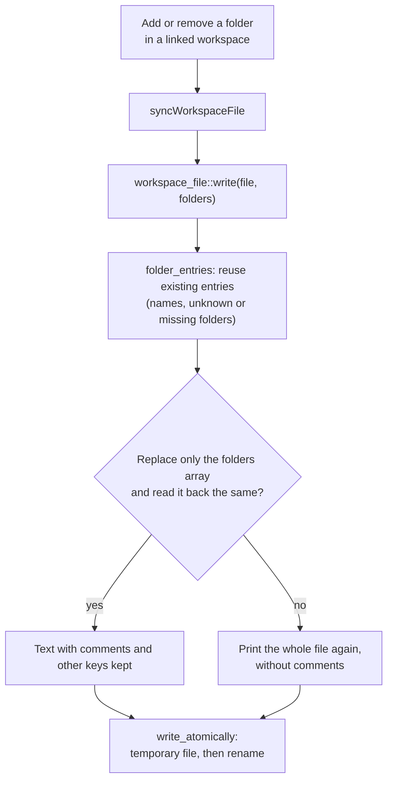

# How Workspace Files Work

A workspace file saves a set of folders, so the user can reopen them in one click. Git Manager writes `.gitmanager-workspace` files and also reads and updates VS Code `.code-workspace` files. This page also covers which folders reopen when the app starts. The rest of the workspace is in [How workspaces work](How-Workspaces-Work.md), and the user side in [Workspaces](../usage/Workspaces.md).

## Why we need it

- **Teams share VS Code workspace files.** Reading them, and keeping their other content when we save, means one file works in both apps.
- **Paths should move with the folders.** Folder paths are stored relative to the file when they share a parent folder with it, so a project checked out somewhere else still opens.
- **The app should start where you left it,** and stay closed when you closed the folder on purpose.

## How it works

`workspace_file.rs` is plain JSON with comments (JSONC): `strip_jsonc` removes comments and trailing commas before parsing. `read` resolves each `folders[].path` against the file's folder and reports the ones that no longer exist, so the UI can open the rest and show a note.

`write` keeps existing folder entries, so a VS Code `name` survives, and so do entries it cannot open (missing folders or `uri` folders). It replaces only the `folders` array in the original text and falls back to writing the whole file, without comments, if that edit would not read back correctly. It writes through a temporary file, like `config.rs`, and through a symlink to its target. `syncWorkspaceFile` in `repo.svelte.ts` rewrites a linked file after every add or remove.

### Which folders open at start

On start, `App.svelte` opens a command line argument first, else the steps from the pure `sessionSteps` (in `settingsData.ts`): `lastSessionFile`, then `lastSession`. The most recent folder is used only when state.json never recorded a session (`sessionRecorded`), so after Close Folder the welcome screen shows. `closeWorkspace()` records the empty session.

## Where the code lives

| File | What it does |
| --- | --- |
| `src-tauri/src/workspace_file.rs` | JSONC parsing, relative paths, rewriting `folders`, the atomic write |
| `src-tauri/src/commands/workspace.rs` | `read_workspace_file` and `write_workspace_file` |
| `src/lib/stores/repo.svelte.ts` | `syncWorkspaceFile`, `closeWorkspace` |
| `src/lib/views/repoPicker.ts` | Open and Save Workspace pickers |
| `src/lib/stores/settingsData.ts` | `sessionSteps`, `parseState` |

## Design decisions

**Stay compatible with `.code-workspace`.** Teams share one file with VS Code, so we only touch `folders`.

**Edit the text, not the parsed value.** Printing the parsed JSON again would drop comments and reorder keys. Splicing the array keeps the file as the user wrote it.

**An empty recorded session means "closed on purpose".** Falling back to a recent folder is only for old state files from before sessions were recorded.

## Bugs we fixed

**Close Folder did not stay closed.**
- **The issue:** after Close Folder and a restart, the app reopened the most recent folder.
- **Why it happened:** closing saved an empty session, which the start code treated like "never had one", falling back to `recentRepos[0]`.
- **The fix and why we chose it:** `parseState` notes whether state.json recorded a session (`sessionRecorded`), and the pure `sessionSteps` falls back to a recent folder only for old state without one. An empty recorded session means "closed on purpose".

**Saving a workspace file lost VS Code folder names and comments.**
- **The issue:** adding or removing a folder dropped folder names, comments and folders not found, and a crash mid-write could leave half a file.
- **Why it happened:** `write` rebuilt `folders` as plain `{ path }` entries, printed the whole file again and wrote it in place.
- **The fix and why we chose it:** `write` reuses entries, edits only the `folders` array (kept only if it parses back to the same folders) and writes through a temporary file. Comments inside the array itself are still lost.

## Tests

- `src-tauri/src/workspace_file.rs`: comments and trailing commas, relative paths, round trips that keep other keys, VS Code files with missing folders, invalid files, kept names and unknown entries, adding `folders` to a file without them, and writing through a symlink.
- `src/lib/stores/settingsData.test.ts`: `sessionSteps` and `parseState`.

## Keeping this page in sync

- Update this page when the file format, the write or the start order change.
- Update [Workspaces](../usage/Workspaces.md) for visible changes.
