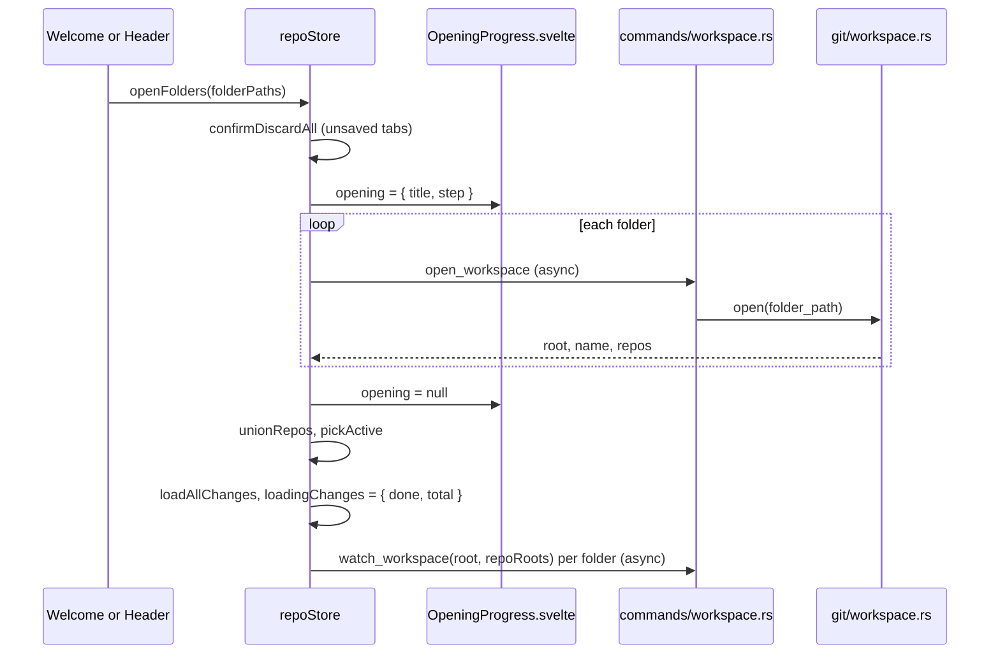

# How workspaces work

A workspace is one or more folders opened together, like a VS Code multi-root workspace, each holding any number of git repositories (nested too) or none. The user side is in [Workspaces](../usage/Workspaces.md).

## Why we need it

Many people keep several projects in one folder, so, like VS Code, we open any folder and find every repository inside:

- **The backend finds repositories.** Scanning runs in Rust; only the list of roots crosses the bridge.
- **The UI uses absolute paths.** Two folders can both contain `src/index.ts`, so we convert to repo-relative paths only for git.
- **One repository is active** for branches, the Log and pull or push, while statuses are kept for all.

## How it works

Opening a folder gets a `WorkspaceInfo` (root, name, repositories); the store then reads every status and starts one watcher per folder.

### Opening progress

Finding repositories in a big folder can take seconds. So `openFolders` and `addFolder` set `repoStore.opening` to `{ title, step }` ("Opening acme" and "Looking for repositories...", per folder for a workspace, "Adding X" for Add Folder). `OpeningProgress.svelte` shows it as a card over a dimmed window, but only after 150 ms so a quick open does not flash, and after 4 seconds adds a hint that folders such as `node_modules` are skipped.

Once the repositories are known the workspace is on screen, and `loadAllChanges` reads every status in parallel. It keeps `loadingChanges = { done, total }`, which the status bar shows as "Reading changes 2 of 5" (see [How the status bar works](How-the-Status-Bar-Works.md)). The texts come from `stores/openingProgress.ts`.

`find_repos` combines `enclosing_repo` (`Repository::discover`, for a folder inside a bigger repository) with `scan`, a breadth-first search limited by `MAX_SCAN_DEPTH` (6) and `MAX_SCAN_DIRS` (50,000) that skips `SKIPPED_DIRS` such as `node_modules` and never follows symlinks.

`workspace` is an `OpenWorkspace` (`id`, `name`, `root`, `folders`, optional linked `file`); each `WorkspaceFolder` keeps its `repoRoots`. `close()` and `openFolders` first ask `confirmDiscardAll` (the Unsaved Changes dialog of `closeTabs`). `closeWorkspace()`, behind Close Folder, also records an empty session.

### Watching for changes

`watcher::watch` puts one debounced recursive watcher on each folder. It sends `repo-changed` (the store refreshes that repository) and `workspace-changed` (the Files panel reloads, and with `reposChanged` the store rescans quietly). How each file event is sorted is in [How folder watching works](How-Folder-Watching-Works.md).

### Workspace files and the session

Workspace files (`.gitmanager-workspace` and VS Code `.code-workspace`) and which folders reopen at start are in [How workspace files work](How-Workspace-Files-Work.md).

### Showing or hiding the activity bars

The activity bars are the icon strips at each edge. Two header buttons left of the theme button, and View > Left Activity Bar and Right Activity Bar, call `settings.toggleActivityBar(side)`, which flips `leftBarVisible` or `rightBarVisible` (default `true`) in `state.json`. `Workspace.svelte` leaves a hidden bar out, and `ACTIVITY_BARS` counts 44 px per visible bar in the panel width math. The button icon, `views/LayoutToggleIcon.svelte`, is a small window with that side filled while the bar shows, like VS Code's layout controls.

## Where the code lives

| File | What it does |
| --- | --- |
| `src-tauri/src/git/workspace.rs` | Repository scan, `init`, `deepest_repo` |
| `src-tauri/src/commands/workspace.rs` | Workspace, discovery, watching and workspace file commands |
| `src-tauri/src/watcher.rs`, `src-tauri/src/state.rs` | The watchers, see [How folder watching works](How-Folder-Watching-Works.md) |
| `src/lib/stores/repo.svelte.ts` | `openFolders`, `opening`, `loadAllChanges`, `closeWorkspace`, `rediscover`, `rescan` |
| `src/lib/views/OpeningProgress.svelte`, `src/lib/stores/openingProgress.ts` | The opening card and its texts |
| `src/lib/stores/workspacePaths.ts` | `folderFor`, `locateAbsolute`, `relativeTo`, `joinPath` |
| `src/lib/views/Header.svelte`, `LayoutToggleIcon.svelte`, `Workspace.svelte` | The activity bar toggles and widths |

## Design decisions

**Scan in Rust with hard limits,** so a huge folder cannot freeze the app or flood IPC.

**Show the window before the statuses.** The repository list is enough to draw the workspace; statuses fill in with a counter, so a big workspace is usable sooner.

**Rescan only on a hint.** Rescanning on every change is costly in big folders, and polling costs CPU and memory.

## Bugs we fixed

**Nested repository shown as an untracked folder.**
- **The issue:** the parent repository listed a nested repository as an untracked `dir/`, so the same work showed twice.
- **Why it happened:** git reports another repository's folder as one untracked path ending in `/`.
- **The fix and why we chose it:** `status::read` and the Files panel skip it when the folder has its own `.git` (`is_nested_repo`), a cheap check.

**Closing a folder threw away unsaved edits.**
- **The issue:** Close Folder, Open Folder, a recent folder or a workspace file closed every tab, dropping unsaved edits without a question.
- **Why it happened:** `close()` cleared the tabs directly; only `closeTabs` asked first.
- **The fix and why we chose it:** `close()` and `openFolders` ask through `confirmDiscardAll`, the dialog of closing tabs, before loading anything, so Cancel or a failed open changes nothing. One familiar dialog for every close.

**Opening a big folder froze the window.**
- **The issue:** opening or adding a big folder froze the whole window: 0.3 to 1.1 seconds on a folder with 60,000 files, longer on bigger ones.
- **Why it happened:** `watch_workspace` was not `async`, so it ran on the main thread, and the watcher's default file id cache (`RecommendedCache`) walks every file when watching starts and keeps their paths in memory.
- **The fix and why we chose it:** the watcher uses `NoCache` (see [How folder watching works](How-Folder-Watching-Works.md)), and `watch_workspace` and `unwatch_workspace` are `async`, working through `blocking`. The stall went from 516 ms to 9 ms; the progress card covers the rest.

**A failed open showed the welcome screen with no message.**
- **The issue:** when restoring the session or opening a folder failed, the welcome screen came up silently.
- **Why it happened:** `openFolders` caught errors only around `api.openWorkspace`. Anything that threw later, such as a bad reply, rejected a promise nobody caught.
- **The fix and why we chose it:** `openFolders` never throws: any error is a toast from the pure `openFailure` (`openingProgress.ts`) naming the folder and the error. One catch in the store covers every caller.

**The welcome screen did not fit a short window.**
- **The issue:** in a short window the card was cut off at the top and bottom.
- **Why it happened:** `align-items: center` on a `100vh` screen with `overflow: hidden` pushes a taller card past both edges.
- **The fix and why we chose it:** `Welcome.svelte` centers with `margin: auto` (never past the top), caps the card at the window height and lets the recent lists scroll inside it. Plain CSS, no resize code.

**Option+Cmd+B did not match.**
- **The issue:** a check on `event.key` never fired, so the Files panel did not toggle.
- **Why it happened:** on macOS, Option changes the typed character, so `event.key` is not `b`.
- **The fix and why we chose it:** `workspaceShortcuts.ts` matches `event.code === "KeyB"`, the physical key, a project rule for every Option shortcut.

## Tests

- `src-tauri/src/commands/tests.rs`: the `open_workspace_*` and `init_repository_*` tests.
- `src-tauri/src/watcher.rs`: see [How folder watching works](How-Folder-Watching-Works.md).
- `src/lib/stores/workspacePaths.test.ts` and `openingProgress.test.ts`.

The opening card, live watchers and the unsaved-changes dialog need a check by hand with `scripts/make-workspace-demo.sh`. See [Testing](Testing.md).

## Keeping this page in sync

- Update this page when scanning, opening progress or rescans change, and [How workspace files work](How-Workspace-Files-Work.md) or [How folder watching works](How-Folder-Watching-Works.md) for their parts.
- Update [Workspaces](../usage/Workspaces.md) for visible changes.
- Retake `welcome.png`, `window-overview.png`, `workspace-folders.png`, `repository-switcher.png`, `init-repository.png`, `scan-repositories.png`, `unsaved-changes-close.png` and `workspace-opening.png` when they change. See [Docs and Screenshots](Docs-and-Screenshots.md).
