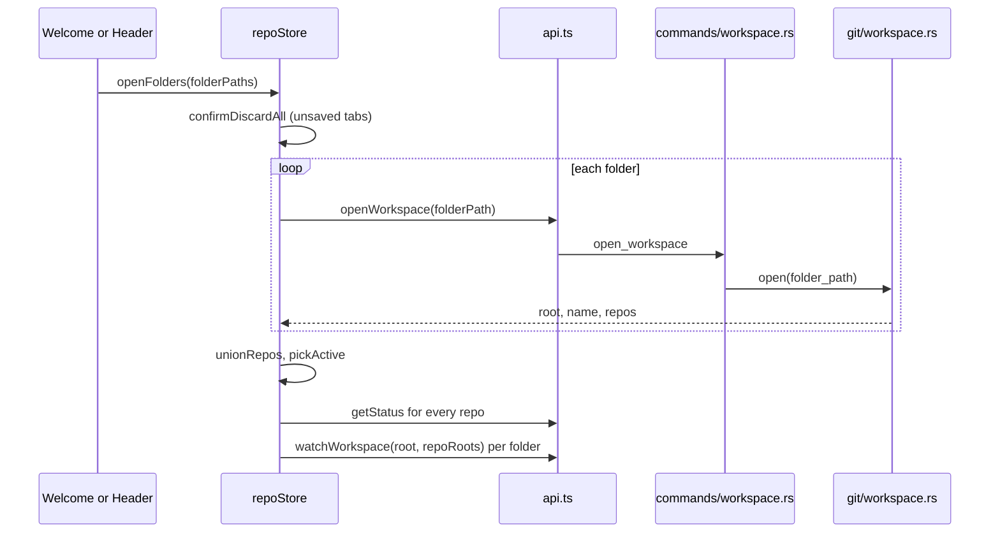
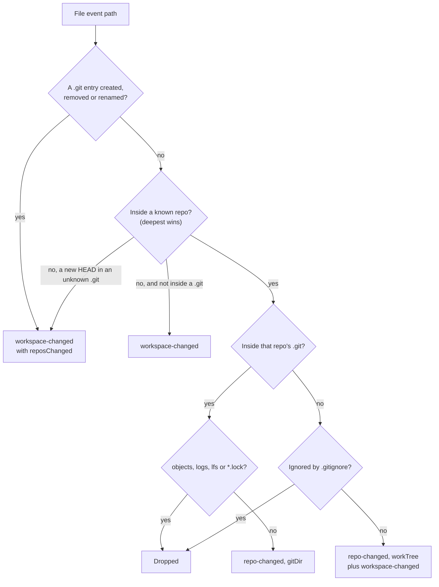

# How workspaces work

A workspace is one or more folders opened together, like a VS Code multi-root workspace, each holding any number of git repositories (nested too) or none. The user side is in [Workspaces](../usage/Workspaces.md).

## Why we need it

Many people keep several projects in one folder, so, like VS Code, we open any folder and find every repository inside:

- **The backend finds repositories.** Scanning runs in Rust; only the list of roots crosses the bridge.
- **The UI uses absolute paths.** Two folders can both contain `src/index.ts`, so we convert to repo-relative paths only for git.
- **One repository is active** for branches, the Log and pull or push, while statuses are kept for all.

## How it works

Opening a folder gets a `WorkspaceInfo` (root, name, repositories); the store then reads every status and starts one watcher per folder.

`find_repos` combines `enclosing_repo` (`Repository::discover`, for a folder inside a bigger repository) with `scan`, a breadth-first search limited by `MAX_SCAN_DEPTH` (6) and `MAX_SCAN_DIRS` (50,000) that skips `SKIPPED_DIRS` such as `node_modules` and never follows symlinks.

`workspace` is an `OpenWorkspace` (`id`, `name`, `root`, `folders`, optional linked `file`); each `WorkspaceFolder` keeps its `repoRoots`. `close()` and `openFolders` first ask `confirmDiscardAll` (the Unsaved Changes dialog of `closeTabs`). `closeWorkspace()`, behind Close Folder, also records an empty session.

### Watching for changes

`watcher::watch` puts one debounced (300 ms) recursive watcher on a folder, plus the `.git` of an enclosing repository outside it. Each batch goes through the pure function `attribute`:

Other paths inside an unknown `.git` are dropped. Removing or moving a folder that holds a known repository, or moving in a folder with a `.git` (`has_git_entry`), also sets `reposChanged`. `repo-changed` calls `refreshRepo`. `workspace-changed` reloads the Files panel, and with `reposChanged` the store runs a quiet `rescan` one second later (`RESCAN_DELAY_MS`). That changes nothing unless the list of repositories changed; then it rewatches, refreshes and shows "Found repository NAME" (or "Found N new repositories"). Scan for Repositories (`rediscover`) still works too.

### Workspace files and the session

`workspace_file.rs` reads `.gitmanager-workspace` and VS Code `.code-workspace` files. `write` keeps existing folder entries, so a VS Code `name` survives, and entries it cannot open (missing or `uri` folders). It replaces only the `folders` array in the original text and falls back to writing the whole file, without comments, if that edit would not read back correctly. It writes through a temporary file, like `config.rs`. `syncWorkspaceFile` rewrites a linked file after every add or remove.

On start, `App.svelte` opens a command line argument first, else the steps from `sessionSteps` (in `settingsData.ts`): `lastSessionFile`, then `lastSession`. The most recent folder is used only when state.json never recorded a session, so after Close Folder the welcome screen shows.

## Where the code lives

| File | What it does |
| --- | --- |
| `src-tauri/src/git/workspace.rs` | Repository scan, `init`, `deepest_repo` |
| `src-tauri/src/commands/workspace.rs` | Workspace, discovery, watching and workspace file commands |
| `src-tauri/src/watcher.rs` | Debounced watcher, `attribute`, `has_git_entry` |
| `src-tauri/src/workspace_file.rs` | JSONC parsing, relative paths, rewriting `folders` |
| `src/lib/stores/repo.svelte.ts` | `openFolders`, `closeWorkspace`, `rediscover`, `rescan`, refreshes |
| `src/lib/stores/workspacePaths.ts` | `folderFor`, `locateAbsolute`, `relativeTo`, `joinPath` |
| `src/lib/stores/settingsData.ts` | `sessionSteps` |

## Design decisions

**Scan in Rust with hard limits,** so a huge folder cannot freeze the app or flood IPC.

**Rescan only on a hint.** Rescanning on every change is costly in big folders, and polling costs CPU and memory.

**Stay compatible with `.code-workspace`.** Teams share one file with VS Code, so we only touch `folders`.

## Bugs we fixed

**Nested repository shown as an untracked folder.**
- **The issue:** the parent repository listed a nested repository as an untracked `dir/`, so the same work showed twice.
- **Why it happened:** git reports another repository's folder as one untracked path ending in `/`.
- **The fix and why we chose it:** `status::read` and the Files panel skip it when the folder has its own `.git` (`is_nested_repo`), a cheap check.

**Adding a second folder stopped watching the first.**
- **The issue:** only the newest folder refreshed on its own.
- **Why it happened:** `watch_workspace` still called `watchers.clear()`.
- **The fix and why we chose it:** watchers are keyed by folder root, so each folder stays independent.

**Closing a folder threw away unsaved edits.**
- **The issue:** Close Folder, Open Folder, a recent folder or a workspace file closed every tab, dropping unsaved edits without a question.
- **Why it happened:** `close()` cleared the tabs directly; only `closeTabs` asked first.
- **The fix and why we chose it:** `close()` and `openFolders` ask through `confirmDiscardAll` with the same dialog as closing tabs, and Cancel leaves everything as it was. `openFolders` asks before loading anything, so a cancelled or failed open changes nothing. One dialog for every close is familiar.

**Close Folder did not stay closed.**
- **The issue:** after Close Folder and a restart, the app reopened the most recent folder.
- **Why it happened:** closing saved an empty session, which the start code treated like "never had one", falling back to `recentRepos[0]`.
- **The fix and why we chose it:** `parseState` notes whether state.json recorded a session (`sessionRecorded`), and the pure `sessionSteps` falls back to a recent folder only for old state without one. An empty recorded session means "closed on purpose".

**A new repository only showed up after Scan for Repositories.**
- **The issue:** after `git init` or a clone in an open folder from outside the app, the repository did not appear.
- **Why it happened:** a new `.git` only reloaded the Files panel, and changes inside an unknown `.git` were dropped.
- **The fix and why we chose it:** `attribute` sets `reposChanged` in the cases above, and the store rescans only then, once the burst settles, doing nothing more if the list is the same.

**Saving a workspace file lost VS Code folder names and comments.**
- **The issue:** adding or removing a folder dropped folder names, comments and folders not found, and a crash mid-write could leave half a file.
- **Why it happened:** `write` rebuilt `folders` as plain `{ path }` entries, printed the whole file again and wrote it in place.
- **The fix and why we chose it:** `write` reuses entries, edits only the `folders` array (kept only if it parses back to the same folders) and writes through a temporary file. Comments inside the array itself are still lost.

## Tests

- `src-tauri/src/commands/tests.rs`: the `open_workspace_*` and `init_repository_*` tests.
- `src-tauri/src/watcher.rs`: ten tests: `attribute` cases (noise, ignored paths, an enclosing repository, `reposChanged`) and `has_git_entry` on a real folder.
- `src-tauri/src/workspace_file.rs`: comments, relative paths, VS Code files, kept names and unknown entries, inserting `folders`, symlinks.
- `src/lib/stores/workspacePaths.test.ts` and `settingsData.test.ts` (`sessionSteps`).

Live watchers and the unsaved-changes dialog need a check by hand with `scripts/make-workspace-demo.sh`. See [Testing](Testing.md).

## Keeping this page in sync

- Update this page when scanning, watching, rescans, the workspace file format or the start order change.
- Update [Workspaces](../usage/Workspaces.md) for visible changes.
- Retake `welcome.png`, `window-overview.png`, `workspace-folders.png`, `repository-switcher.png`, `init-repository.png`, `scan-repositories.png` and `unsaved-changes-close.png` when they change. See [Docs and Screenshots](Docs-and-Screenshots.md).
