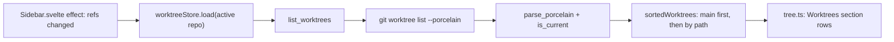
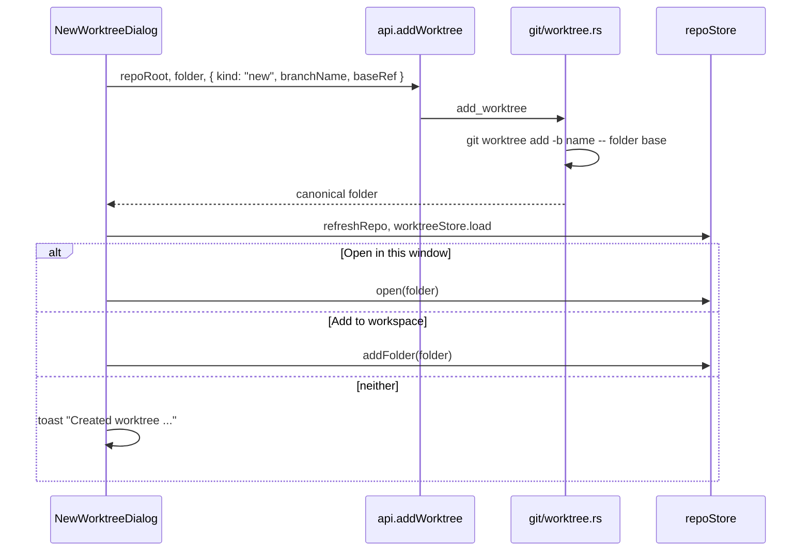

# How Worktrees Work

Git Manager lists, creates, locks, removes and prunes linked worktrees (`git worktree`), and opens any worktree folder as a repository. For the user side, see [Worktrees](../usage/Worktrees.md).

## Why we need it

A linked worktree is a second folder with another branch checked out, sharing the main repository's objects and refs. Its `.git` is a file that points into `<main>/.git/worktrees/<name>`. People use worktrees to keep a long-running branch or a hotfix open next to their main work. The app must show them, create them without the user typing paths, and still treat each folder as a normal repository: status, watcher and tabs.

## How it works

### Reading the list

`git/worktree.rs` runs `git worktree list --porcelain` and parses its records with `parse_porcelain`: `worktree <path>`, `HEAD <id>`, `branch <ref>`, `detached`, `bare`, `locked [reason]`, `prunable [reason]`. The first record is the main worktree. `list` marks the one it was read from as `is_current` by comparing canonical paths. This is a read through the CLI, an exception to "reads use git2", because the porcelain gives every field (including lock and prune reasons) in one cheap call.

`worktreeStore` keeps only the active repository's list. It reloads whenever the sidebar sees that repository's refs replaced (every refresh), so new or removed worktrees show up without a separate watcher. A failed list (for example an old git) only empties the section.

### Changing worktrees

| Action | Command | git |
| --- | --- | --- |
| New Worktree | `add_worktree(repoPath, worktreePath, branch)` | `worktree add -- <path> <branch>`, `worktree add -b <name> -- <path> <base>` or `--detach` |
| Lock / Unlock | `lock_worktree`, `unlock_worktree` | `worktree lock [--reason r] -- <path>`, `worktree unlock -- <path>` |
| Remove | `remove_worktree(..., force)` | `worktree remove [--force] -- <path>` |
| Prune | `prune_worktrees` | `worktree prune --verbose`; the report decides the toast |
| Changes check | `worktree_has_changes(worktreePath)` | git2 status with untracked files, without submodules |

`WorktreeBranch` is a tagged enum: `existing { branchName }`, `new { branchName, baseRef }` or `detached { baseRef }` (the dialog offers the first two). `add` refuses a relative path, an existing non-empty folder, and values starting with `-`, and every path goes after `--`. It returns the canonical path of the new folder.

### The dialog

`NewWorktreeDialog.svelte` loads refs and the worktree list. **Existing branch** lists only `availableBranches`: local branches not checked out in any worktree, because git refuses those. **From** offers HEAD, local and remote branches. The folder default is `defaultWorktreePath(mainRoot, branch)`: `<repo>-<branch>` next to the main worktree, with `/` and other unsafe characters turned into `-`. It follows the branch until the user types in the folder field (`folderEdited`). "Open in this window" and "Add to workspace" are two check boxes that exclude each other.

### Row menus

`worktreeActions.ts` builds the section and row menus. Remove is disabled for the main, current, locked or prunable worktree. Before removing, `worktree_has_changes` decides between "Remove Worktree" and "Worktree Has Changes" with Force Remove, both danger confirms. A worktree that is a workspace folder (with other folders left) leaves the workspace first, so no tab points at a deleted folder.

### A worktree as a repository

git2 opens a linked worktree folder like any repository. `RepoInfo.worktree` is `repo.is_worktree()`, set by `git/repo.rs` and the workspace scan, and the Changes sidebar shows a **worktree** badge. The watcher maps git dirs that are not `<root>/.git` (`git_dir_links` in `watcher.rs`): changes inside `<main>/.git/worktrees/<name>` are rewritten to the worktree's own `.git` path (`relink`), so its HEAD and index changes refresh it. The shelf lives in the common git dir and is shared (see [How the Shelf Works](How-the-Shelf-Works.md)).

## Where the code lives

| File | What it does |
| --- | --- |
| `src-tauri/src/git/worktree.rs` | `WorktreeInfo`, `WorktreeBranch`, porcelain parser, add, remove, lock, unlock, prune, `has_changes` |
| `src-tauri/src/commands/worktree.rs` | The seven `*_worktree*` commands |
| `src-tauri/src/watcher.rs` | `git_dir_links`, `relink` for external git dirs |
| `src/lib/views/git/worktrees/worktreeStore.svelte.ts` | The active repository's list |
| `src/lib/views/git/worktrees/worktreeActions.ts` | Menus and actions |
| `src/lib/views/git/worktrees/worktreeModel.ts` | Labels, tooltip, default folder, validation, sort |
| `src/lib/views/git/worktrees/NewWorktreeDialog.svelte` | The New Worktree dialog |
| `src/lib/views/sidebar/tree.ts`, `RowContent.svelte`, `src/lib/views/Sidebar.svelte` | The Worktrees section, its rows, tags and **+** button |
| `src/lib/menu/menuSpec.ts`, `menuActions.ts` | Git > Worktrees |

## Design decisions

**Folder next to the main worktree.** JetBrains does the same. A sibling folder is easy to find, never ends up inside the repository (where it would show as untracked), and the name says which branch it holds.

**Only branches git will accept.** Filtering out checked-out branches in the dialog avoids a git error after the user filled in the form.

**Reload with refs, not a watcher.** Worktrees change rarely and always change refs or the repository's git dir, which the existing refresh already sees.

**Force only after asking.** Removing a worktree with changes loses them, so the danger confirm names that case and only then passes `force`.

## Tests

- `src-tauri/src/git/worktree.rs`: `parses_every_porcelain_field`; `adds_lists_locks_removes_and_prunes_worktrees` (new and existing branch, the current worktree seen from a linked one, a non-empty folder refused, lock with a reason and unlock, a dirty worktree needs force, prune of a deleted folder); `a_worktree_folder_opens_as_a_repository` (workspace scan, `worktree` flag, status of its own).
- `src-tauri/src/commands/tests.rs`: `open_workspace_finds_linked_worktrees`.
- `src/lib/views/git/worktrees/worktreeModel.test.ts`: labels, default folder, main worktree lookup, validation and available branches.

## Keeping this page in sync

- Update this page when `git/worktree.rs`, `commands/worktree.rs` or `src/lib/views/git/worktrees/` change.
- Update [Worktrees](../usage/Worktrees.md) for any change to the section, the menus or the dialog, and retake `worktrees-section.png` and `worktrees-new-dialog.png`.
- The commands are listed in [Commands and Events](Commands-and-Events.md); the sidebar in [How Branches and Tags Work](How-Branches-and-Tags-Work.md).

## Bugs we fixed

None yet.
