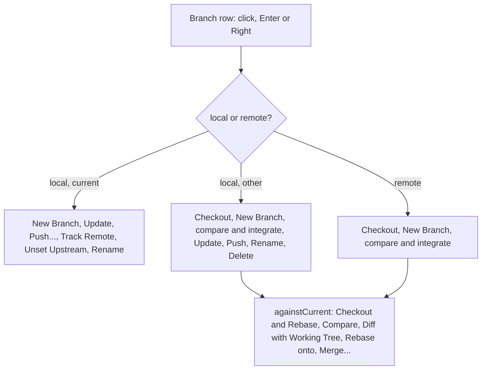

# How the Branches popup works

The Branches popup is JetBrains' branch list: a filter, New Branch, Checkout Tag or Revision, then local and remote branches, each with a submenu of actions. It opens from a repository's branch button in Changes and from **Git > Branches...**. Two of its actions open editor tabs: Compare with the current branch, and Show Diff with Working Tree. The user side is in [Branches Popup](../usage/Branches-Popup.md).

## Why we need it

The Branches sidebar shows only the active repository and acts through right-click menus. People coming from JetBrains expect one keyboard-friendly list per repository, with actions the sidebar never had: update a branch you are not on, push it, change what it tracks, compare it with yours. Opening it from each repository row also means no switch of the active repository, which would reload branches and history.

## How it works

### Opening and listing

`openBranchPicker(repoRoot)` in `views/changes/repoActions.ts` calls `gitDialogs.open({ kind: "branches", repoRoot })`. `GitDialogHost.svelte` renders `BranchesPopup.svelte` inside `GitDialogFrame`, the frame every Git dialog uses (title, Esc, footer). The popup loads refs with `loadDetails`, which reuses `repoStore.refs` for the active repository and calls `getRefs` for any other. For the active repository an effect keeps the list fresh after an action.

`filterBranches(refs, query)` in `branchPopup.ts` keeps branches whose name contains every word of the query and puts the current branch first. `trackingHint` gives the row hint, such as "origin/main, 1 ahead".

### The submenu

`localBranchActions(branch, context)` and `remoteBranchActions(remoteBranch, context)` are pure: they return the rows (labels with the branch names filled in, `disabled`, `danger`, `hint`) from a `BranchPopupContext` of the current branch, busy, operation in progress and whether remotes exist. `branchMenuItems` in `branchPopupActions.ts` maps each `BranchAction` to code and closes the popup first, as JetBrains does. The submenu itself is a `contextMenu` anchored at the row's right edge, so it gets the menu's keyboard handling for free.

With a detached HEAD there is no current branch, so `againstCurrent` offers only Show Diff with Working Tree.

### What the actions run

| Action | Code | git |
| --- | --- | --- |
| Checkout, New Branch, Rename, Delete, Rebase onto | `sidebar/actions.ts` with a `RepoTarget` | as in [How Branches and Tags Work](How-Branches-and-Tags-Work.md) |
| Merge... | `gitDialogs.open({ kind: "merge" })` | the Merge dialog |
| Checkout and Rebase onto | `checkoutAndRebase` | `rebaseWithOptions` with `onto` and `branchName` (a remote branch is checked out as its tracking branch first) |
| Update, other branch | `update_branch` | `fetch <remote> <upstream>:<branch>`, refused unless a fast-forward |
| Update, current branch | `pull_with_options` | `pull --no-rebase` or `--rebase`, from the `updateMethod` setting |
| Push, other branch | `push_branch` | `push <remote> refs/heads/<b>:<upstream>`, or `-u` to the default remote |
| Push..., current branch | the Push dialog | see [How the Git Menu Works](How-the-Git-Menu-Works.md) |
| Track Remote Branch..., Unset Upstream | `set_branch_upstream`, `unset_branch_upstream` | `branch --set-upstream-to`, `branch --unset-upstream` |

The new commands live in `src-tauri/src/commands/branch_actions.rs`. Branch names pass `reject_option`, so a name can never be read as a flag.

### Compare tabs

Compare and Show Diff open pseudo tabs, like commit tabs (see [How Commit Tabs Work](How-Commit-Tabs-Work.md)). `branchTabPath` in `stores/branchTabs.ts` encodes the reference as `branches-compare:<repo>|<branch>|<base>` or `branches-worktree:<repo>|<revision>`, URI-encoded, never starting with `/`, so it cannot clash with a file. `branchTabTitle` names the tab ("fix/tax-rates vs main") and `branchTabsInFolder` closes them with their workspace folder.

- `BranchCompareTab.svelte` calls `compare_branches`: commits in each side and not the other (at most `MAX_COMPARED`, 1000, then `truncated`) and the changed files. A file's diff comes from `revisions_file_diff`, the base on the left.
- `WorktreeDiffTab.svelte` calls `compare_with_worktree` (untracked files count as added) and `compare_with_revision` per file. It reloads when the repository's status object changes.

Both share `BranchFileList.svelte` and the normal `DiffView`.

## Where the code lives

| File | What it does |
| --- | --- |
| `src/lib/views/git/BranchesPopup.svelte` | The popup: filter, actions, list, keyboard, submenu anchor |
| `src/lib/views/git/branchPopup.ts` | Pure: filter, hints, the submenu rows |
| `src/lib/views/git/branchPopupActions.ts` | What each action runs |
| `src/lib/views/git/BranchCompareTab.svelte`, `WorktreeDiffTab.svelte`, `BranchFileList.svelte` | The two tabs |
| `src/lib/stores/branchTabs.ts` | Pseudo tab paths, titles, folder cleanup |
| `src-tauri/src/commands/branch_actions.rs` | Update, push, upstream and compare commands |

## Design decisions

**Update without checkout uses a fetch refspec.** `git fetch origin main:main` moves a branch that is not checked out, and git refuses anything but a fast-forward. No checkout, no touched files, no lost commits.

**Close the popup before acting.** Dialogs such as Rename or Merge then open on a clean screen, and a long operation shows its progress in the header rather than under a popup.

**Pure rows, tested.** Which items exist and when they are disabled is the part that grows, so it lives in `branchPopup.ts` with tests, and the component only renders.

## Tests

- `src/lib/views/git/branchPopup.test.ts`: actions for another local branch, the current branch and a remote branch, and filtering with the current branch first.
- `src/lib/stores/branchTabs.test.ts`: paths round-trip, other paths are refused, titles and folder cleanup.
- `src-tauri/src/commands/branch_actions.rs`: `update_fast_forwards_a_branch_without_checking_it_out`, `push_branch_publishes_and_then_pushes_to_the_upstream`, `upstream_is_set_and_unset`, `compares_commits_and_files_between_branches`, `compares_a_branch_with_the_working_tree`.

## Keeping this page in sync

- Update this page and [Branches Popup](../usage/Branches-Popup.md) when an action, a disabled rule or a tab changes, with a case in `branchPopup.test.ts`.
- Retake `branches-popup.png` and `branches-compare-tab.png` when they look different.
- Related: [How Repository Actions Work](How-Repository-Actions-Work.md), [How Branches and Tags Work](How-Branches-and-Tags-Work.md).

## Bugs we fixed

None yet.
