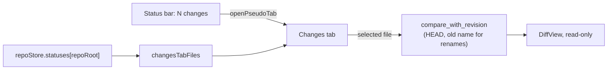
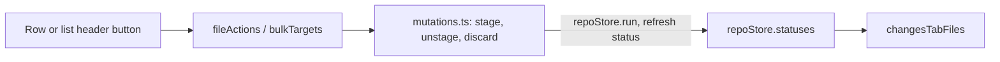

# How the Changes tab works

Clicking **N changes** in the status bar opens a **Changes** editor tab for that repository: every uncommitted file on the left, and the selected file's diff against the last commit on the right. For the user side, see [Status Bar and Help](../usage/Status-Bar-and-Help.md).

## Why we need it

The Changes sidebar splits files into Staged and Changes and shows one side at a time, which is right for building a commit. Sometimes you just want to read through everything you changed since the last commit, in a big view. The status bar count is the natural door to that view, and before this tab it only switched the sidebar, which did nothing visible when the sidebar was already open.

## How it works

The tab is a pseudo tab, like the branch compare tabs (see [How the Branches Popup Works](How-the-Branches-Popup-Works.md)). `branchTabPath({ kind: "changes", repoRoot })` in `stores/branchTabs.ts` makes `branches-changes:<repo>`, and `BranchTab.svelte` renders `ChangesTab.svelte` for it. Reusing the branch tab kind gives the tab title, closing with its workspace folder and the Auto repository follow for free.

### The file list

The list comes from the repository's status, which the store already keeps fresh, so the tab costs no extra git call and its count always matches the status bar. `changesTabFiles` in `views/git/changesTab.ts` (pure, tested) turns each `FileStatus` into one row:

- `changeAgainstHead` picks one letter for both areas, since the tab compares HEAD with the work tree: a deletion wins, then untracked, then a staged add or rename, then the work tree kind. A conflicted file has no kind and shows **C** in red.
- Conflicts come first, then the status order.
- Only renames keep `origPath`, so the diff reads the old name from HEAD.

`pickSelected` keeps the selected file while it is still changed, else falls back to the first. `stepSelection` moves with Up and Down and with the toolbar's previous and next buttons. Enter or a double-click opens the file in the editor.

### Stage, unstage and discard

Each row keeps its `FileStatus` (`status`), so the tab can act on the index like the Changes sidebar. Three pure helpers in `changesTab.ts` decide what to offer:

- `fileActions` gives a row's hover buttons: **Resolve in merge tool** for a conflict, **Unstage** when the file has staged changes, and **Discard changes** and **Stage** when it has unstaged ones. A partly staged file gets all three. A submodule gets no Discard, as in the sidebar.
- `stagedState` adds a small **staged** or **partly staged** tag, since one list mixes both areas and the letter compares with HEAD.
- `bulkTargets` collects the files for **Unstage all**, **Discard all** and **Stage all** in the list header. Conflicts are left out; they belong to the merge tool.

The buttons and the right-click menu (Stage, Unstage, Discard Changes..., Open File, Shelve Changes..., Add to .gitignore, Copy Path) call the sidebar's own `stage`, `unstage` and `discard` from `views/changes/mutations.ts`. So the confirmation dialog, the busy state and the status refresh are the same in both places, and the list updates from the new status.

### Resizing and hiding the list

The list's width is `changesListWidth` in `state.json` (default 320 px, at least 160) and whether it shows is `changesListVisible`, both on `settings` and saved like the terminal list width. A `ResizeHandle` sits between the list and the diff; it writes the width while dragging and saves on release. `changesListBounds` (pure, tested) caps the width so the diff keeps `MIN_CHANGES_DIFF_WIDTH` (240 px) in a narrow tab; the saved width stays as dragged. The toolbar's layout button calls `settings.toggleChangesList()`. With the list hidden, the toolbar shows the selected file, its letter and "2 of 5", so you still know where you are.

### The diff

`compare_with_revision` takes the file, `HEAD` and an optional `orig_path`. The backend (`diff::against_revision`) reads the old side from HEAD under `orig_path` when given, else under the path, and the new side from the work tree. Without `orig_path` a renamed file would look brand new.

A new status object means files changed on disk, so an `$effect` loads the diff again. The loaded diff and any error are stored with their file path, so picking another file never shows the previous file's diff while the new one loads. Submodules, and repositories with no commits yet, show a short note instead of a diff.

## Where the code lives

| File | What it does |
| --- | --- |
| `src/lib/views/git/ChangesTab.svelte` | The tab: file list, row and header actions, menu, keyboard, diff loading |
| `src/lib/views/git/changesTab.ts` | `changeAgainstHead`, `changesTabFiles`, `fileActions`, `stagedState`, `bulkTargets`, `pickSelected`, `stepSelection`, `changesListBounds` |
| `src/lib/views/changes/mutations.ts` | `stage`, `unstage`, `discard`, shared with the Changes sidebar |
| `src/lib/stores/settingsData.ts` | `changesListWidth` and `changesListVisible`, validated |
| `src/lib/stores/branchTabs.ts` | The `changes` kind: path, title, folder cleanup |
| `src/lib/views/StatusBar.svelte` | Opens the tab from the changes count |
| `src-tauri/src/git/diff.rs` | `against_revision` with the optional old name |
| `src-tauri/src/commands/history.rs` | `compare_with_revision` |

## Design decisions

**Compare with HEAD, not the index.** The question the tab answers is "what did I change since the last commit", so staged and unstaged edits show as one diff. Staging stays in the Changes sidebar.

**Read-only diff, file-level staging.** Hunk staging needs a side (index or work tree), and this diff compares HEAD with the work tree, so it stays read-only. Whole files can be staged, unstaged and discarded from the list, which covers the common "clean up before committing" pass without switching to the sidebar. The diff's Open File button and a double-click lead to editing.

**One list, not two groups.** Splitting the list into Staged and Changes would show a partly staged file twice with the same diff. One row per file with the right buttons and a staged tag keeps the list matching the diff.

**Discard means unstaged changes.** As in the sidebar, Discard restores the staged version, so staged work is never thrown away by accident. Unstage first to discard everything.

**One list setting for every Changes tab.** The width and the hidden state are a layout habit, like the sidebar width, so they live in `state.json` and apply to every repository's tab.

**Live, not a snapshot.** The list follows the status, so files you commit or discard leave the tab at once.

## Tests

- `src/lib/views/git/changesTab.test.ts`: one kind per file, conflicts first, old names only for renames, row actions per area (submodules without Discard), staged tags, bulk targets without conflicts, selection kept and stepped, list width bounds.
- `src/lib/stores/settingsData.test.ts`: `changesListWidth` and `changesListVisible` are validated and saved.
- `src/lib/stores/branchTabs.test.ts`: the `changes` path round-trips, bad paths are refused, and the title.
- `src-tauri/src/commands/history.rs`: `compare_with_revision_reads_a_renamed_file_by_its_old_name`.

## Keeping this page in sync

- Update this page when `ChangesTab.svelte`, `changesTab.ts`, `mutations.ts` or `compare_with_revision` change.
- Update [Status Bar and Help](../usage/Status-Bar-and-Help.md) for new clicks or keys.
- Related: [How the Status Bar Works](How-the-Status-Bar-Works.md), [How the Branches Popup Works](How-the-Branches-Popup-Works.md).
