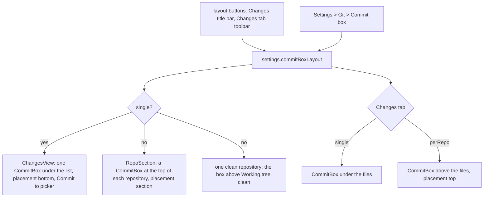

# How the commit box layout works

This chapter explains how the commit box moves between one box under the Changes list and one box per repository. The user side is in [Commit Box Layout](../usage/Commit-Box-Layout.md); the commit box itself (drafts, amend, templates, the commit flow) is in [How changes and commits work](How-Changes-and-Commits-Work.md).

## Why we need it

JetBrains IDEs have one commit box at the bottom and a picker for the repository. VS Code gives every repository in Source Control its own message box. People who switch from VS Code with a workspace of several repositories want to see and write every message at once, while others prefer the short list and one fixed place. The user asked for both, switched from the Changes title bar and from Settings.

## How it works

One preference, `commitBoxLayout` (`"single"` or `"perRepo"`, in `settings.json`), decides where `CommitBox.svelte` is mounted. Nothing else about committing changes.

### One box component, three placements

`CommitBox.svelte` takes `placement`:

- `bottom`: the single box, with a top border and, with several repositories, the **Commit to** picker.
- `top`: the same box above a list (the Changes tab), with the border at its foot.
- `section`: inside a repository's section. No picker (the section names the repository), a 56 px message instead of 96 px, a transparent background, and no Sync Changes button, since the section header (`RepoActions`) already has push, pull and publish. The placeholder names the branch, as VS Code does.

`RepoSection.svelte` gets `commitBox` and renders the box under its header, before the Conflicts, Staged and Changes groups, while the section is expanded.

### Drafts are per repository already

`commitDraft.for(repoRoot)` keeps a message, the amend state and the template per repository. Every box reads its own draft, so the single box, a section's box and the Changes tab's box of the same repository all show the same text, and switching the layout loses nothing.

### Keys inside the list

The repositories' boxes sit inside the Changes list, whose key handler moves the selection with Up and Down and stages with Space. `onListKeydown` in `ChangesView.svelte` now returns at once for keys typed in an input, textarea or select, so typing a message never moves the selection, and Up in an empty box still opens the message history.

## Where the code lives

| File | What it does |
| --- | --- |
| `src/lib/stores/settingsData.ts` | `CommitBoxLayout`, `COMMIT_BOX_LAYOUT_CHOICES`, the default and validation |
| `src/lib/views/changes/CommitBox.svelte` | The `placement` prop and its styles |
| `src/lib/views/changes/RepoSection.svelte` | The box at the top of a section |
| `src/lib/views/ChangesView.svelte` | The title bar button, where the boxes go, the key guard |
| `src/lib/views/git/ChangesTab.svelte` | The toolbar button and the box above or under the files |
| `src/lib/views/changes/CommitLayoutIcon.svelte` | The button's icon: one box at the foot, or one in each half |
| `src/lib/views/SettingsDialog.svelte`, `settings/settingsSearch.ts` | The Commit box row and its search words |

## Design decisions

**A preference, not view state.** The layout is a habit, like the diff layout, so it lives in `settings.json`, applies to every window and shows in Settings. The buttons are shortcuts to the same value.

**Reuse the box.** A second, smaller commit component would have to copy amend, history, templates and Commit Options. One component with a placement keeps every feature in both layouts.

**No sync button in a section.** The section header already shows the sync, push and publish actions; a second button in every repository would only make the list longer.

**Clean repositories get no box.** With several repositories, the clean ones are folded into **No Changes**. A single clean repository keeps its box so Amend stays one click away.

## Tests

- `src/lib/stores/settingsData.test.ts`: `commitBoxLayout` defaults to single and rejects unknown values.
- `src/lib/views/settings/settingsSearch.test.ts`: every Settings row, the Commit box row too, is in the search index.

The placements and the key guard need a visual check in the app: `commit-box-per-repo` in `scripts/screenshots.ts`.

## Keeping this page in sync

- Update this page and [Commit Box Layout](../usage/Commit-Box-Layout.md) when a placement or the setting changes.
- Retake `commit-box-per-repo.png`. See [Docs and Screenshots](Docs-and-Screenshots.md).
