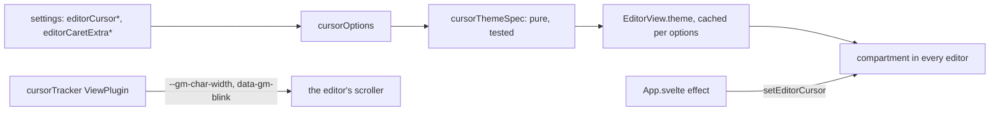

# How the Cursor Works

The editors' cursor can change its shape, width, blinking and height, like VS Code's cursor settings plus Sublime Text's `caret_extra_top` and `caret_extra_bottom`. The user side is in [Editing Code](../usage/Code-Appearance.md#the-cursor).

## Why we need it

People come from VS Code, JetBrains and Sublime Text with strong habits about the cursor. A thin line is easy to lose on a big screen; a block or a taller caret is easier to find. The settings cost nothing while unchanged: they are a small theme in one compartment.

## How it works

CodeMirror's `drawSelection` draws each cursor as a `.cm-cursor` element inside the `.cm-cursorLayer`, positioned and sized inline by CodeMirror, and blinks the whole layer with its `cm-blink` animation. `cursor.ts` styles those elements instead of drawing its own.

- **Shape.** Line styles use `border-left` (the width, or 1 px for Line thin) with a negative half-width margin so the line sits in the gap between characters. Block, Block outline and the underlines are one character wide, from `--gm-char-width`. A block is filled with the cursor color at 55%, so the character under it stays readable in every theme; Block outline uses an inset `outline` so the size does not change.
- **Extra height.** CodeMirror sets the element's height inline. Padding on top and bottom, with `box-sizing: content-box`, makes the element taller than that height, and a negative top margin moves it up by the extra top. The border, fill or outline covers the padding.
- **Blinking.** The theme turns the layer's animation off (`animation: none !important`, which beats CodeMirror's inline animation name) and animates each cursor with keyframes named after the mode. Blink is `steps(1)` over 1.2 s, CodeMirror's rate; Smooth, Phase and Expand use VS Code's frames over 0.6 s, alternating. Solid adds no animation.
- **Restart on move.** VS Code keeps the cursor visible while you type. Each mode has two identical keyframe copies, `-a` and `-b`. `cursorTracker` flips `data-gm-blink` on the scroller after every selection or document change, so the other copy starts from its first, visible frame.
- **Character width.** `cursorTracker` writes `view.defaultCharacterWidth` to `--gm-char-width` on the scroller when the editor is created and when its geometry changes, for example after a font size change.
- **Smooth caret.** A short `left` and `top` transition. CodeMirror reuses the cursor element when only its position changes, so the transition plays.
- **Live changes.** `editorCursor` adds a registry plugin and a compartment, like `whitespace.ts`. The effect in `App.svelte` calls `setEditorCursor`, which reconfigures the compartment in every open editor.

## Where the code lives

| File | What it does |
| --- | --- |
| `src/lib/editor/cursor.ts` | `cursorOptions`, `cursorThemeSpec`, `cursorTracker`, `editorCursor`, `setEditorCursor` |
| `src/lib/editor/setup.ts` | Adds `editorCursor(cursorOptions(settings))` to every editor, diff and merge pane |
| `src/lib/App.svelte` | The effect that applies changed cursor settings |
| `src/lib/stores/settingsData.ts` | The six keys, their choices, ranges and validation |
| `src/lib/views/SettingsDialog.svelte` | The rows in Settings, Editor |

## Design decisions

**Style CodeMirror's cursor, do not replace it.** CodeMirror already places cursors for every selection range, bidirectional text and wrapped lines. Drawing our own would repeat that work and its bugs.

**Use the default character width.** A block over a wide character, such as a tab, is one normal character wide. Measuring the character under every cursor would cost a layout read on each move for a small gain with monospace fonts.

**Write to the scroller, not the editor root.** CodeMirror rewrites the root's `class` from its attributes facet, which would drop a class we set by hand. The scroller is never rewritten, so the data attribute and the variable stay.

**Cache one theme per set of options.** Each `EditorView.theme` adds style rules to the page. Dragging a slider back and forth reuses the cached themes instead of adding new rules each time.

**VS Code's default of 2 px.** The old fixed cursor was about 1.2 px. Line thin keeps a thin cursor for anyone who prefers it.

## Tests

- `src/lib/editor/cursor.test.ts`: each shape, the width and thin styles, the extra height, smooth movement, the layer blink turned off, the two keyframe copies and each blinking mode.
- `src/lib/stores/settingsData.test.ts`: defaults and the clamping of hand-edited cursor values.

How the cursor looks needs a visual check in the app.

## Keeping this page in sync

- Update this page and [Editing Code](../usage/Code-Appearance.md#the-cursor) when a cursor setting or its behavior changes.
- Update [Settings Reference](Settings-Reference.md) when a key, default or range changes.

## Bugs we fixed

None yet.
