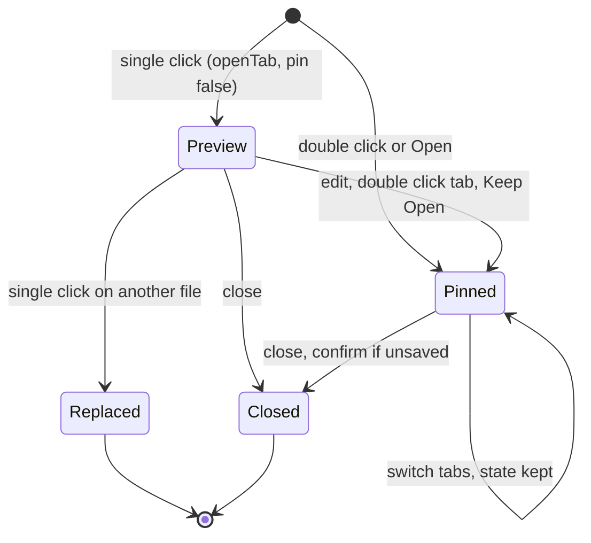
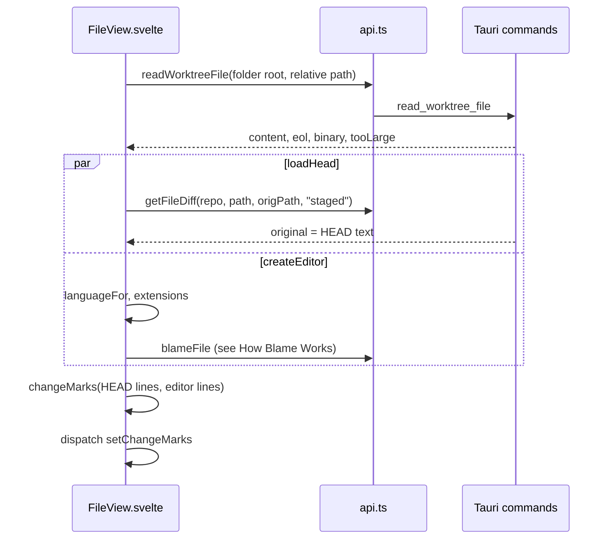

# How the editor works

Every file you open gets a tab with a CodeMirror 6 editor, with change markers against the last commit, inline conflict actions, blame, and next or previous change navigation. The user side is in [Editor and Tabs](../usage/Editor-and-Tabs.md).

## Why we need it

Fixing a conflict or a typo should not mean switching to another editor. People expect the tabs of VS Code and JetBrains: a single click previews a file, a double click or an edit keeps it open, and every tab remembers its cursor, undo history and unsaved text.

CodeMirror 6 is small, renders only visible lines and loads languages on demand, which keeps memory low.

## How it works

### Tabs

The tab rules are pure functions in `src/lib/stores/tabs.ts`. `repoStore` holds `tabs` and `openFilePath` (both absolute paths) and applies each result with `applyTabs`.

`openTab` reuses the preview tab only when it has no unsaved edits. `setTabDirty` pins a preview tab when you type. `closeTabs` moves focus to the right neighbour, else the left, and `repoStore.closeTabs` asks before discarding unsaved work. `tabLabels` adds the folder name when two tabs share a file name. A tab can also hold a commit ([How commit tabs work](How-Commit-Tabs-Work.md)).

`EditorTabs.svelte` draws the strip: the Diff tab (only while a change is selected in Changes), then the file tabs, with middle click to close and a context menu (Keep Open, Close, Close Others, Close to the Right, Close All, Copy Path, Copy Relative Path).

`Workspace.svelte` renders one `FileView` per tab and hides the inactive ones, so a tab keeps its editor state while you look at another one. Its window shortcuts come from the pure `workspaceShortcut`.

### Opening a file and its markers

`read_file` flags files over 4 MB (`MAX_OPEN_BYTES`) and binary content, so neither opens in an editor. Line endings are normalized to LF, and the original `eol` is kept for saving. Reads and writes go through the workspace folder holding the file (`folderFor`), so files outside any repository work too.

The editor is built from `baseExtensions` in `src/lib/editor/setup.ts` plus:

- `conflictMarkers` for the inline conflict actions (see [How conflict resolution works](How-Conflict-Resolution-Works.md)),
- `changeMarkField`, `changeGutter` and `scrollMarkers` for the colored gutter bars and the overview ruler beside the scrollbar,
- `blameExtension` for blame (see [How blame works](How-Blame-Works.md)).

`changeMarks` in `src/lib/editor/lineDiff.ts` is a line-level Myers diff, fast when the texts are mostly equal. Past `MAX_EDITS` (4000) it marks the whole range as one change. It reruns 200 ms after you stop typing. `markSource` merges conflict regions over plain changes, so conflicts always win in the gutter and the ruler.

**Previous** and **Next** (also Shift+F7 and F7) use `sectionAt` and `sectionTarget` from `src/lib/editor/navigation.ts`, which wrap around the file. Cmd+S saves through `writeWorktreeFile` with the remembered `eol`, then refreshes that repository's status. The dirty flag compares the document with the last saved `baseline`.

A tab without unsaved edits reloads when the repository status changes, so outside changes show up. The visible tab reports its cursor, tab size, line ending and language to `editorStatus`.

Two settings live outside the editor. Ctrl or Cmd plus the mouse wheel zooms through `WheelZoom` in `App.svelte`, only over a `.cm-editor`. Font ligatures are a `data-ligatures` root attribute set by `applyAppearance` and styled in `src/app.css`.

## Where the code lives

| File | What it does |
| --- | --- |
| `src/lib/views/files/FileView.svelte` | One editor tab: load, save, markers, navigation, breadcrumbs, actions |
| `src/lib/views/EditorTabs.svelte` | The tab strip and its menu |
| `src/lib/views/workspaceShortcuts.ts` | Which window shortcut a key means; skips handled keys |
| `src/lib/views/EmptyMain.svelte` | The main area when no diff, file or Log is open |
| `src/lib/stores/tabs.ts` | Pure tab rules |
| `src/lib/stores/repo.svelte.ts` | `openFile`, `pinFile`, `setDirty`, `closeTabs` |
| `src/lib/editor/setup.ts` | Theme, `baseExtensions`, lazy `languageFor`, `languageName` |
| `src/lib/editor/lineDiff.ts` | `diffLines` and `changeMarks` |
| `src/lib/editor/scrollMarkers.ts` | Overview ruler and change gutter |
| `src/lib/editor/navigation.ts` | Next and previous section |
| `src/lib/editor/wheelZoom.ts` | Ctrl + wheel font size steps |
| `src-tauri/src/git/files.rs` | `read_file` |

## Design decisions

**Keep one live editor per tab.** Undo history and cursor survive tab switches. The cost is memory per tab, and closing a tab destroys its view.

**Diff against HEAD in the UI.** The committed text is fetched once, and a small line diff runs as you type. Asking git on every keystroke would be slow.

**Word wrap only in the file editor.** In side by side diffs and the merge tool, wrapping would misalign the panes. Open tabs pick up a change only after they reopen.

## Bugs we fixed

**Toolbar buttons overlapped, including Save.**
- **The issue:** a conflicted file has many buttons, and opening the Files panel made them overlap.
- **Why it happened:** all actions shared one fixed row that could not grow.
- **The fix and why we chose it:** menus were tried, but the user wanted every option visible. The title row holds the breadcrumbs and badges, and a separate `.actions` row wraps, so the editor shrinks to fit.

**Breadcrumbs hidden by a wide right sidebar.**
- **The issue:** with the Files panel wide, part of the path disappeared.
- **Why it happened:** the crumbs scrolled sideways on one line.
- **The fix and why we chose it:** `.crumbs` wraps too. Each chevron lives inside the segment after it, so no line ends with a dangling separator.

**The Diff tab could not be closed.**
- **The issue:** the Diff tab always showed a file and had no close button.
- **Why it happened:** it was a fixed tab, and `changesSelection.sync` picked the first changed file on its own.
- **The fix and why we chose it:** the tab shows only while a change is selected, with a close button (`changesSelection.close()`). `sync` waits until the user picks a file, so a closed tab stays closed.

**Find previous also opened Changes.**
- **The issue:** Shift+Cmd+G in the editor (find previous) also switched the sidebar to Changes, and Shift+Cmd+L with text selected also opened or closed the Log.
- **Why it happened:** CodeMirror uses these keys for its search, and the window shortcut handler in `Workspace.svelte` ran as well, without checking whether the key was already handled.
- **The fix and why we chose it:** the decision moved to a small pure function, `workspaceShortcut` in `workspaceShortcuts.ts`, which skips a key when `event.defaultPrevented` is set, like every other window key handler. Inside an editor the editor's action wins, as in other Mac apps, and outside an editor the app shortcut still works. Shortcuts CodeMirror does not use, such as Cmd+B and Ctrl+-, keep working while you type.

## Tests

- `src/lib/stores/tabs.test.ts`: preview replacement, pinning, dirty tabs, closing and labels.
- `src/lib/editor/lineDiff.test.ts`, `navigation.test.ts`, `wheelZoom.test.ts` and `languageName.test.ts`.
- `src/lib/views/workspaceShortcuts.test.ts`: the window shortcuts, and skipping handled keys, dialogs and the merge tool.
- `src-tauri/src/commands/tests.rs`: `read_worktree_file_normalizes_crlf_and_detects_binary`, `write_worktree_file_applies_eol` and `worktree_file_commands_work_in_a_plain_folder`.

Put new tab, shortcut or navigation rules in the pure modules, with tests. Header wrapping needs a visual check at narrow widths. See [Testing](Testing.md).

## Keeping this page in sync

- Update this page when tab rules, window shortcuts, editor extensions, markers or the header layout change.
- Update [Editor and Tabs](../usage/Editor-and-Tabs.md) for visible changes.
- Retake `editor-tabs.png`, `editor-change-markers.png` and `empty-main.png`. See [Docs and Screenshots](Docs-and-Screenshots.md).
