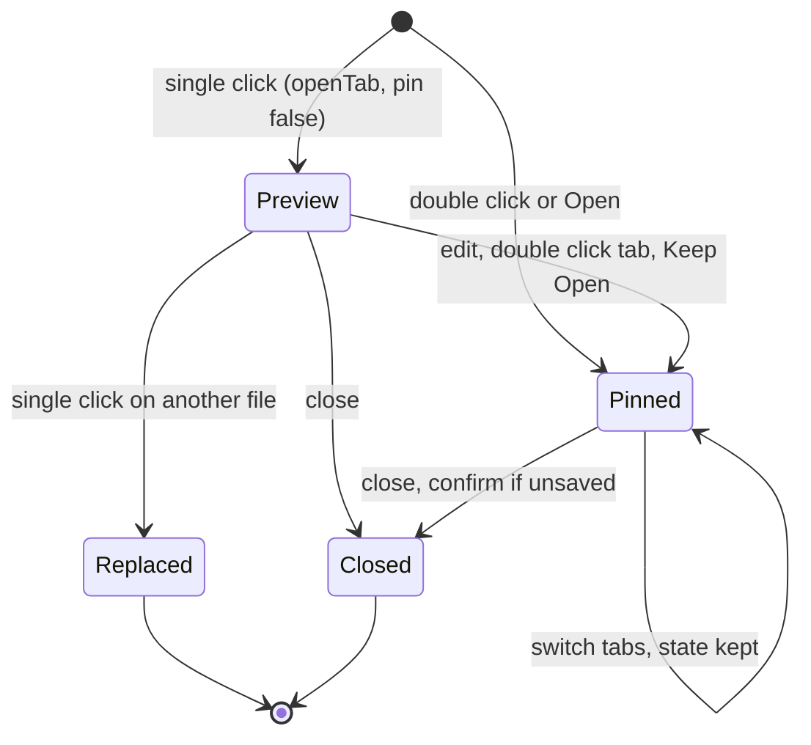
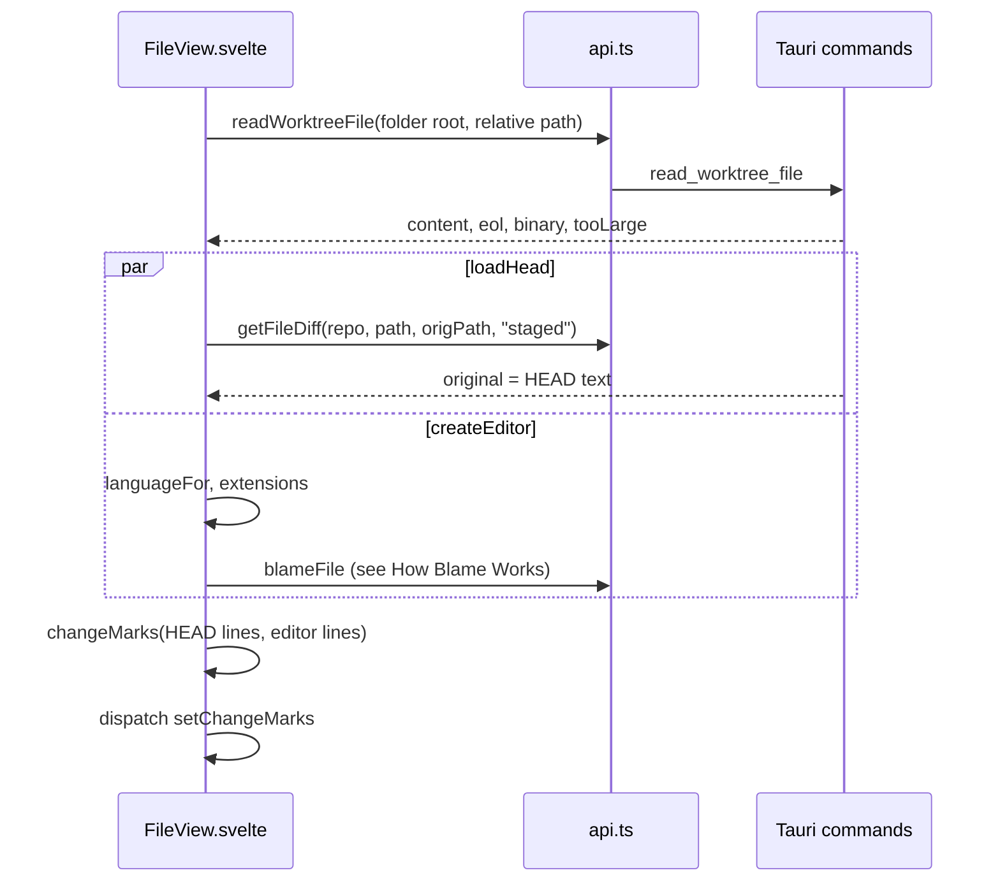

# How the editor works

Every file you open gets a tab with a CodeMirror 6 editor, with change markers against the last commit, inline conflict actions, blame, and next or previous change navigation. The user side is in [Editor and Tabs](../usage/Editor-and-Tabs.md). Commands, keys and the look of the text are in [How editing code works](How-Editing-Code-Works.md), the bar above the code in [How the path bar works](How-the-Path-Bar-Works.md), and the Markdown preview in [How the Markdown Editor Works](How-the-Markdown-Editor-Works.md).

## Why we need it

Fixing a conflict or a typo should not mean switching editors. People expect VS Code and JetBrains tabs: a single click previews, a double click or an edit keeps the tab, and every tab remembers its cursor, undo history and unsaved text. CodeMirror 6 is small, renders only visible lines and loads languages on demand.

## How it works

### Tabs

The tab rules are pure functions in `src/lib/stores/tabs.ts`; `repoStore` holds `tabs` and `openFilePath` (absolute paths) and applies each result with `applyTabs`.

`openTab` reuses the preview tab only when it has no unsaved edits. `setTabDirty` pins a preview tab when you type. `closeTabs` moves focus to the right neighbour, else the left, and `repoStore.closeTabs` asks before discarding unsaved work. `tabLabels` adds the folder name when two tabs share a file name, and `adjacentTab` serves Next Tab and Previous Tab.

A tab can also hold a commit, a terminal, a Git history or compare view, a shelved file, a branch comparison or a branch against the working tree. Each has a pseudo path that never starts with `/`, checked by `isPseudoTab` (`stores/pseudoTabs.ts`). See [How commit tabs work](How-Commit-Tabs-Work.md#other-tabs-that-are-not-files) and [How the terminal works](How-the-Terminal-Works.md).

`EditorTabs.svelte` draws the strip: the Diff tab (while a change is selected), then the tabs. `Workspace.svelte` renders one `FileView` per file tab and hides the inactive ones, so each keeps its state.

Right under the strip, each `FileView` draws one slim bar, like JetBrains: the breadcrumbs and badges, then icon buttons for the change arrows, Blame, Copy relative path and the Markdown view switch. How it collapses when narrow, and why it replaced two rows, is in [How the path bar works](How-the-Path-Bar-Works.md).

### Opening a file and its markers

`read_file` flags files over 4 MB (`MAX_OPEN_BYTES`) and binary content. Line endings become LF, and the original `eol` is kept for saving. Paths go through the workspace folder holding the file (`folderFor`), so files outside any repository work too.

The editor is built from `baseExtensions` in `src/lib/editor/setup.ts` (the theme, the find bar, the Code menu keys, render whitespace and the current line highlight) plus:

- `conflictMarkers` for the inline conflict actions (see [How conflict resolution works](How-Conflict-Resolution-Works.md)),
- `changeMarkField`, `changeGutter` and `scrollMarkers` for the colored gutter bars and the overview ruler beside the scrollbar,
- `blameExtension` for blame (see [How blame works](How-Blame-Works.md)).

`changeMarks` in `src/lib/editor/lineDiff.ts` is a line-level Myers diff that reruns 200 ms after you stop typing; past `MAX_EDITS` (4000) it marks the whole range as one change. `markSource` lets conflict regions win over plain changes. **Previous** and **Next** (Shift+F7 and F7) use `sectionTarget` from `navigation.ts`, which wraps around.

### Saving and reverting

There are no Save or Revert buttons. Each `FileView` registers `save` and `revert` with `fileCommands` (`stores/fileCommands.svelte.ts`), keyed by its path, and the File menu handlers in `menuActions.ts` call the active tab's entry: **Save** (Cmd+S, also in the editor's keymap), **Save All** (Option+Cmd+S, every dirty tab, one toast) and **Revert File**, which asks first when there are unsaved edits.

Saving writes through `writeWorktreeFile` with the remembered `eol` and refreshes the repository's status. A tab without unsaved edits reloads when that status changes.

## Where the code lives

| File | What it does |
| --- | --- |
| `src/lib/views/files/FileView.svelte` | One editor tab: load, save, markers, navigation, the path bar |
| `src/lib/views/EditorTabs.svelte` | The tab strip and its menu |
| `src/lib/views/EmptyMain.svelte` | The empty editor area with the Navigation Bar; buttons reuse `openQuickOpen`, `openFileSearch`, `openNavigationBar` |
| `src/lib/views/workspaceShortcuts.ts` | Which window shortcut a key means |
| `src/lib/stores/tabs.ts` | Pure tab rules |
| `src/lib/stores/pseudoTabs.ts` | `isPseudoTab` for tabs that are not files |
| `src/lib/stores/fileCommands.svelte.ts` | Save and Revert of each open editor, for the menus |
| `src/lib/stores/repo.svelte.ts` | `openFile`, `pinFile`, `setDirty`, `closeTabs` |
| `src/lib/editor/setup.ts` | Theme, `baseExtensions` (with the [editor features](How-Editor-Features-Work.md)) |
| `src/lib/editor/languages.ts` | Language names and lazy `languageFor` |
| `src/lib/editor/activeLine.ts` | The current line highlight |
| `src/lib/editor/lineDiff.ts` | `diffLines` and `changeMarks` |
| `src/lib/editor/scrollMarkers.ts`, `navigation.ts` | Ruler, gutter, next and previous section |
| `src-tauri/src/git/files.rs` | `read_file` |

## Design decisions

**Keep one live editor per tab.** Undo history and cursor survive tab switches. The cost is memory per tab; closing a tab destroys its view.

**Diff against HEAD in the UI.** The committed text is fetched once and a small line diff runs as you type, instead of asking git on every keystroke.

**Save and Revert in the File menu.** The native menu bar has Save, Save All and Revert File, like other Mac editors, so the path bar keeps only the actions that live nowhere else.

**Word wrap only in the file editor.** In diffs and the merge tool, wrapping would misalign the panes. `editor/wordWrap.ts` keeps `lineWrapping` in a compartment, so View > Word Wrap and Option+Z (`toggleWordWrap`, matched by `event.code`) reach open editors at once.

## Bugs we fixed

**A selection inside one line was invisible.**
- **The issue:** selecting text inside one line showed no selection at all.
- **Why it happened:** CodeMirror draws the selection behind the text, and the opaque current line background on the cursor's line covered it.
- **The fix and why we chose it:** `activeLine.ts` highlights the current line only while nothing is selected, like VS Code and JetBrains, tested in `activeLine.test.ts`. It was found with the MCP `inspect_elements` tool in the real app.

The toolbar and breadcrumb bugs moved with the bar to [How the path bar works](How-the-Path-Bar-Works.md#bugs-we-fixed).

**The Diff tab could not be closed.**
- **The issue:** the Diff tab always showed a file and had no close button.
- **Why it happened:** it was a fixed tab, and `changesSelection.sync` picked the first changed file on its own.
- **The fix and why we chose it:** the tab shows only while a change is selected, with a close button, and `sync` waits for the user to pick a file.

**Find previous also opened Changes.**
- **The issue:** Shift+Cmd+G in the editor (find previous) also showed Changes, and Shift+Cmd+L also toggled the Log.
- **Why it happened:** the window handler in `Workspace.svelte` ran too, without checking whether the editor had handled the key.
- **The fix and why we chose it:** the pure `workspaceShortcut` skips a key when `event.defaultPrevented` is set, like every window key handler, so inside an editor the editor's action wins.

## Tests

- `src/lib/stores/tabs.test.ts`: preview replacement, pinning, dirty tabs, closing, labels and `adjacentTab`.
- `src/lib/editor/lineDiff.test.ts`, `navigation.test.ts`, `activeLine.test.ts` and `languageName.test.ts`.
- `src/lib/views/workspaceShortcuts.test.ts`: the window shortcuts and the keys they skip.
- `src-tauri/src/commands/tests.rs`: `read_worktree_file_normalizes_crlf_and_detects_binary`, `write_worktree_file_applies_eol` and `worktree_file_commands_work_in_a_plain_folder`.

Put new rules in the pure modules, with tests. The path bar needs a visual check at narrow widths ([How the path bar works](How-the-Path-Bar-Works.md#tests)). See [Testing](Testing.md).

## Keeping this page in sync

- Update this page and [Editor and Tabs](../usage/Editor-and-Tabs.md) when tabs, shortcuts, extensions, markers or saving change. Dragging, pinning and wrapping tabs are in [How tabs are arranged](How-Tabs-Are-Arranged.md).
- A new pseudo tab kind goes into `isPseudoTab` and the table in [How commit tabs work](How-Commit-Tabs-Work.md).
- Retake `editor-tabs.png`, `editor-change-markers.png` and `empty-main.png`. See [Docs and Screenshots](Docs-and-Screenshots.md).
