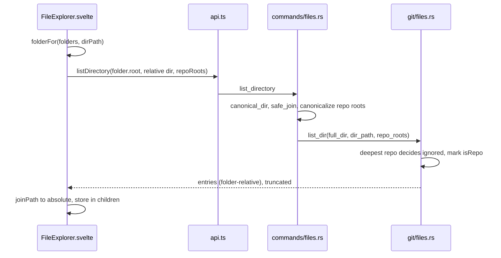
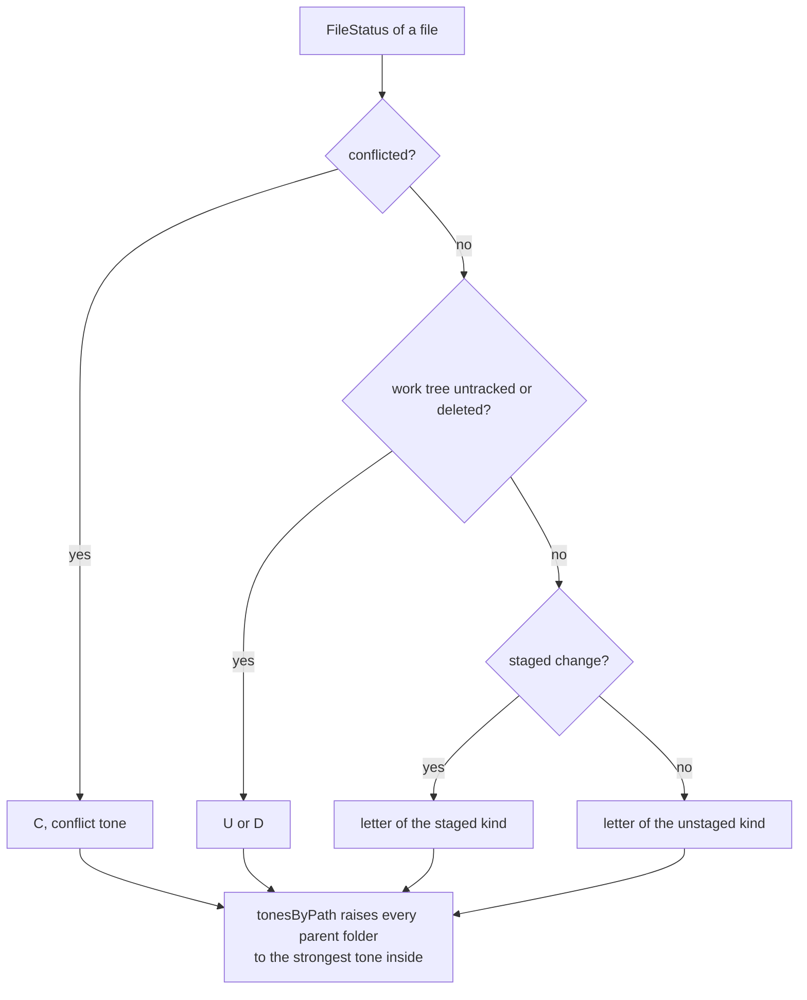

# How the Files panel works

The Files panel is the tree on the right: every workspace folder, each file colored by its git status, opening in editor tabs. The user side is in [Files Panel](../usage/Files-Panel.md).

## Why we need it

People want to browse and open files without leaving the app, like VS Code's explorer, and see at a glance what git did to each file, with VS Code's U, A, M, D, R, T and C letters.

A workspace can be very large (think `node_modules`), so the panel loads one folder level at a time, renders only the visible rows and throws away the contents of folders you collapse.

## How it works

`FileExplorer.svelte` keeps loaded folders in `children`, a map keyed by the **absolute** folder path, and the open folders in `expanded`. Expanding a folder calls `loadDir`:

`list_dir` hides `.git`, follows symlinked folders so they can be expanded, and sorts folders first. A folder with more than `MAX_ENTRIES` (5,000) entries sets `truncated` and keeps the first 5,000 in sort order, using a bounded heap so memory does not grow with the folder. Only the deepest repository that contains the listed folder decides what is ignored, so each call opens at most one repository. A folder that is itself a repository root gets `isRepo` and is never dimmed, even when the parent's `.gitignore` lists it.

### Status letters and colors

The panel reuses `repoStore.statuses` instead of asking the backend. `workspaceFiles` joins every repository's changed files to absolute paths, and three pure helpers in `tones.ts` turn them into marks:

- `marksByPath` gives each file its letter and a tooltip such as "Added (staged), modified (not staged)". The work tree wins over the index, since it is the file as it is now.
- `tonesByPath` colors files and gives every folder the strongest tone of its contents (conflict, then modified, then added, then deleted).
- `deletedByFolder` lists files deleted from disk, so `entriesOf` can show them struck through in the folder they came from.

### Rows, refresh and actions

`rows` flattens the expanded tree into a list. With several folders, each folder becomes a top-level row. Rows are 24 px high and only the visible slice (plus `OVERSCAN` rows) is rendered.

An effect watches `repoStore.statuses`, `repoStore.workspaceVersion` and `repoStore.repos`, and after 250 ms `refreshLoaded` reloads the roots and every expanded folder. For the watcher events, see [How workspaces work](How-Workspaces-Work.md).

A single click calls `repoStore.openFile(path)`, which opens a preview tab. A double click passes `{ pin: true }`. The context menu adds Open, Open Preview, Resolve Conflict (`repoStore.openMerge`), Set as Active Repository, Initialize Repository Here, Add or Remove Folder, and the two copy actions. Arrow keys and Enter move through the tree.

The panel is shown by `settings.explorerOpen`. The Files icon in `RightActivityBar.svelte` and Option+Cmd+B call `settings.toggleExplorer()`.

## Where the code lives

| File | What it does |
| --- | --- |
| `src/lib/views/files/FileExplorer.svelte` | Tree state, lazy loading, virtual rows, keyboard and context menu |
| `src/lib/views/files/tones.ts` | `marksByPath`, `tonesByPath`, `deletedByFolder` |
| `src/lib/views/RightActivityBar.svelte` | The Files toggle on the right edge |
| `src/lib/views/Workspace.svelte`, `workspaceShortcuts.ts` | Panel widths and the Option+Cmd+B shortcut |
| `src/lib/ui/ResizeHandle.svelte` | The drag handle that resizes the side panels |
| `src/lib/ui/Icon.svelte`, `src/lib/ui/icons.ts` | Inline stroke icons used in the tree and across the app |
| `src-tauri/src/commands/files.rs` | `list_directory` and `read_worktree_file` |
| `src-tauri/src/git/files.rs` | `list_dir`, ignore checks, `read_file` |
| `src-tauri/src/commands/mod.rs` | `safe_join`, which refuses paths that escape the folder |
| `src/lib/stores/workspacePaths.ts` | `folderFor`, `joinPath`, `relativeTo`, `locateAbsolute` |

## Design decisions

**Load one level at a time.** A full tree of a big workspace would cost seconds and memory; loading on expand keeps the first paint instant.

**Collapse frees memory.** `collapse` deletes the loaded contents below a folder; keeping them would make memory only grow. Workspace folder roots keep their listing.

**Reuse the store's statuses.** A second status call per folder would duplicate work the Changes sidebar already paid for.

**The deepest repository decides ignores.** Checking every repository per entry would open many repositories per call and could disagree with git about nested repositories.

**Show deleted files in place.** A struck-through name where the file used to be is clearer than a missing row.

## Bugs we fixed

**Nested repository shown as a folder change.**
- **The issue:** a nested repository showed as an untracked `dir/` of its parent, coloring the folder as changed.
- **Why it happened:** git reports another repository's folder as a single untracked path ending in `/`.
- **The fix and why we chose it:** `status::read` skips such an entry when the folder is a nested repository (`is_nested_repo`), and `workspaceFiles` also skips any path ending in `/`. The nested repository's own status fills in its files.

**Option+Cmd+B did not match.**
- **The issue:** a check on `event.key` never fired, so the Files panel did not toggle.
- **Why it happened:** on macOS, Option changes the typed character, so `event.key` is not `b`.
- **The fix and why we chose it:** the shortcut (now in `workspaceShortcuts.ts`) matches `event.code === "KeyB"`, the physical key. This is a project rule for every Option shortcut.

**The editor could be squeezed too narrow.**
- **The issue:** wide side panels could squeeze the editor below its minimum width.
- **Why it happened:** the width limits ignored the two activity bars.
- **The fix and why we chose it:** `ACTIVITY_BARS` (88 px) is part of the `sidebarMax` and `explorerMax` math, so the editor keeps `MIN_MAIN` (360 px) whenever the window is wide enough. A panel never shrinks below `MIN_PANEL` (200 px), so in a very narrow window the editor can still get smaller.

**A huge folder showed a random 5,000 entries.**
- **The issue:** a folder with more than 5,000 entries showed 5,000 of them, but not the first 5,000 by name, so the "5000+" note was misleading.
- **Why it happened:** `list_dir` stopped reading at the limit in file system order and only then sorted.
- **The fix and why we chose it:** `list_dir` now reads every name and keeps the first 5,000 in sort order in a small heap, then checks ignores only for those. Memory stays bounded. Folder detection uses the directory entry's type and only stats symlinks, so the extra reading stays cheap.

## Tests

- `src-tauri/src/commands/tests.rs`: `list_directory_sorts_folders_first_and_marks_ignored_entries`, `list_directory_rejects_paths_outside_the_work_tree` and `list_directory_uses_the_deepest_repository_for_ignores`.
- `src-tauri/src/git/files.rs`: `cut_off_listings_keep_the_first_entries_in_sorted_order`, `a_folder_past_the_limit_still_lists_its_folders_first`, `linked_folders_count_as_folders`.
- `src/lib/views/files/tones.test.ts`: folder tones, VS Code letters, staged new files and deleted files per folder.

Extend `tones.test.ts` for letters or tones, and add a Rust test with `TestDir` for ignore rules, `isRepo` or the limit. The virtual scrolling and menus need a visual check. See [Testing](Testing.md).

## Keeping this page in sync

- Update this page when `list_dir`, the status letters, the row size or the panel actions change.
- Update [Files Panel](../usage/Files-Panel.md) for any visible change.
- Retake `files-panel.png` and `files-context-menu.png` when the tree or its menu changes. See [Docs and Screenshots](Docs-and-Screenshots.md).
