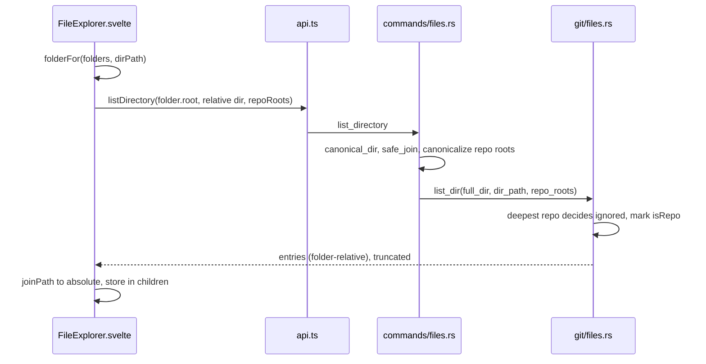
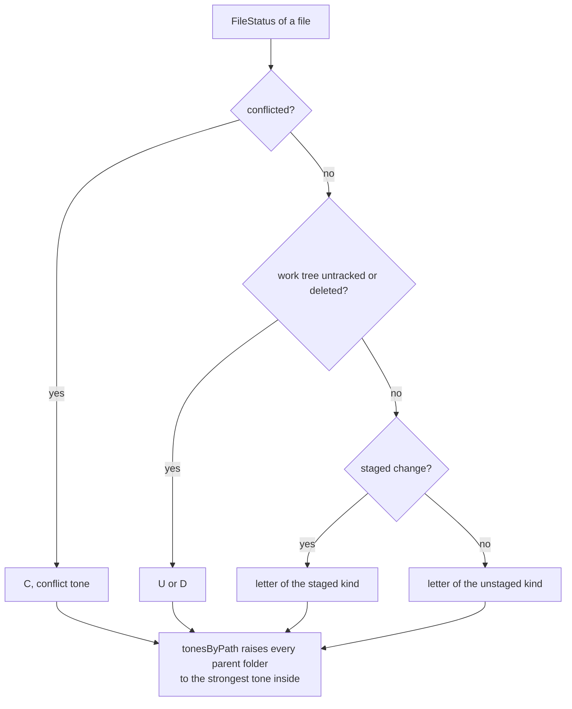

# How the Files panel works

The Files panel is the tree on the right: every workspace folder, each file colored by its git status, opening in editor tabs. The user side is in [Files Panel](../usage/Files-Panel.md).

## Why we need it

People want to browse and open files in the app, like VS Code's explorer, and see what git did to each file with VS Code's U, A, M, D, R, T and C letters. A workspace can be huge (think `node_modules`), so the panel loads one level at a time, renders only visible rows and frees collapsed folders.

## How it works

`FileExplorer.svelte` keeps loaded folders in `children`, a map keyed by the **absolute** folder path, and the open folders in `expanded`. Expanding a folder calls `loadDir`:

`list_dir` hides `.git`, follows symlinked folders, and sorts folders first. A folder with more than `MAX_ENTRIES` (5,000) entries sets `truncated` and keeps the first 5,000 in sort order. Only the deepest repository that contains the listed folder decides what is ignored, so each call opens at most one repository. A repository root gets `isRepo` and is never dimmed, even when the parent's `.gitignore` lists it.

### Status letters and colors

The panel reuses `repoStore.statuses` instead of asking the backend. `workspaceFiles` joins every repository's changed files to absolute paths, and three pure helpers in `tones.ts` turn them into marks:

- `marksByPath` gives each file its letter and a tooltip such as "Added (staged), modified (not staged)". The work tree wins over the index.
- `tonesByPath` colors files and gives every folder the strongest tone of its contents (conflict, then modified, then added, then deleted).
- `deletedByFolder` lists files deleted from disk, so `entriesOf` can show them struck through in the folder they came from.

### Rows, refresh and actions

`rows` flattens the expanded tree into a list. With several folders, each folder becomes a top-level row. Rows are 24 px high and only the visible slice (plus `OVERSCAN` rows) is rendered.

An effect watches `repoStore.statuses`, `repoStore.workspaceVersion` and `repoStore.repos`, and after 250 ms `refreshLoaded` reloads the roots and every expanded folder. For the watcher events, see [How folder watching works](How-Folder-Watching-Works.md).

A single click calls `repoStore.openFile(path)`, which opens a preview tab. A double click passes `{ pin: true }`. Arrow keys and Enter move through the tree; Cmd-click, Shift-click and Shift+arrows select several rows (`selection.ts`). The context menu (`openMenu`) builds its items from the row:

- Open, Open Preview and Resolve Conflict (`repoStore.openMerge`) on files; Expand, Set as Active Repository, Initialize Repository Here and Add or Remove Folder on folders.
- New File, Cut, Copy, Paste, Rename, Move to Trash and the rest from `fileOpGroups`, plus drag and drop. See [How file operations work](How-File-Operations-Work.md).
- **Add to .gitignore** from `ignoreMenu` (`src/lib/ignore/ignoreActions.ts`), for anything inside a repository except its root.
- **Reveal in Finder** calls the opener plugin's `revealItemInDir`. `revealLabel` in `reveal.ts` names it per platform, like VS Code: Reveal in File Explorer on Windows, Open Containing Folder on Linux.
- **Open in Integrated Terminal** calls `terminalStore.create({ folderPath })` with `terminalFolderFor`: the folder itself, or a file's parent folder.
- Copy Path and Copy Relative Path.

**Select Opened File** (the header crosshair) runs `selectOpenedFile`: `foldersToOpen` (`locate.ts`) lists the folders down to the file, the panel expands and loads them and selects the file, and after a `tick` `centeredScrollTop` centers its row. It is greyed out while `openedFile` is null (a pseudo tab or a file outside the workspace).

A deleted file only gets Show in Changes and the copy items. Files stored in Git LFS get an "LFS" tag: while the panel is open, `lfsStore.follow` reads each repository's LFS files once per status refresh.

The panel is shown by `settings.explorerOpen`. The Files icon in `RightActivityBar.svelte` and Option+Cmd+B call `settings.toggleExplorer()`.

## Where the code lives

| File | What it does |
| --- | --- |
| `src/lib/views/files/FileExplorer.svelte` | Tree state, lazy loading, virtual rows, keyboard and context menu |
| `src/lib/views/files/tones.ts` | `marksByPath`, `tonesByPath`, `deletedByFolder` |
| `src/lib/views/files/reveal.ts` | `revealLabel`, `terminalFolderFor` |
| `src/lib/views/files/locate.ts` | `foldersToOpen`, `centeredScrollTop` for Select Opened File |
| `src/lib/views/RightActivityBar.svelte` | The Files toggle on the right edge |
| `src/lib/views/Workspace.svelte`, `workspaceShortcuts.ts` | Panel widths and the Option+Cmd+B shortcut |
| `src/lib/ui/ResizeHandle.svelte` | The drag handle that resizes the side panels |
| `src-tauri/src/commands/files.rs` | `list_directory` and `read_worktree_file` |
| `src-tauri/src/git/files.rs` | `list_dir`, ignore checks, `read_file` |
| `src-tauri/src/commands/mod.rs` | `safe_join`, which refuses paths that escape the folder |
| `src/lib/stores/workspacePaths.ts` | `folderFor`, `joinPath`, `relativeTo`, `locateAbsolute` |

## Design decisions

**Load one level at a time.** A full tree of a big workspace would cost seconds and memory.

**Collapse frees memory.** `collapse` deletes the loaded contents below a folder, so memory does not only grow.

**Reuse the store's statuses.** A second status call per folder would repeat work the Changes sidebar already did.

**The deepest repository decides ignores.** Checking every repository would open many per call and could disagree with git about nested repositories.

**Show deleted files in place.** A struck-through name where the file used to be is clearer than a missing row.

**Select the opened file only on request.** Following every tab change would open and load many folders, against collapse freeing memory.

**Open the terminal in a folder, never on a file.** A shell cannot start in a file, so a file opens its parent folder, as in VS Code.

## Bugs we fixed

The nested repository that showed as an untracked folder is in [How Workspaces Work](How-Workspaces-Work.md#bugs-we-fixed).

**The editor could be squeezed too narrow.**
- **The issue:** wide side panels could squeeze the editor below its minimum width.
- **Why it happened:** the width limits ignored the two activity bars.
- **The fix and why we chose it:** `ACTIVITY_BARS` (44 px per visible bar) is part of the `sidebarMax` and `explorerMax` math, so the editor keeps `MIN_MAIN` (360 px) and a panel never goes below `MIN_PANEL` (200 px).

**A huge folder showed a random 5,000 entries.**
- **The issue:** a folder with more than 5,000 entries showed 5,000 of them, but not the first 5,000 by name.
- **Why it happened:** `list_dir` stopped reading at the limit in file system order and only then sorted.
- **The fix and why we chose it:** `list_dir` reads every name, keeps the first 5,000 in sort order in a small heap and checks ignores only for those, so memory stays bounded.

## Tests

- `src-tauri/src/commands/tests.rs`: `list_directory_sorts_folders_first_and_marks_ignored_entries`, `list_directory_rejects_paths_outside_the_work_tree` and `list_directory_uses_the_deepest_repository_for_ignores`.
- `src-tauri/src/git/files.rs`: `cut_off_listings_keep_the_first_entries_in_sorted_order`, `a_folder_past_the_limit_still_lists_its_folders_first`, `linked_folders_count_as_folders`.
- `src/lib/views/files/tones.test.ts`: folder tones, VS Code letters, staged new files and deleted files per folder.
- `src/lib/views/files/reveal.test.ts`: the Reveal label per platform and the terminal folder of a file or folder.
- `src/lib/views/files/locate.test.ts`: the folders to open for a file, and when and where the list scrolls.

The virtual scrolling and menus need a visual check. See [Testing](Testing.md).

## Keeping this page in sync

- Update this page when `list_dir`, the status letters, the row size or the menu items change.
- Update [Files Panel](../usage/Files-Panel.md) for any visible change.
- Retake `files-panel.png`, `files-context-menu.png` and `init-repository.png` when the tree or its menu changes. See [Docs and Screenshots](Docs-and-Screenshots.md).
