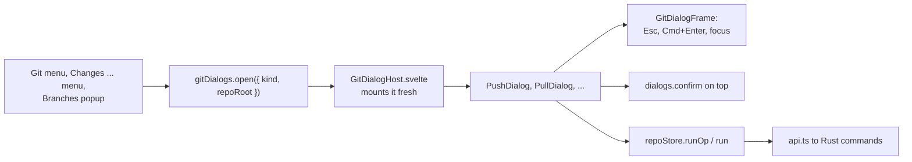
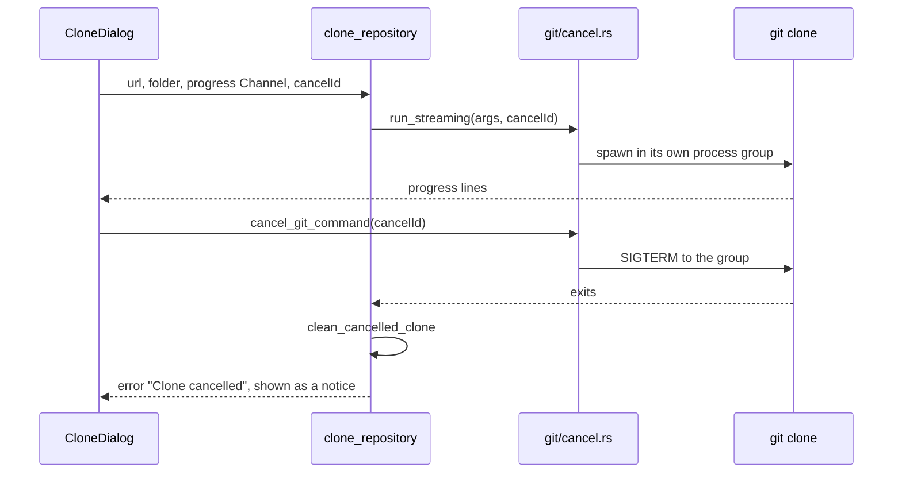

# How the Git dialogs work

The Git menu opens JetBrains-style dialogs for Push, Pull, Update Project, Merge, Rebase, Reset HEAD, Rollback, Manage Remotes and Clone. This chapter explains how they are shown, where their rules live and how a clone can be cancelled. The user side is in [Git Dialogs](../usage/Git-Dialogs.md); the menu that opens them is in [How the Git menu works](How-the-Git-Menu-Works.md).

## Why we need it

One-click buttons are fine for a plain push or pull, but git has options people need now and then: push to another branch, pull with rebase, merge with `--no-ff`, reset in Keep mode. JetBrains shows those in small dialogs, with the commits that will move. We do the same, and add a preview of the exact git command, which also teaches git.

## How it works

### One dialog at a time

`gitDialogs.svelte.ts` holds the one open dialog as a tagged value (`push`, `pull`, `reset`, `rollback`, `remotes`, `clone`, `update`, `merge`, `rebaseBranch`, `rebase`, plus the ones other chapters cover). `GitDialogHost.svelte` renders it inside `{#key active}`, so every open mounts fresh and starts from the repository's current state.

`GitDialogFrame.svelte` draws the overlay, title, body and footer. Escape cancels, Cmd+Enter (Ctrl+Enter) runs the main action, and the first field gets the focus. It ignores keys while a confirmation from `dialogs` (DialogHost) is on top, and `closable={false}` keeps it open while work runs, as during a clone. While a Git dialog is open, guarded menu items and window shortcuts do nothing (`shortcutsBlocked`).

The dialog closes before the git command runs. `repoStore.runOp` and `run` then show the busy state, the toast and refresh the status, like every other git action.

### Pure rules and the command preview

The rules are in pure, tested modules, so the Svelte files only wire them up:

- `gitOptions.ts`: the default push target (the upstream, else the same name on `origin` or the first remote), `pushCommand`, `PULL_MODES` and `pullCommand`, `RESET_MODES`, name, URL and revision checks, `cloneFolderName` (git's "humanish" folder name), `updatePlan` and `rollbackPaths`.
- `integrateOptions.ts`: the Merge and Rebase flags, which options exclude each other (`toggleMergeFlag`, `toggleRebaseFlag`), `validateRebase`, the request sent to Rust and `mergeCommand` / `rebaseCommand`.

The previews are built from the same values the backend gets, and `commands/integrate.rs` builds the same arguments. The backend checks again: it refuses option combinations that make no sense and names that start with `-` (`reject_option`).

### What each dialog calls

| Dialog | Commands |
| --- | --- |
| Push | `outgoing_commits` (refreshed 200 ms after the target changes), `push_with_options` |
| Pull | `pull_with_options` with merge, rebase or ff-only and `--no-commit` |
| Update Project | `pull_with_options` per repository, one after another |
| Merge, Rebase | `merge_with_options`, `rebase_with_options`; `--interactive` asks `rebase_plan_onto` |
| Reset HEAD | `resolve_revision` while typing, `reset_to` with soft, mixed, hard or keep |
| Rollback | `rollback_files` with the ticked paths and "delete added" |
| Manage Remotes | `list_remotes`, `add_remote`, `edit_remote`, `remove_remote` |
| Clone | `clone_repository` with a progress Channel, `cancel_git_command` |

**Update Project** runs `updateProject` in `gitMenuActions.ts`: `updatePlan` lists the repositories with an upstream (others are skipped with a reason), then each one is pulled in order with the label "Updating 2 of 5: name". It stops at the first conflict or failure and says how many were not updated. The method is saved as the `updateMethod` preference.

### Cancelling a clone

`cancel.rs` keeps a registry of running commands by cancel id. git runs in its own process group, so the signal also stops its helpers (`git-remote-https`, `index-pack`). It gets SIGTERM, not SIGKILL, so it can clean up; on Windows the child is killed. A process that was already reaped is never signalled, since its pid may belong to another process by then. `clean_cancelled_clone` removes the folder only if the clone created it; a folder that existed (and was empty) only loses what the clone put in it.

## Where the code lives

| File | What it does |
| --- | --- |
| `src/lib/views/git/gitDialogs.svelte.ts`, `GitDialogHost.svelte`, `GitDialogFrame.svelte` | The store, the host and the frame |
| `src/lib/views/git/PushDialog.svelte`, `PullDialog.svelte`, `UpdateProjectDialog.svelte` | Remotes |
| `src/lib/views/git/MergeDialog.svelte`, `RebaseBranchDialog.svelte` | Merge and Rebase |
| `src/lib/views/git/ResetDialog.svelte`, `RollbackDialog.svelte` | Reset and Rollback |
| `src/lib/views/git/RemotesDialog.svelte`, `CloneDialog.svelte` | Remotes and Clone |
| `src/lib/views/git/gitOptions.ts`, `integrateOptions.ts` | Pure rules and previews |
| `src-tauri/src/commands/remote.rs` | Push, pull, fetch, remotes, clone |
| `src-tauri/src/commands/integrate.rs` | Merge and rebase with options |
| `src-tauri/src/commands/history.rs` | Reset and revisions |
| `src-tauri/src/git/cancel.rs` | Cancellable streaming commands |

## Design decisions

**A store of its own.** Git dialogs are bigger than the prompts in `dialogs`, and they need those prompts on top of them (Force Push, Hard Reset). Two stores keep that simple.

**Mount fresh every time.** `{#key active}` means no stale branch or remote from the last open.

**Show the command.** The preview costs little and makes every option's effect clear.

**Confirm what loses work.** Force push, Hard reset, Rollback and Remove Remote ask again with a red button, as the project rules require.

**Update one repository at a time.** One busy state, a clear progress label, and a stop at the first conflict, so you never face conflicts in several repositories at once.

## Bugs we fixed

**Screen readers read the Browse button as part of the folder field.** Found while driving the Clone dialog with Windows UI Automation: the folder field was named "Clone into folder Browse...". A `<label>` names its field with all the text inside it, and these labels also hold a button. The fields with a button beside them (Clone, New Worktree, Merge, Reset, Rebase) now carry an `aria-label` with just their label text. We kept the wrapping labels, so a click on the label text still focuses the field.

## Tests

- `src/lib/views/git/gitOptions.test.ts`: push targets and preview, pull modes, reset modes, revision, name, URL and folder checks, the update plan and rollback paths.
- `src/lib/views/git/integrateOptions.test.ts`: excluded options, requests and previews, rebase forms and `--interactive`.
- `src-tauri/src/commands/remote.rs`: pull and push with options, outgoing commits, remotes, `clone_goes_into_a_missing_or_empty_folder_only` and `cancelling_a_clone_removes_only_what_it_created`.
- `src-tauri/src/commands/integrate.rs`: every merge option, bad combinations, and rebase with `--onto`, `--root` and the other flags.
- `src-tauri/src/commands/history.rs`: `reset_keep_moves_the_branch_and_keeps_local_changes`, `resolve_revision_finds_branches_tags_and_hashes`.
- `src-tauri/src/git/cancel.rs`: `cancel_stops_the_command_and_its_children`.

The dialogs' layout needs a visual check. See [Testing](Testing.md).

## Keeping this page in sync

- A new option goes in the pure module with a test, in the Rust command and in the preview.
- Update [Git Dialogs](../usage/Git-Dialogs.md) and retake the dialog screenshots (`git-*-dialog.png`). See [Docs and Screenshots](Docs-and-Screenshots.md).
