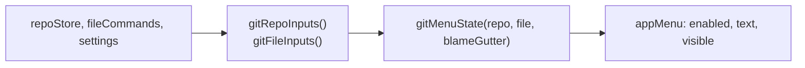
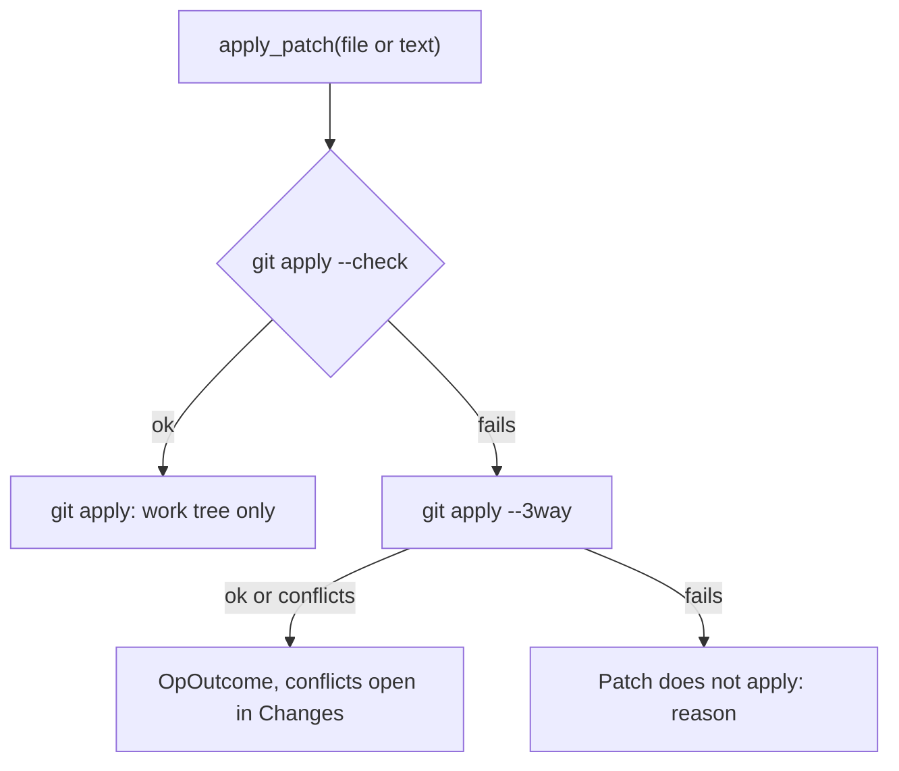

# How the Git menu works

The Git menu of the native menu bar holds every git command, laid out like JetBrains' Git menu. This chapter covers what decides its state, what its items run, the Current File tabs, patches and GitHub links. The user side is in [Git Menu](../usage/Git-Menu.md). The menu bar itself is in [How the menus work](How-the-Menus-Work.md), and the dialogs it opens in [How the Git dialogs work](How-the-Git-Dialogs-Work.md).

## Why we need it

The user asked for JetBrains' Git menu: one place for every command, with familiar keys (Cmd+K, Cmd+T, Cmd+9, Option+Cmd+A). It also made room in the header, whose Fetch, Pull, Push and Stash buttons moved into this menu (see [How remotes work](How-Remotes-Work.md)). The Current File submenu adds per-file history and compares that the app did not have.

## How it works

### Enabled, shown and named

`gitMenuInputs.ts` reads the active repository (busy, ahead, behind, branch, unborn, operation, conflicts, changes, remotes, a github.com remote) and the file on screen (changed, untracked, staged or not, conflicted). `gitMenuState` in `menuState.ts` turns that into the item states:

- **Ready** means a repository that is not busy. Push and Pull also need a branch, a remote and no operation in progress. `countLabel` names them **Push (2 ahead)...** and **Pull (1 behind)...**.
- **Operation items** are `visible` only during a merge, rebase, cherry-pick or revert, and named after it (`OPERATION_NAMES`): **Continue Rebase**, **Abort Rebase**. Continue stays grey while conflicts remain, Resolve Conflicts shows only with conflicts, and Skip Commit only in a rebase.
- **Current File** items need a file tab inside a repository. History and compare items need a tracked file; Rollback File needs a change that is not a conflict.
- **GitHub** shows for every repository, because Share Project is for one without a GitHub remote. The link items need a github.com remote.

### Running an item

`menuActions.ts` wraps each handler in `git(...)` (an active repository that is not busy), `workspace(...)` or, for Clone (which works from the welcome screen), `app(...)`, then calls `gitMenuActions.ts`. That module reuses what the views already do:

| Item | Runs |
| --- | --- |
| Commit... | `focusCommitMessage` in `gitActions.ts` |
| Fetch, Fetch All Remotes, Force Push..., Stash Changes... | `fetchRemote`, `fetchAll`, `push(true)`, `stash` in `gitActions.ts` |
| Merge..., Rebase..., Branches..., New Tag... | `mergeBranch`, `rebaseBranch`, `openBranchPicker`, `createTag` in `changes/repoActions.ts` |
| New Branch..., Unstash Changes... | `newBranchFrom`, `applyStash` in `sidebar/actions.ts` |
| Continue, Abort, Skip Commit | `operationActions.ts`, shared with the banner (`OpBanner.svelte`) |
| Push..., Pull..., Reset HEAD..., Rollback..., Manage Remotes..., Clone..., Update Project... | `gitDialogs.open(...)` |
| Cherry-Pick..., Interactive Rebase... | a commit picker (`pickCommit`, 200 commits), then `cherry_pick` or the [Interactive Rebase](How-Interactive-Rebase-Works.md) dialog |

### Current File tabs

Compare with Revision, Compare with Branch, Show History and Show History for Selection open in editor tabs. Like commit tabs, each has a pseudo path that can never be a file (`stores/gitTabs.ts`), such as `git-fileHistory:<repo>|<file>`. `GitTab.svelte` picks the view:

- `FileHistoryTab.svelte` pages through `file_history`, which runs `git log --follow` so renames are followed. The selected commit shows in `CommitDetails`.
- `LineHistoryTab.svelte` calls `line_history`, which runs `git log -L start,end:file`. `patchLines.ts` splits each patch into lines to color.
- `CompareTab.svelte` gets `compare_with_revision` (the file at a revision against the work tree) and shows it in a read-only `DiffView`.

The two history commands live in `src-tauri/src/git/history.rs` and use the git CLI, because libgit2 can neither follow renames nor trace a line range.

### Patches

- `create_patch` runs `git diff` (HEAD to index, index to work tree, or HEAD to work tree; the empty tree before the first commit) and `create_commit_patch` runs `git format-patch -1 --stdout`. Both add `--binary` and explicit `a/` `b/` prefixes, so a user's `diff.noprefix` never breaks the patch.
- `apply_patch` applies to the work tree only, like JetBrains. If that fails, a 3-way merge can still apply it with conflicts, using the base blobs the patch names.
- `read_clipboard_text` reads the clipboard natively (`pbpaste` on macOS), because the web view only allows a clipboard read right after a click in the page. The frontend checks the text looks like a patch first.

### GitHub links

`views/git/github.ts` is pure: it reads https, ssh, `git://` and scp-like remote URLs, picks the upstream's remote, then `origin`, and builds file, compare and pull request URLs. No API and no sign-in are used. `linkRevision` uses the branch name only when the branch is pushed as it is, else the commit.

## Where the code lives

| File | What it does |
| --- | --- |
| `src/lib/menu/menuState.ts` | `gitMenuState`, `countLabel` |
| `src/lib/views/git/gitMenuInputs.ts` | Inputs read from the stores, `currentGitFile` |
| `src/lib/views/git/gitMenuActions.ts` | What each item does |
| `src/lib/views/git/operationActions.ts` | Continue, Abort, Skip Commit |
| `src/lib/views/git/github.ts` | GitHub remotes and links |
| `src/lib/stores/gitTabs.ts`, `src/lib/views/git/GitTab.svelte` and its tabs | Current File tabs |
| `src-tauri/src/commands/patch.rs` | Patch commands and the clipboard read |
| `src-tauri/src/commands/history.rs`, `src-tauri/src/git/history.rs` | File and line history, compare |

## Design decisions

**One function per action, shared.** A menu item calls the same code as its button in Changes, the banner or the Log, so they cannot drift apart.

**Hide what does not apply.** Operation items appear only during an operation, like JetBrains, instead of sitting grey.

**History in tabs.** Show History and compares open as editor tabs, so several can stay open next to the code, with Back and Forward.

**Links without an account.** Open on GitHub and friends only build URLs; the account features are separate (see [How GitHub works](How-GitHub-Works.md)).

## Bugs we fixed

None yet.

## Tests

- `src/lib/menu/menuState.test.ts`, "Git menu": ahead and behind labels, branch and remote rules, operation items, Current File rules, GitHub and Clone.
- `src/lib/views/git/github.test.ts`, `patchLines.test.ts` and `src/lib/stores/gitTabs.test.ts`.
- `src-tauri/src/commands/patch.rs`: `create_patch_writes_the_chosen_changes`, `create_patch_works_before_the_first_commit`, `a_commit_patch_applies_elsewhere`, `apply_patch_falls_back_to_a_three_way_merge`, `apply_patch_reports_why_it_does_not_apply` and `apply_patch_from_text`.
- `src-tauri/src/commands/history.rs`: `file_history_follows_renames_page_by_page`, `line_history_traces_a_range` and `compare_with_revision_reads_the_old_version`.

The native menu itself needs a manual check. See [Testing](Testing.md).

## Keeping this page in sync

- New items follow the steps in [How the menus work](How-the-Menus-Work.md), with a `gitMenuState` rule and test.
- Update [Git Menu](../usage/Git-Menu.md) and retake its screenshots (`git-menu-*.png`). See [Docs and Screenshots](Docs-and-Screenshots.md).
