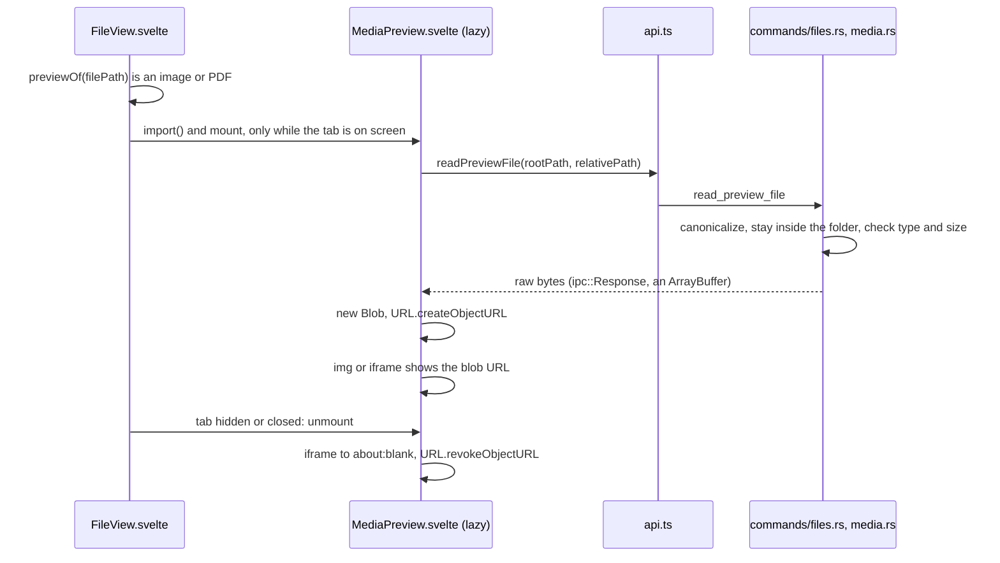

# How the Image and PDF Preview Works

Images and PDFs in the work tree open in a preview tab instead of the "Binary file, not shown" message. The user side is in [Image and PDF Preview](../usage/Image-and-PDF-Preview.md).

## Why we need it

Repositories hold screenshots, icons and PDF manuals. Seeing them without leaving the app saves a trip to Finder. The rule from [Architecture](Architecture.md) still holds: memory is a feature, so a preview must cost nothing when it is not on screen.

## How it works

- **Picking the preview.** `previewOf` in `views/files/mediaPreview.ts` maps the extension to a kind (`image` or `pdf`) and a media type. When it matches, `FileView.load` does not read the file as text at all; it only bumps `previewToken`, so the bytes are read once, by the preview.
- **Loading.** `MediaPreview.svelte` is imported with `{#await import(...)}`, so its code is a separate chunk loaded the first time. It mounts only while `isActive` is true, so a background tab holds nothing.
- **Bytes, not base64.** `read_preview_file` returns `tauri::ipc::Response`, which reaches the page as an `ArrayBuffer`. A base64 data URL would be a third bigger and live on as a string. The page wraps the bytes in a `Blob` and drops the buffer, so one copy remains.
- **Images.** An `` shows the blob URL. `fitZoom` shrinks big images to the canvas and keeps small ones at 100%; `nextZoom` walks `ZOOM_STEPS` from wherever the zoom is, so the first step after a fitted 62% goes to 75% or 50%. Ctrl or Cmd with the wheel zooms, which also covers a trackpad pinch.
- **PDFs.** An `<iframe>` shows the blob URL and WebKit's own PDF viewer draws it. No PDF library is bundled.
- **Freeing.** `onDestroy` sets the frame to `about:blank` first, so WebKit drops the document, then revokes the URL. The decoded picture goes with the ``.
- **Reloading.** FileView's existing status effect calls `load(true)` when the file may have changed; for a preview that bumps `previewToken`, and the preview reads the file again and revokes the old URL.
- **Security.** `media::read_preview` resolves symlinks and refuses anything outside the workspace folder, any other type, and files over `MAX_IMAGE_PREVIEW_BYTES` (50 MB) or `MAX_PDF_PREVIEW_BYTES` (100 MB). The CSP in `tauri.conf.json` allows `blob:` for `img-src` and `frame-src`, which only covers URLs the page made itself.

## Where the code lives

| File | What it does |
| --- | --- |
| `src/lib/views/files/mediaPreview.ts` | `previewOf`, `ZOOM_STEPS`, `nextZoom`, `fitZoom`, `zoomLabel` |
| `src/lib/views/files/MediaPreview.svelte` | The lazy viewer: loading, blob URL, zoom bar, freeing |
| `src/lib/views/files/FileView.svelte` | Chooses the preview, mounts it only while active, `previewToken` |
| `src/lib/api.ts` | `readPreviewFile` |
| `src-tauri/src/commands/files.rs` | `read_preview_file` |
| `src-tauri/src/media.rs` | `preview_mime`, `read_preview` and the size limits |
| `src-tauri/tauri.conf.json` | `blob:` in the CSP |

## Design decisions

**WebKit's PDF viewer, not pdf.js.** pdf.js would add megabytes of code and a worker, and keep rendering state in the page. The built-in viewer costs nothing until a PDF opens and pages through the document natively. The catch is other platforms: WebView2 on Windows has its own viewer, but WebKitGTK on Linux may show nothing. Reveal in File Explorer or Open Containing Folder stays as the way out.

**Unmount on hide, not only on close.** Reading a file again when you come back is cheap; keeping a few decoded 20-megapixel photos in background tabs is not.

**SVG stays in the editor.** It is text that people edit. Its picture is one Markdown preview away.

**Separate limits for images and PDFs.** A decoded image takes several times its file size, a PDF does not, so a PDF may be twice as big.

**A code chunk cannot be unloaded.** Browsers keep an imported module for the life of the page. That is why the module is kept small and holds no data: the memory that matters, the picture or the document, is freed.

## Tests

- `src-tauri/src/media.rs`: the types by extension, files inside the folder only, symlinks that leave it, other types and the size limits.
- `src-tauri/src/commands/tests.rs`: `read_preview_file_reads_workspace_images_and_pdfs_only`.
- `src/lib/views/files/mediaPreview.test.ts`: which files get a preview, the zoom steps, fitting and the label.

How the viewer looks and that memory goes down after closing a tab need a check in the app; the status bar's memory readout shows it. See [How Memory Is Measured](How-Memory-Is-Measured.md).

## Keeping this page in sync

- Keep the extension list in `mediaPreview.ts` and `preview_mime` in `media.rs` the same.
- Update [Image and PDF Preview](../usage/Image-and-PDF-Preview.md) and retake `media-preview-image.png` and `media-preview-pdf.png` when the viewer changes.

## Bugs we fixed

None yet.
