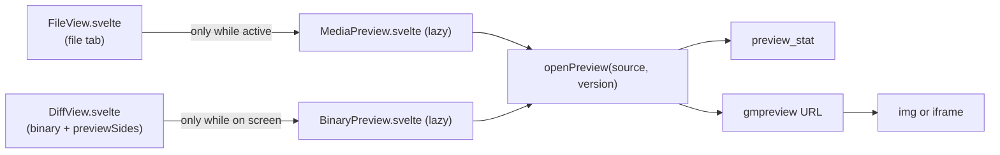

# How the Image and PDF Preview Works

Images and PDFs in the work tree open in a preview tab instead of the "Binary file, not shown" message, and a diff of a binary image or PDF shows the old and new version side by side. The user side is in [Image and PDF Preview](../usage/Image-and-PDF-Preview.md) and [Diffs](../usage/Diffs.md).

## Why we need it

Repositories hold screenshots, icons and PDF manuals. Seeing them in the app saves a trip to Finder, and both versions side by side are the only useful diff of a logo. Memory is a feature ([Architecture](Architecture.md)), so a preview must cost nothing when it is not on screen.

## How it works

Both viewers load their files from the `gmpreview` URL scheme, so the bytes go straight from Rust to WebKit and never enter JavaScript. The scheme, its security rules and its range requests are in [How the Preview Scheme Works](How-the-Preview-Scheme-Works.md).

### The file tab

- **Picking the preview.** `previewOf` in `views/files/mediaPreview.ts` maps the extension to a kind (`image` or `pdf`) and a media type. Then `FileView.load` does not read the file as text; it only bumps `previewToken`.
- **Loading.** `MediaPreview.svelte` is imported with `{#await import(...)}`, so its code is a separate chunk loaded the first time. It mounts only while `isActive` is true, so a background tab holds nothing. It calls `openPreview({ kind: "worktree", filePath }, previewToken)`, shows the size from the stat, and sets the URL on an `` or `<iframe>`.
- **Images.** `fitZoom` shrinks big images to the canvas and keeps small ones at 100%; `nextZoom` walks `ZOOM_STEPS` from wherever the zoom is (a fitted 62% steps to 75% or 50%). Ctrl or Cmd with the wheel zooms, which covers a trackpad pinch too.
- **PDFs.** An `<iframe>` shows the URL and WebKit's own PDF viewer draws it. No PDF library is bundled.
- **Reloading.** FileView's status effect calls `load(true)` when the file may have changed; that bumps `previewToken`, which becomes the URL's `v=` number, so WebKit loads the file again.

### The diff

`DiffView` takes an optional `previewSides`: where the old and the new side come from, each a `PreviewSource` (a work tree path, or a repository, revision and path) or null when that side does not exist. `showsBinaryPreview` in `diff/binaryPreview.ts` decides: the diff is binary or too large, it is not a Git LFS pointer (those keep their sizes), the file is an image or PDF, and the caller passed sides. Then `BinaryPreview.svelte` is imported lazily in place of the "Binary file" message.

| Caller | Left (old) | Right (new) |
| --- | --- | --- |
| `ChangesDiff`, unstaged | `index` | work tree |
| `ChangesDiff`, staged | `HEAD` at the old path of a rename | `index` |
| `CommitDetails` (Log, commit tabs, file history) | `<commit>^` at the old path; none for a root commit | the commit |
| `CompareTab` (Compare with Revision) | the resolved commit; none when the file is not in it | work tree |
| `WorktreeDiffTab` (Show Diff with Working Tree) | the branch's commit; none when not in it | work tree |
| `BranchCompareTab` | the base branch's commit, old path | the branch's commit |
| `ShelfDiffTab` | no preview | |

The shelf keeps a binary file only as a patch, and its new blob is usually not in the repository, so the scheme cannot address it: it keeps the "Binary file" message.

`sideState` turns each side's source and stat into loading, ready, absent or error. An absent old side says "Not in" and the side's label (for example "Not in HEAD"); an absent new side says "Deleted". Each side's head shows its label and `sideInfo`: the pixel size and the file size.

The two images share one zoom. Fit uses `sharedFit`, the smallest fit of both, so they stay at one scale and a bigger new logo looks bigger. Scrolling one side scrolls the other to the same place in proportion (`syncedScroll`); an `echo` flag skips the scroll event that syncing causes. PDFs get two frames with their own viewers.

Callers whose sides can change on disk pass a `version` (ChangesDiff bumps it on every status change of the repository, the compare tabs on every load). The preview loads again when the sources or the version change, compared as a string key.

### Freeing

DiffView mounts the preview inside a host bound to its width. A hidden tab is `display: none`, its width drops to 0, and the preview unmounts. Both viewers set their frames to `about:blank` on destroy, so WebKit drops the PDF document, and remove each image's `src`. The decoded pictures go with the elements.

## Where the code lives

| File | What it does |
| --- | --- |
| `src/lib/views/files/mediaPreview.ts` | `previewOf`, `ZOOM_STEPS`, `nextZoom`, `fitZoom`, `zoomLabel`, `tooLargeText` |
| `src/lib/views/files/MediaPreview.svelte` | The file tab viewer: zoom bar, size, freeing |
| `src/lib/views/files/FileView.svelte` | Chooses the preview, mounts it only while active, `previewToken` |
| `src/lib/diff/binaryPreview.ts` | `PreviewSides`, `showsBinaryPreview`, `sideState`, `sideInfo`, `sharedFit`, `syncedScroll` |
| `src/lib/diff/BinaryPreview.svelte` | The two sides of a diff |
| `src/lib/diff/DiffView.svelte` | `previewSides`, the on-screen host |
| `src/lib/views/files/previewScheme.ts` | `openPreview` |

## Design decisions

**WebKit's PDF viewer, not pdf.js.** pdf.js would add megabytes of code and a worker, and keep rendering state in the page. The built-in viewer costs nothing until a PDF opens. It is checked on macOS. WebView2 on Windows has its own viewer, but WebKitGTK on Linux may show nothing; Reveal in File Explorer or Open Containing Folder stays as the way out.

**Unmount on hide, not only on close.** Reading a file again when you come back is cheap; keeping a few decoded 20-megapixel photos in background tabs is not.

**SVG stays in the editor.** It is text that people edit, so its diff is a text diff.

**One scale for both sides.** Fitting each image on its own would make a 128 px and a 256 px logo look the same size, which hides the change.

**A code chunk cannot be unloaded.** Browsers keep an imported module for the life of the page, so the modules are small and hold no data; the pictures and documents are what gets freed.

## Tests

- `src/lib/views/files/mediaPreview.test.ts`: which files get a preview, the zoom steps, fitting, the label and the too big message.
- `src/lib/diff/binaryPreview.test.ts`: when the preview shows, absent sides, side states, the info line, the shared fit and synced scroll.
- The scheme's own tests are listed in [How the Preview Scheme Works](How-the-Preview-Scheme-Works.md).

How the viewers look and that memory goes down after closing a tab need a check in the app, with the status bar's memory readout ([How Memory Is Measured](How-Memory-Is-Measured.md)).

## Keeping this page in sync

- Keep the extension list in `mediaPreview.ts` and `preview_mime` in `media.rs` the same.
- When a new diff view is added, give it `previewSides` and add it to the table above.
- Update [Image and PDF Preview](../usage/Image-and-PDF-Preview.md) and retake `media-preview-image.png`, `media-preview-pdf.png` and `diff-binary-image.png` when the viewers change. `diff-binary-image.png` uses `extras/brand-kit` of the demo, where the logo is replaced by a bigger one.
- `media-preview-pdf.png` is taken by hand, since Playwright's WebKit has no PDF viewer and `scripts/screenshots.ts` would get an empty frame. Open `notes/lorem-ipsum.pdf` of the demo (`scripts/make-docs-demo.sh`, made by `scripts/make-demo-pdf.ts`) in the real app, capture the window (`git-manager cli screenshot`, or Cmd+Shift+4 then Space) and crop it to the document, so no tooltip or real path shows.

## Bugs we fixed

None yet.
