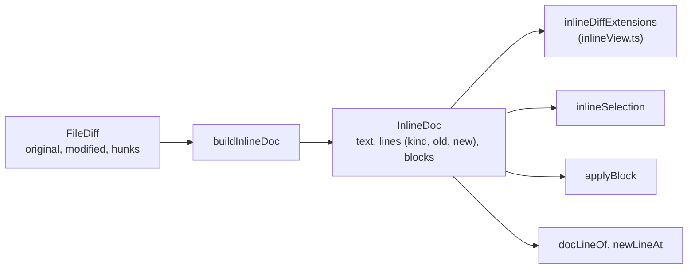

# How the inline diff works

This chapter explains the inline layout of the diff view: one column with each change's removed lines above the lines that replace them, and two line number columns, like the unified viewer of JetBrains IDEs. The user side is in [Inline Diffs](../usage/Inline-Diffs.md); the diff view itself (side by side, hunk staging, the split) is in [How Diffs Work](How-Diffs-Work.md).

## Why we need it

Two columns halve the width of each version. In a narrow window, or with long lines, a lot of the change scrolls out of sight. One column gives the text the whole width and still shows what was removed. The same switch is in JetBrains IDEs, and it was asked for in the toolbar next to Open File.

## How it works

### One setting, every diff

The layout is `settings.diffLayout` in `state.json`: `"sideBySide"` (the default) or `"inline"`, read with `pickOneOf` against `DIFF_LAYOUTS` in `settingsData.ts`, so any other value falls back to side by side. `settings.setDiffLayout` sets and saves it. It is a shared key, not a per-window one, so every window and every `DiffView` follows the same choice.

The two buttons sit in a `role="group"` in the diff toolbar of `DiffView.svelte`, with the `split-view` and `split-rows` icons. They are disabled when the diff has no text to show (binary, too large, LFS or identical). The build effect reads the setting, so a click tears the old view down and builds the other one; the layout is part of the scroll key.

### The inline document

`buildInlineDoc` in `inlineDoc.ts` walks the backend's line hunks and writes one text: unchanged lines once, then for each hunk its old lines followed by its new lines. Every line keeps its kind and its 0-based number on each side, and `newToDoc` maps new lines back. Removed lines are ordinary text, so selecting, copying and Cmd+F work on them with no extra code.

Hunks that do not fit the texts (`hunkRanges` returns null), or a payload without them, are found again with `fallbackHunks`, which runs CodeMirror's `Chunk.build` and turns the chunks into line hunks.

### The editor

`inlineDiffExtensions` adds to the read-only `baseExtensions` (built with `lineNumbers: false`):

- line classes by kind of change (added green, removed grey, modified blue, the `--diff-*` tokens) and changed-word marks from `inlineWordMarks`, which diffs each modified block's old lines against its new lines,
- two number gutters, old then new, that tint changed rows like the code,
- a gutter with a Stage (+) or Unstage (-) button on the first line of each change,
- folded unchanged runs from `collapsedRuns` (3 lines of margin, at least 4 folded). They are block widgets in a `StateField`, as block decorations must be, and a run opens when clicked or when the cursor lands in it, so a Find match or a reveal is never hidden.

### Mapping back to the two versions

Everything outside the editor speaks in new-text lines or old and new lines, so `DiffView` maps at the edges:

- **Reveal** (Back and Forward) turns a new line into a document line with `docLineOf`; **Open File** goes the other way with `newLineAt` (a removed line counts as the line after it).
- **Line actions**: `inlineSelection` turns the selected document lines into exactly the removed and added lines they cover. The backend's `partial_text` accepts any mix of old and new lines, so a selection of only new lines adds them and keeps the old ones.
- **Chunk buttons**: `applyBlock` builds the index's new full text (stage: the old text with the hunk's new lines; unstage: the new text with its old lines back) and hands it to `onChange`, the same path as the side by side buttons.
- **Blame**: `loadBlame` blames the new text, then `expandBlame` spreads it over the document. Removed lines get `REMOVED_LINE`, which the gutter and the inline note skip.
- **Navigation and the ruler** use the blocks: `revealChange` goes to a block's first line, `inlineChangeMarks` gives one tick per block.

## Where the code lives

| File | What it does |
| --- | --- |
| `src/lib/diff/inlineDoc.ts` | The document, word marks, selection, `applyBlock`, folds, line mapping |
| `src/lib/diff/inlineView.ts` | `inlineDiffExtensions`: colors, gutters, buttons, folds |
| `src/lib/diff/DiffView.svelte` | The toolbar buttons and building either layout |
| `src/lib/editor/blame.ts`, `blameModel.ts` | `loadBlame` for an inline source, `expandBlame`, `REMOVED_LINE` |
| `src/lib/editor/setup.ts` | The `lineNumbers` option of `baseExtensions` |
| `src/lib/stores/settingsData.ts`, `settings.svelte.ts` | `diffLayout` in `state.json`, `setDiffLayout` |

## Design decisions

**Our own document, not CodeMirror's unified view.** `unifiedMergeView` from `@codemirror/merge` draws removed lines as widgets. Widgets have no line numbers, cannot be selected and are not searched, which is why the first version had all three limits. Putting both versions into the text fixes them at once and keeps one source of line facts for every feature.

**The same colors as side by side.** Green, grey and blue by kind of change, so switching layouts does not change what a color means; the two number columns say which lines are old and which are new, as in JetBrains IDEs.

**Exact selections.** Side by side, a selection on one side also takes the facing lines of the other. Inline, both are on screen, so a selection takes only what it covers.

**One toggle for all diffs.** The layout is a reading habit, like the split ratio, so it lives in `state.json` and applies everywhere.

## Tests

- `src/lib/diff/inlineDoc.test.ts`: document order and numbers, line mapping, new and unchanged files, exact selections, stage and unstage text, word marks only in modified blocks, ruler ticks, folds with margins, the fallback hunks.
- `src/lib/editor/blameModel.test.ts`: `expandBlame` blanks removed lines and records new lines for Back and Forward.
- `src/lib/stores/settingsData.test.ts`: `diffLayout` defaults to side by side, rejects unknown values and is saved.
- The look needs a visual check: `diff-inline` in `scripts/screenshots.ts`.

## Keeping this page in sync

- Update this page when `inlineDoc.ts`, `inlineView.ts` or the inline parts of `DiffView.svelte` and `blame.ts` change.
- Update [Inline Diffs](../usage/Inline-Diffs.md) and retake `diff-inline.png` for visible changes.
- Related: [How Diffs Work](How-Diffs-Work.md), [Settings Reference](Settings-Reference.md).
