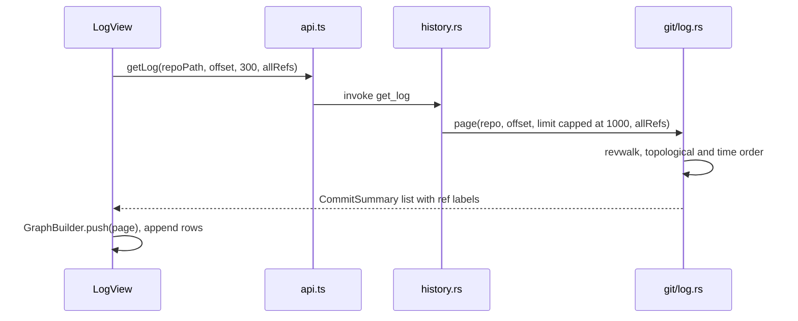
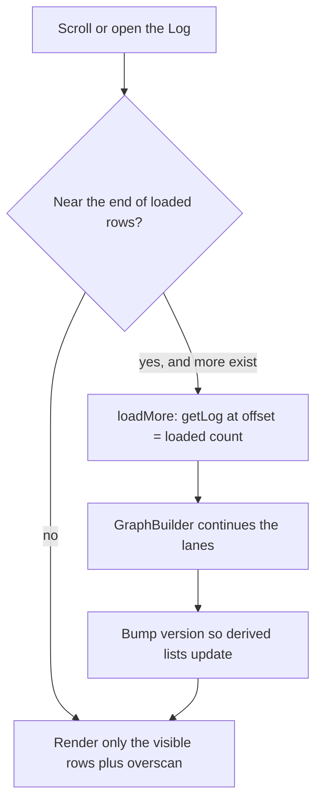

# How the Log works

The Log is the commit history of the active repository, drawn as a branch graph with the details of the selected commit below it. This page explains how it loads, draws and acts on history. For the user side, see [History and Log](../usage/History-and-Log.md).

## Why we need it

People want to scroll the history, see where branches split and merged, read one commit, and act on it: cherry-pick, revert, reset or check out.

Histories can be huge, and a big repository must still open quickly without holding its whole history in memory. So the Log loads history in pages, lays out the graph page by page, and only renders the rows you can see.

## How it works

`LogView.svelte` fills the main area. The Log button in the activity bar, the empty main area and Shift+Cmd+L all call `changesSelection.toggleLog()`, which remembers the view you came from, so a second click returns you there.

Double-clicking a commit opens it in its own editor tab instead; see [How commit tabs work](How-Commit-Tabs-Work.md).

Loading a page goes through the usual bridge:

`log::page` walks from HEAD with git2. When `allRefs` is set (the `logAllRefs` setting, on by default) it also pushes every local and remote branch, like `git log --branches --remotes` (tags and stashes are not walked). Each `CommitSummary` carries its parents and its ref labels.

`GraphBuilder` in `src/lib/log/graph.ts` gives each commit a lane. It keeps its lane state between calls, so page after page gives the same picture as the whole history at once. Rows store edges as flat number quadruples, and `GraphCell.svelte` draws them.

A few details keep it fast:

- **Plain arrays, not runes.** The loaded `commits`, `rows` and `indexById` live outside `$state`, so thousands of commits are never wrapped in proxies. A `version` counter is bumped when they change, and the derived values read it.
- **Virtual list.** Rows are a fixed 26 px. Only the visible range plus 12 rows of overscan is rendered. When the visible range comes within 80 rows of the end, the next 300 commits load.
- **Reloads keep your place.** When `repoStore.historyVersion` changes (a commit, a checkout, a fetch), the Log refetches as many commits as it had (up to 3000) and keeps the selected commit.
- **Stale answers are dropped.** Every load captures a `generation` number; a result that arrives after the repository changed is thrown away.

The filter searches loaded commits only (hash prefix, summary, author), and the graph collapses to one lane while filtering. Automatic paging pauses while filtering; a Load more button searches deeper. `CommitDetails.svelte` calls `getCommitDetails` (files changed against the first parent, with renames) and `getCommitFileDiff`.

### Jumping to a commit from elsewhere

Blame (through `navigation.openCommit`) and Back/Forward reach `repoStore.showCommit(repoRoot, commitId, filePath, line, lineText)`. It switches the active repository if needed, sets `repoStore.logFocus` with a fresh token and sets the view to `"log"`. An effect in `LogView` sees the token and runs `focusCommit`, which loads pages until the commit appears (at most 20), centers it, and passes the file, line and line text to `CommitDetails`. There `revealLine` uses `findLine` (`src/lib/log/lineMatch.ts`) on the commit's file text: the nearest line reading `lineText`, else the line itself. If it is not found, a toast says so, and suggests showing all branches when `logAllRefs` is off.

### Acting on a commit

The context menu offers Copy Revision Hash, New Branch Here, Checkout Revision, Cherry-Pick, Revert Commit and Reset Current Branch to Here. Cherry-pick and revert are disabled on merge commits, and a hard reset asks twice. Writes go through `repoStore.run` or `runOp` and use the git CLI (`cherry-pick`, `revert --no-edit`, `reset`, `switch --detach`). Cherry-pick and revert return an `OpOutcome`, so stopping on conflicts is a normal result.

## Where the code lives

| File | What it does |
| --- | --- |
| `src/lib/views/LogView.svelte` | The Log: paging, virtual list, filter, selection, focus, context menu |
| `src/lib/log/graph.ts` | `GraphBuilder`: incremental lane layout |
| `src/lib/log/GraphCell.svelte` | Draws one row of the graph; `LANE_COLORS` |
| `src/lib/log/CommitDetails.svelte` | Commit message, changed files and per-file diff, `revealLine` |
| `src/lib/log/lineMatch.ts` | `findLine`: which diff line to scroll to |
| `src/lib/log/format.ts` | Dates and ref label sorting |
| `src/lib/views/changes/selection.svelte.ts` | `toggleLog()` and `shownView` |
| `src/lib/stores/repo.svelte.ts` | `showCommit`, `logFocus`, `historyVersion` |
| `src-tauri/src/commands/history.rs` | `get_log`, `get_commit_details`, `get_commit_file_diff`, `cherry_pick`, `revert_commit`, `reset_to`, `checkout_commit` |
| `src-tauri/src/git/log.rs` | git2 revwalk, ref labels, commit details |

## Design decisions

**Page the history and lay out the graph incrementally.** Loading the whole history first would be slow and heavy on big repositories. The lane state carried between pages gives the same graph without redoing earlier pages. The backend is simpler: each page walks again from the tips and skips `offset` commits, so deep pages cost more.

**Keep commit data outside Svelte runes.** Reactive proxies on tens of thousands of objects cost memory and time. One `version` counter is cheap and explicit. The price is that every change must remember to bump it.

**Filter only what is loaded.** A full-history search would need a new backend query. Filtering loaded commits is instant, and the label says "of N loaded commits" so nobody is misled.

**The Log lives in the main area, toggled from the activity bar.** It needs the width for the graph.

## Bugs we fixed

**The Log could not be hidden.**
- **The issue:** the Log was a tab in the header, next to a Diff tab that could not be closed, and it could only be opened, not hidden.
- **Why it happened:** the header treated the Log as one of several permanent tabs.
- **The fix and why we chose it:** at the user's request the Log button moved to the activity bar as a toggle. `toggleLog()` remembers the previous view, so hiding the Log returns you where you were.

**A type check failure in `focusCommit`.**
- **The issue:** `bun run check` failed while diff steps were added to Back/Forward.
- **Why it happened:** a new `token` parameter on `focusCommit` clashed with the local `token` that holds the load generation.
- **The fix and why we chose it:** the parameter was renamed to `focusToken`, keeping the generation check untouched.

## Tests

- `src/lib/log/graph.test.ts`: linear history, branch and merge, lane reuse, octopus merges, several roots, duplicate parents, page-by-page equals all-at-once, and rows never reference lanes outside their width.
- `src-tauri/src/git/tests.rs`: `log_page_orders_newest_first_and_pages`, `log_page_in_unborn_repo_is_empty`, `log_page_labels_refs_and_includes_all_refs`, `log_details_lists_files_with_rename`, `diff_commit_file_sides`.
- `src-tauri/src/commands/tests.rs`: `cherry_pick_conflict_then_continue`, `revert_conflict_then_continue`, `reset_and_checkout_commit`.
- `src/lib/log/lineMatch.test.ts`: `findLine` keeps or moves the line, ties, no match, CRLF.

Graph changes need a case in `graph.test.ts`; history command changes need a Rust test on a real repository from `test_support.rs`.

## Keeping this page in sync

- Update this page when `LogView.svelte`, `graph.ts`, `git/log.rs` or `commands/history.rs` change behavior, page size or menu items.
- Update [History and Log](../usage/History-and-Log.md) for any visible change.
- Retake `log-graph.png`, `commit-details.png` and `log-context-menu.png` when the Log looks different.
- See also [How Blame Works](How-Blame-Works.md), [How Navigation Works](How-Navigation-Works.md) and [Frontend](Frontend.md).
