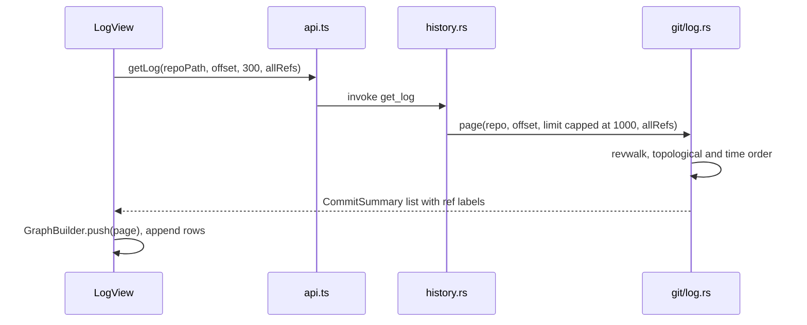
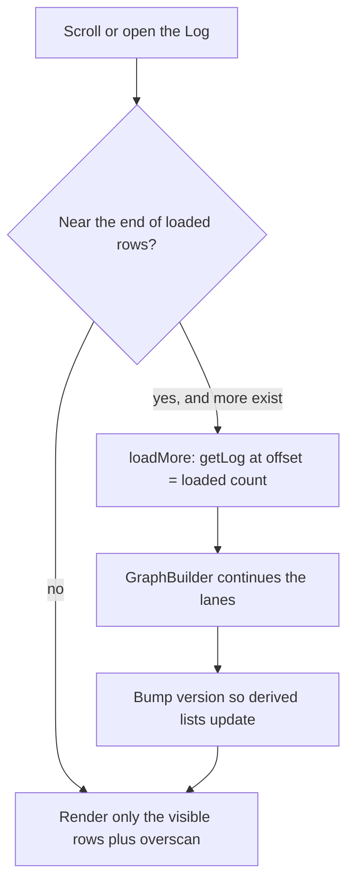

# How the Log works

The Log is the commit history of the active repository, drawn as a branch graph with the details of the selected commit below it. This page explains how it loads, draws and acts on history. For the user side, see [History and Log](../usage/History-and-Log.md).

## Why we need it

People want to scroll the history, see where branches split and merged, read one commit, and act on it. Histories can be huge, so the Log loads history in pages, lays out the graph page by page, and only renders the rows you can see.

## How it works

`LogView.svelte` fills the main area. The Log button in the activity bar, the empty main area, Shift+Cmd+L and View > Log all call `changesSelection.toggleLog()`, which remembers the view you came from, so a second click returns you there. Git > Show Git Log (Cmd+9) and a repository row's **...** > Show Log call `showLog(repoRoot?)` in `views/gitActions.ts`, which makes the repository active first and only opens the Log, never hides it.

Double-clicking a commit opens it in its own editor tab instead; see [How commit tabs work](How-Commit-Tabs-Work.md).

Loading a page goes through the usual bridge:

`log::page` walks from HEAD with git2. When `allRefs` is set (the `logAllRefs` setting, on by default) it also pushes every local and remote branch, like `git log --branches --remotes` (tags and stashes are not walked). Each `CommitSummary` carries its parents and its ref labels.

`GraphBuilder` in `src/lib/log/graph.ts` gives each commit a lane. It keeps its lane state between calls, so page after page gives the same picture as the whole history at once. Rows store edges as flat number quadruples, and `GraphCell.svelte` draws them.

A few details keep it fast:

- **Plain arrays, not runes.** `commits`, `rows` and `indexById` live outside `$state`, so commits are never wrapped in proxies; a `version` counter tells derived values they changed.
- **Virtual list.** Rows are a fixed 26 px; only the visible range plus 12 rows is rendered, and within 80 rows of the end the next 300 commits load.
- **Reloads keep your place.** When `repoStore.historyVersion` changes, the Log refetches as many commits as it had (up to 3000) and keeps the selection.
- **Stale answers are dropped** through a `generation` number captured by every load.

The filter searches loaded commits only (hash prefix, summary, author), and the graph collapses to one lane while filtering. Automatic paging pauses while filtering; a Load more button searches deeper. `CommitDetails.svelte` calls `getCommitDetails` (files changed against the first parent, with renames) and `getCommitFileDiff`.

### Jumping to a commit from elsewhere

Blame and Back/Forward reach `repoStore.showCommit(repoRoot, commitId, filePath, line, lineText)`. It switches the active repository if needed and sets `repoStore.logFocus` with a fresh token. An effect in `LogView` runs `focusCommit`, which loads pages until the commit appears (at most 20), centers it, and passes the line to `CommitDetails`, where `revealLine` uses `findLine` (`src/lib/log/lineMatch.ts`). If the commit is not found, a toast says so, and suggests all branches when `logAllRefs` is off.

### Acting on a commit

The context menu's items write through `repoStore.run` or `runOp` with the git CLI (`cherry-pick`, `revert --no-edit`, `reset`, `switch --detach`); cherry-pick and revert return an `OpOutcome`, so conflicts are a normal result. They and Interactively Rebase from Here are disabled on merge commits; the rebase also needs a branch and hands over to `startInteractiveRebase` ([How Interactive Rebase Works](How-Interactive-Rebase-Works.md)).

Reset offers Soft, Mixed, Hard and Keep; Hard asks twice. `run_reset` in `commands/history.rs` maps them to `--soft`, `--mixed`, `--hard` and `--keep`, refuses a revision that starts with `-`, and ends the arguments with `--` so a revision named like a file is never read as a path. The Git menu's Reset HEAD dialog uses the same command.

An effect publishes the selected commit to `logSelection.current` (`src/lib/log/logSelection.svelte.ts`), and clears it when the Log closes. The Git menu reads it for Create Patch from Commit and Interactive Rebase.

## Where the code lives

| File | What it does |
| --- | --- |
| `src/lib/views/LogView.svelte` | The Log: paging, virtual list, filter, selection, focus, context menu |
| `src/lib/log/graph.ts` | `GraphBuilder`: incremental lane layout |
| `src/lib/log/GraphCell.svelte` | Draws one row of the graph; `LANE_COLORS` |
| `src/lib/log/CommitDetails.svelte` | Commit message, changed files and per-file diff, `revealLine` |
| `src/lib/log/lineMatch.ts` | `findLine`: which diff line to scroll to |
| `src/lib/log/format.ts` | Dates and ref label sorting |
| `src/lib/log/logSelection.svelte.ts` | The selected commit, for Git menu items |
| `src/lib/views/changes/selection.svelte.ts` | `toggleLog()` and `shownView` |
| `src/lib/stores/repo.svelte.ts` | `showCommit`, `logFocus`, `historyVersion` |
| `src-tauri/src/commands/history.rs` | `get_log`, `get_commit_details`, `get_commit_file_diff`, `cherry_pick`, `revert_commit`, `reset_to` (`run_reset`), `checkout_commit` |
| `src-tauri/src/git/log.rs` | git2 revwalk, ref labels, commit details |

## Design decisions

**Page the history and lay out the graph incrementally.** Loading the whole history first would be slow and heavy on big repositories. The lane state carried between pages gives the same graph without redoing earlier pages. The backend is simpler: each page walks again from the tips and skips `offset` commits, so deep pages cost more.

**Keep commit data outside Svelte runes.** Proxies on tens of thousands of objects cost memory and time; one `version` counter is cheap, but every change must bump it.

**Filter only what is loaded.** Filtering loaded commits is instant, and the label says "of N loaded commits" so nobody is misled.

## Bugs we fixed

**The Log could not be hidden.**
- **The issue:** the Log was a permanent tab in the header, next to a Diff tab, and could not be hidden.
- **Why it happened:** the header treated the Log as one of several permanent tabs.
- **The fix and why we chose it:** at the user's request the Log became an activity bar toggle. `toggleLog()` remembers the previous view, so hiding the Log returns you where you were.

**A type check failure in `focusCommit`.**
- **The issue:** `bun run check` failed while diff steps were added to Back/Forward.
- **Why it happened:** a new `token` parameter on `focusCommit` clashed with the local `token` that holds the load generation.
- **The fix and why we chose it:** the parameter was renamed to `focusToken`, keeping the generation check untouched.

## Tests

- `src/lib/log/graph.test.ts`: linear history, branch and merge, lane reuse, octopus merges, several roots, duplicate parents, page-by-page equals all-at-once, and rows never reference lanes outside their width.
- `src-tauri/src/git/tests.rs`: `log_page_orders_newest_first_and_pages`, `log_page_in_unborn_repo_is_empty`, `log_page_labels_refs_and_includes_all_refs`, `log_details_lists_files_with_rename`, `diff_commit_file_sides`.
- `src-tauri/src/commands/tests.rs`: `cherry_pick_conflict_then_continue`, `revert_conflict_then_continue`, `reset_and_checkout_commit`.
- `src-tauri/src/commands/history.rs`: `reset_keep_moves_the_branch_and_keeps_local_changes`, which also checks that an option-like revision and an unknown mode are refused.
- `src/lib/log/lineMatch.test.ts`: `findLine` keeps or moves the line, ties, no match, CRLF.

Graph changes need a case in `graph.test.ts`; history command changes need a Rust test on a real repository from `test_support.rs`.

## Keeping this page in sync

- Update this page when `LogView.svelte`, `graph.ts`, `git/log.rs` or `commands/history.rs` change behavior, page size or menu items.
- Update [History and Log](../usage/History-and-Log.md) for any visible change.
- Retake `log-graph.png`, `commit-details.png` and `log-context-menu.png` when the Log looks different.
- See also [How Blame Works](How-Blame-Works.md), [How Navigation Works](How-Navigation-Works.md) and [Frontend](Frontend.md).
