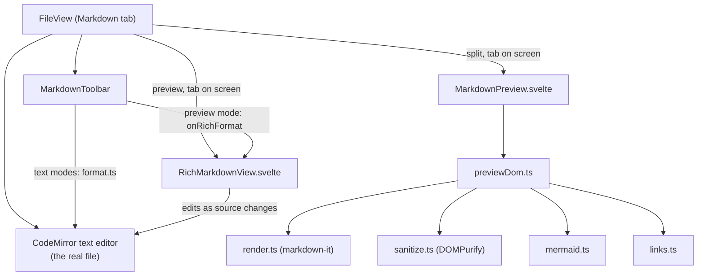
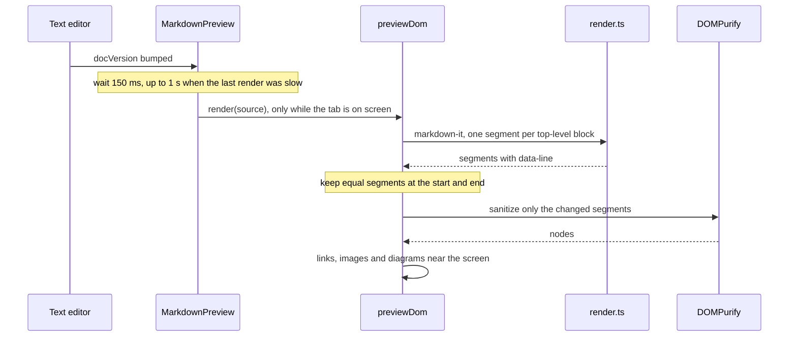

# How the Markdown editor works

Markdown files open with a formatting toolbar and three views: the text, the text beside a live preview, or a rich text editor that edits the rendered page. For the user side, see [Markdown Editor](../usage/Markdown-Editor.md). The rich editor has its own chapter: [How the Rich Markdown Editor Works](How-the-Rich-Markdown-Editor-Works.md).

## Why we need it

Most repositories keep their README and docs in Markdown. Raw text is tiring to read, and switching to a browser to check a table or a diagram breaks the flow. JetBrains IDEs and VS Code show a preview next to the text, so people expect it. A preview of files from cloned repositories is also a security surface, because Markdown may carry raw HTML.

## How it works

`FileView.svelte` decides per tab. `isMarkdownPath` (`markdown/viewMode.ts`) matches `.md`, `.markdown` and `.mdx`. The view mode starts from the `markdownViewMode` setting (default `"split"`) and each file remembers its own choice for the session (`sessionViewMode`, `rememberViewMode`, never saved).

The text editor always exists, hidden in Preview Only, so save, undo, dirty state and diffs keep one source of truth.

### The toolbar and keys

`MarkdownToolbar.svelte` runs pure commands from `markdown/format.ts` (`toggleInline`, `toggleLink`, `setHeading`, `toggleLinePrefix`, `toggleCodeBlock`, `insertTable`). Each returns one `TransactionSpec`: one undo step, every cursor. In Preview mode the buttons call `onRichFormat` instead. A Markdown editor adds Cmd+B (bold), Cmd+I (italic, in place of Select Parent Syntax) and Cmd+K (link).

### The preview pipeline

- `render.ts` (markdown-it with GitHub tables, strikethrough and autolinks) adds `data-line` to every block, GitHub heading ids with the `user-content-` prefix and task checkboxes with their line. `highlight.ts` colors fenced code with the editor's Lezer grammars (plain above 100,000 characters). Mermaid fences become placeholders; images keep their path in `data-gm-src`, with no `src`.
- Output comes in segments, one per top-level block. Raw HTML that spans blocks stays in one segment (`openTagBalance`), so every segment is complete HTML.
- `previewDom.ts` replaces only the changed stretch of segments; kept ones just get their `data-line` shifted.
- `sanitize.ts` (DOMPurify) removes scripts, styles, forms and controls, frames, embeds, media, event handlers, `style`, `srcset` and `target`, and every input except checkboxes. Ids get `user-content-`. The preview is `contain: layout paint`.

### Links and images

`links.ts` is pure: `classifyLink` gives `external` (http, https, mailto), `anchor`, `file` (inside the workspace, `/path` from the repository root) or `blocked`; `classifyImage` gives `data`, `remote` (never fetched), `local` or `blocked` with a reason. Local images come from the `read_image_data_url` command (`src-tauri/src/commands/files.rs`, with the `read_data_url` helper in `src-tauri/src/images.rs`): inside the workspace folder after resolving symlinks, PNG, JPEG, GIF, WebP or SVG, at most 10 MB. The CSP allows only `'self'` and `data:` images.

### Diagrams

`mermaid.ts` loads mermaid only for documents with a diagram and renders one at a time (it is not reentrant), with `securityLevel: "strict"` and a `secure` list so `%%{init}%%` cannot loosen it. Results are cached by theme and source. Built-in themes use mermaid's own looks, other color themes pass CSS variables (`themeVariables`). Every SVG goes through `sanitizeSvg`, a second DOMPurify instance. `watchTheme` redraws shown diagrams after a theme change.

### Scroll sync

`scrollSync.ts` interpolates between the `data-line` blocks, with the document start and end as fixed points; `editorScroll.ts` reads and sets the editor position as a fractional line. The side the user scrolls leads for 150 ms, so the other side never echoes back.

## Memory

Memory follows the screen, not the length of the file:

- **Hidden tabs free their preview.** `FileView` mounts `MarkdownPreview` or `RichMarkdownView` only while `isActive`, and keeps the place (`onLeave`, `initialLine`, `richScroll`).
- **Diagrams and images draw near the screen only.** `nearScreen.ts` has a `NearScreen` class: each preview or rich editor makes one, with one `IntersectionObserver` and a margin of one screen. Far diagrams are freed by `releaseDiagram`, which keeps their height; unused image data URLs are dropped.
- **The mermaid cache is capped** at 24 entries and 2,000,000 characters, and mermaid's temporary render elements are removed (`removeLeftovers`).
- **Off-screen blocks are not painted:** `content-visibility: auto` in `body.css` and `RichMarkdownView`.

Headless Chrome, 40 diagrams: 1 to 2 SVGs and 442 to 644 elements instead of 40 SVGs and 8,562 elements.

## Where the code lives

| File | What it does |
| --- | --- |
| `src/lib/views/files/FileView.svelte` | Mode, split size, mounting, keys |
| `src/lib/views/files/MarkdownToolbar.svelte`, `MarkdownPreview.svelte` | Toolbar; preview timing, scroll sync, clicks |
| `src/lib/markdown/format.ts` | Text formatting commands |
| `src/lib/markdown/render.ts`, `engine.ts`, `previewDom.ts`, `sanitize.ts` | Rendering, the lazy chunk, segment updates, DOMPurify |
| `src/lib/markdown/mermaid.ts`, `nearScreen.ts` | Diagrams, near-screen drawing |
| `src/lib/markdown/links.ts`, `slug.ts`, `highlight.ts` | Links and images, heading ids, code colors |
| `src/lib/markdown/scrollSync.ts`, `editorScroll.ts`, `body.css` | Scroll sync, shared page styles |
| `src-tauri/src/commands/files.rs`, `images.rs` | `read_image_data_url`, local images as data URLs |

## Design decisions

**Lazy chunks.** markdown-it and DOMPurify load on the first preview, mermaid on the first diagram, Milkdown on the first Preview Only. `vite.config.js` lists them in `optimizeDeps` so the dev server does not reload on first use.

**Remote images are never loaded.** Opening a file must not contact a server or reveal that you read it.

**What stays after first use.** The libraries keep their heap until the app quits: markdown-it about 2 MB, mermaid about 30 MB, Milkdown about 8 MB. We tried mermaid in a disposable iframe and rejected it: the UMD build is 73 MB and Chrome did not free it when the iframe was removed.

**Fast scrolling in WebKit.** WebKit's WebContent process peaks at 400 to 650 MB while a 35 KB README is scrolled fast, and settles at 60 to 200 MB after. Plain HTML without our code does the same (runs are noisy: 98 MB and 444 MB for one setup), so it looks like WebKit's own. `content-visibility: auto` is a candidate fix still under test; re-measure in the real app with the MCP tools `scroll_view` and `sample_memory` or the memory log ([Debugging](Debugging.md)).

## Tests

- `src/lib/markdown/render.test.ts`, `format.test.ts`, `links.test.ts`, `highlight.test.ts`, `scrollSync.test.ts`, `slug.test.ts`, `viewMode.test.ts`.
- `src-tauri/src/images.rs` unit tests and `read_image_data_url_reads_workspace_images_only` in `src-tauri/src/commands/tests.rs`.

## Keeping this page in sync

- Update [Markdown Editor](../usage/Markdown-Editor.md) and retake its `markdown-*.png` screenshots when a button, mode or limit changes.
- A new setting goes in [Settings](../usage/Settings.md) and [Settings Reference](Settings-Reference.md).
- The MCP tool `set_markdown_mode` switches a tab's view for automated checks.

## Bugs we fixed

**Cmd+B hid the sidebar instead of making text bold.**
- **The issue:** the Bold tooltip says Cmd+B, but in the text editor it hid the sidebar.
- **Why it happened:** the Markdown keymap bound only Cmd+I and Cmd+K.
- **The fix and why we chose it:** it binds Cmd+B and prevents the default, so the sidebar key skips it ([Menu Keys and Routing](Menu-Keys-and-Routing.md)). One bold key in both editors, like VS Code, beats a tooltip per mode.

**Memory grew with long Markdown files and open Markdown tabs.**
- **The issue:** the memory readout kept climbing while a long file with many mermaid diagrams was open, and every open Markdown tab added more.
- **Why it happened:** every diagram was drawn and kept as SVG, every local image was loaded as a data URL, hidden tabs kept their whole rendered document, the mermaid cache had no limit, and mermaid left its temporary render elements in the page.
- **The fix and why we chose it:** the changes in [Memory](#memory) above, so memory depends on what is on screen.
