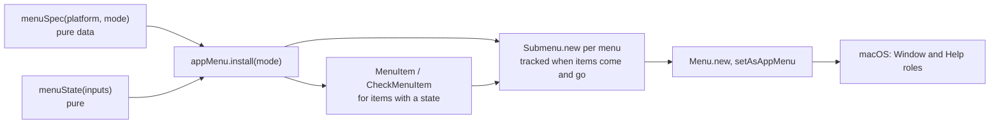
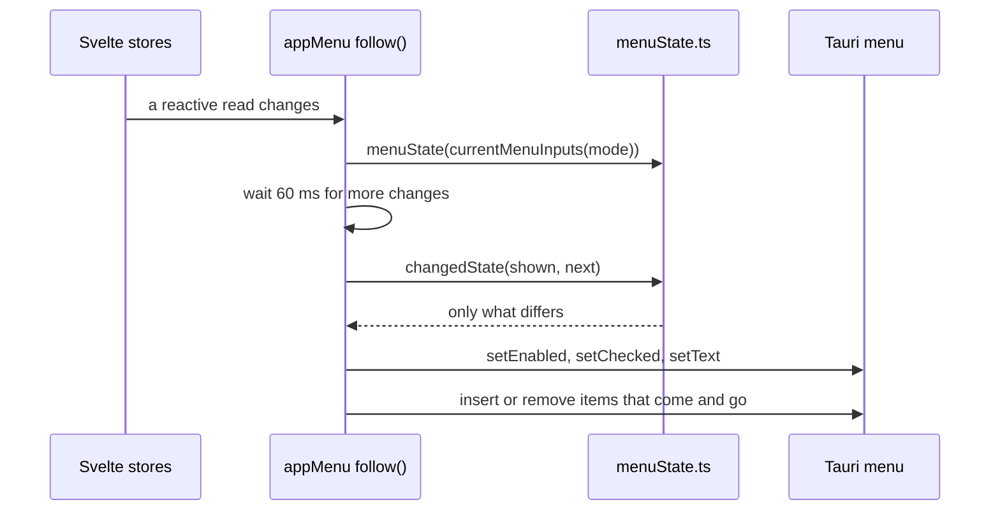

# How the menus work

Git Manager builds its own native menu bar: Git Manager, File, Edit, View, Code, Git, Window and Help, with the right layout per platform and a reduced one for the mergetool window. The user side is in [Menus](../usage/Menus.md). How keys reach the page or the menu is in [Menu Keys and Routing](Menu-Keys-and-Routing.md), and the Git menu's items in [How the Git menu works](How-the-Git-Menu-Works.md).

## Why we need it

Mac users look for commands, and their keys, in the menu bar. Tauri's default menu had only the basics, and its Cmd+W closed the whole window. JetBrains and VS Code users also expect File, Edit, Code and Git menus with the keys they know.

The menu is built from the **frontend** with `@tauri-apps/api/menu`, because the items, their actions and their state all live in the Svelte stores.

## How it works

### From data to the native menu

`menuSpec.ts` describes every menu as plain data: action items (an id from `menuIds.ts`, a label, an accelerator), native items (Cut, Copy, Quit...), separators, submenus and the Open Recent slot. `menuSpec(platform, mode)` returns the layout for macOS, Windows or Linux, for the main window (`"app"`) or git's mergetool window (`"mergeTool"`).

`AppMenu.install` in `appMenu.svelte.ts` runs once per window from `App.svelte`, after the launch mode is known. It creates an object for every item that has a state, then each top menu. On macOS the Window and Help menus get their system roles, so macOS lists the open windows and adds its search field. A failure shows the toast "Could not build the menu bar". Every item id is `action#BUILD_ID`, with a random suffix per page load (see Bugs we fixed).

### Keeping the menu in step

`currentMenuInputs` reads the stores and `menuState` turns them into an `ItemState` per action: `enabled`, `checked`, `text` and `visible`. After 60 ms without changes (`SYNC_DELAY_MS`), `changedState` keeps only what differs from the menu, so a burst of store changes costs a few IPC calls.

Items with `visible` (the Git menu's operation items, Git Console) and entries with `visibleWith` live in **tracked** menus, which keep a handle per entry. `applyVisibility` removes an entry and inserts it again in place later, one change at a time on a queue.

The system ticks a check item on click, so `onAction` syncs it again at once to show the app's real state.

**Open Recent** has its own effect: when the `recentEntries` text changes, it closes the old entries and inserts new `MenuItem` objects above Clear Recent.

### Running an item

`runMenuAction` in `menuActions.ts` sends the Find and Code items to the focused editor (`runEditorCommand`). Everything else has one handler in `HANDLERS`, wrapped in a guard:

- `app(...)`: does nothing while an in-app dialog or a Git dialog is open.
- `workspace(...)`: also needs an open workspace, and does nothing behind Search Everywhere and the merge tool, like the window shortcuts (`shortcutsBlocked`).
- `git(...)`: also needs an active repository that is not busy.
- `shortcut(name)`: runs the same `runWorkspaceShortcut` as the key handler.

Undo, Redo, Delete and Select All have no guard, so they work in dialog fields; the Help links (Git Manager Help, Release Notes, Report a Bug, Request a Feature, Star on GitHub) have none either. A handler that throws shows "The menu command failed". The MCP tools `list_menu_commands` and `run_menu_command` reuse the same spec, state and handlers (`src/lib/mcp/menuCommands.ts`), see [How MCP and the CLI work](How-MCP-and-CLI-Work.md).

## Where the code lives

| File | What it does |
| --- | --- |
| `src/lib/menu/menuIds.ts` | `MENU_ACTIONS`, `EDITOR_ACTIONS`, platform and mode types |
| `src/lib/menu/menuSpec.ts` | The menus as data, per platform and window |
| `src/lib/menu/menuState.ts` | `menuState`, `gitMenuState`, `changedState`, `countLabel` |
| `src/lib/menu/appMenu.svelte.ts` | Builds the Tauri menu, follows the state, Open Recent |
| `src/lib/menu/menuActions.ts` | `runMenuAction` and the guarded handlers |
| `src/lib/menu/editorFocus.svelte.ts` | Whether an editor has the keyboard |
| `src/lib/views/recentEntries.ts` | The recent list for Open Recent and the header |

## Design decisions

**The menu is data.** `menuSpec` is pure, so tests check ids, keys and the layout per platform without Tauri.

**Send only changes, after a pause.** Store changes come in bursts (focus moves, status refreshes, edits). The pause and the diff keep IPC traffic small.

**Hide items that do not apply, like JetBrains.** Continue Merge or Skip Commit appear only during an operation; grey items there would be noise.

**Same functions as the buttons.** Handlers call what the views already use (`gitActions.ts`, `fileCommands`), so a menu item and its button never drift apart.

## Bugs we fixed

**Settings... and About did nothing when clicked.**
- **The issue:** Git Manager > Settings..., About Git Manager and the Open Recent entries did nothing on click, while View > Scripts worked.
- **Why it happened:** Tauri routes a click to the handler registered for the item's id, and freeing any menu item removes the handler of its id. An item passed as options inside `Submenu.new` gets a handle that Tauri frees right away, so its handler was gone. Only items created with `MenuItem.new` and kept by the page (the ones with a state, like View > Scripts) still fired.
- **The fix and why we chose it:** every clickable item is now created with `MenuItem.new` and kept: `itemOptions` stores them in `kept`, and `fillRecent` keeps the Open Recent entries in `recentItems` until the list changes. Ids also get a per-page-load suffix (`BUILD_ID`), because after a reload the old menu is still being freed, and with the same ids that would remove the new items' handlers. Holding the handles is cheap and is how Tauri expects menus to be kept. Found with temporary `console.warn` logs.

## Tests

- `src/lib/menu/menuSpec.test.ts`: the macOS layout, File and Help items elsewhere, the reduced mergetool menu, every action once and each key on one item.
- `src/lib/menu/menuState.test.ts`: Save, Revert and Close Tab, Code and Find items, Markdown modes, ticks, Git Console hiding, the Git menu and `changedState`.
- `src/lib/views/recentEntries.test.ts` and `src/lib/mcp/menuCommands.test.ts`.

Clicks on native items need a manual check in the real app. See [Testing](Testing.md).

## Keeping this page in sync

- A new menu item needs an id in `menuIds.ts`, an entry in `menuSpec.ts`, a handler in `menuActions.ts` and, when it can be grey, a rule in `menuState.ts` with a test.
- Update [Menus](../usage/Menus.md), [Keyboard Shortcuts](../usage/Keyboard-Shortcuts.md) and the `menus-shortcuts-window.png` screenshot. See [Docs and Screenshots](Docs-and-Screenshots.md).
