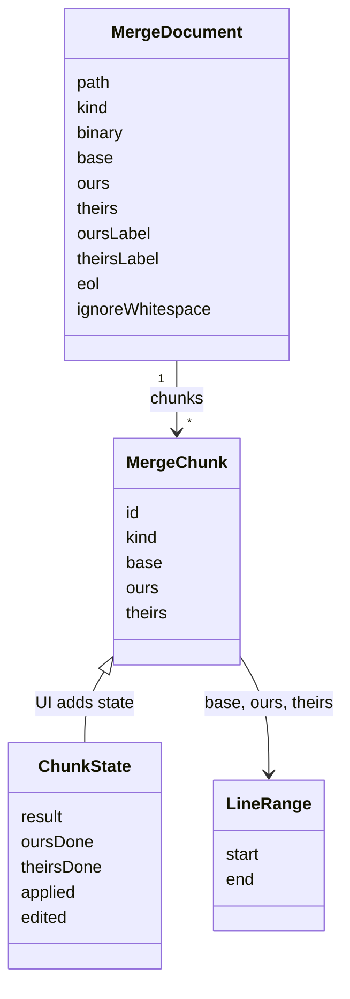
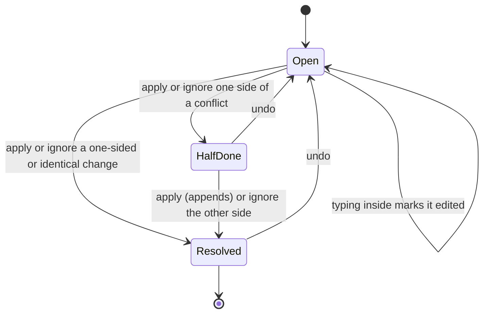

# How the merge tool works

The merge tool is the JetBrains-style three pane view (Yours, Result, Theirs) with connectors and apply and ignore buttons per change. The user side is in [Merge Tool](../usage/Merge-Tool.md).

## Why we need it

Conflict markers are hard to read. The JetBrains merge dialog shows both sides next to the result and takes changes with one click; building that, light on memory, was the original goal of Git Manager. Rust computes the chunks once, and pure, tested TypeScript tracks what you did with them.

## How it works

### Loading a conflict

`conflicts::load` reads the three index stages (base, ours, theirs), and `build_document` makes a `MergeDocument`, normalized to LF with the original `eol` kept. A stage that is not UTF-8 marks the document `binary`, with no chunks. For a deleted side (empty text), `MergeView` first offers the per-file choices, with Merge Text Anyway.

`compute_chunks` in `merge/engine.rs` diffs base to ours and base to theirs (imara-diff, histogram), then walks both hunk lists together. Hunks that overlap **or touch** in the base form one chunk, as in git's xdiff. Each chunk is `oursOnly`, `theirsOnly`, `bothSame` or `conflict`. Ignore whitespace diffs whitespace-normalized lines, so ranges still address the original lines.

Lines split on `\n` as in CodeMirror, so a Rust `LineRange` matches the editor lines.

### Resolving in the UI

`MergeView.svelte`, an overlay in the main window, loads the document for `MergeEditor.svelte`, which builds three editors (sides read-only). The Result starts from the **base** text and holds the chunk state in `chunkField`, a StateField in `extensions.ts`.

`initialChunks` marks the unchanged side done. Each button calls a pure function in `model.ts` and dispatches the result as one transaction:

- `applySide` replaces the chunk's result lines with one side. On a conflict, a second apply **appends** the other side, as in JetBrains.
- `ignoreSide` marks a side handled without touching the text.
- `applyNonConflicting` applies every unresolved, unedited non-conflict chunk, optionally from one side.
- `acceptWholeSide` replaces the whole result (Accept Left and Accept Right).
- `mapChunks` moves chunk ranges through your typing and marks chunks you type in as `edited`.

`dispatchAction` sends the text edit with `setChunks` and `isolateHistory.of("full")`, so each click is one undo step, and `chunkHistory` (`invertedEffects`) makes undo restore text and chunk state together.

`draw` builds SVG ribbons for the visible chunks, with the buttons as HTML overlays. Scrolling one pane scrolls the others through `mapLine`, a piecewise linear mapping between chunk edges. `changedSpans` in `inline.ts` adds word highlights. F7 and Shift+F7 use `findUnresolved`.

Cmd+Enter saves from any pane (a high-priority keymap from `applyKeymap`). Escape, Cancel and the title-bar close button all run `cancel`, which asks first when there is undo history. Ignore whitespace recomputes the chunks, after a confirm. `save` warns about unresolved changes and leftover markers, then `saveResolution` writes and stages the file. The same editor runs as `git mergetool`, see [How mergetool mode works](How-Mergetool-Mode-Works.md).

## Where the code lives

| File | What it does |
| --- | --- |
| `src-tauri/src/merge/engine.rs` | `compute_chunks`, the git comparison test |
| `src-tauri/src/merge/model.rs` | `LineRange`, `MergeChunk`, `MergeDocument`, `Eol` |
| `src-tauri/src/git/conflicts.rs` | `load` and `build_document` |
| `src-tauri/src/commands/merge.rs` | `load_conflict`, `save_resolution` |
| `src/lib/merge/model.ts` | Pure chunk actions, line edits, scroll mapping |
| `src/lib/merge/extensions.ts` | `chunkField`, undo support, line decorations, the Cmd+Enter keymap |
| `src/lib/merge/inline.ts` | Word-level highlights |
| `src/lib/merge/MergeEditor.svelte` | Three panes, connectors, toolbar, save and cancel |
| `src/lib/merge/MergeView.svelte` | The overlay, reload and file-level fallbacks |

## Design decisions

**Our own engine, checked against git.** `git merge-file` gives marker text, not chunk ranges for a UI, so a property test compares our clean merges with it.

**Chunk state inside the editor.** In a StateField, undo never leaves text and buttons out of step.

**One overlay, not a second window.** Every window starts another web view process, which costs memory.

## Bugs we fixed

**The engine check compared too few merges.**
- **The issue:** the test failed with "too few clean cases compared: 8".
- **Why it happened:** random edits hit one line in 12, so nearly every merge conflicted.
- **The fix and why we chose it:** one line in 40, 300 runs, over 50 clean comparisons required and under 5% disagreement, so the check means something.

**Undo could restore the wrong chunk state.**
- **The issue:** undoing grouped steps could bring back buttons from the wrong moment.
- **Why it happened:** grouped undo events carry several `setChunks` effects, oldest last.
- **The fix and why we chose it:** `chunkField` takes the last `setChunks` effect of a transaction.

**Apply non-conflicting could send overlapping edits.**
- **The issue:** after heavy manual edits, one click could produce overlapping edits, which CodeMirror rejects.
- **Why it happened:** a chunk grown by typing could touch the previous one.
- **The fix and why we chose it:** `applyNonConflicting` leaves such a chunk for you instead of guessing.

**Word highlights on unrelated lines.**
- **The issue:** mostly rewritten lines got scattered word highlights instead of one block.
- **Why it happened:** the "unrelated text" guard counted matching whitespace, and skipped base tokens were counted twice.
- **The fix and why we chose it:** `changedSpans` counts only matched words and returns null under 30% match.

**Cmd+Enter added a line instead of applying.**
- **The issue:** in the Result pane, Cmd+Enter inserted a blank line, so you had to click a side pane or Apply.
- **Why it happened:** CodeMirror's default keymap binds Cmd+Enter to "insert blank line". The Result is editable, so the editor used the key first, and the window handler, which skips handled keys, never saw it.
- **The fix and why we chose it:** `applyKeymap` adds a high-priority Cmd+Enter binding to all three panes and their search bars. Winning inside CodeMirror is simpler and safer than bending the window handler's "already handled" rule.

**The close button dropped your work.**
- **The issue:** the X in the title bar closed the tool at once and threw away an edited result, while Cancel and Esc asked first.
- **Why it happened:** the X called `repoStore.closeMerge()` directly; the "Discard Changes" question lived only in the editor's cancel.
- **The fix and why we chose it:** `MergeEditor` exports `cancel()` and the X calls it, so the X, Cancel and Esc share one path and one question. With no editor shown (loading, errors, binary files) the X closes at once, as there is nothing to lose.

## Tests

- `src-tauri/src/merge/engine.rs`: chunk kinds, touching changes, offsets, final newlines, ignore whitespace and the comparison with `git merge-file`.
- `src-tauri/src/git/tests.rs`: the `load_*` tests (chunks, CRLF, both added, deleted, binary, ignore whitespace).
- `src/lib/merge/model.test.ts`: `replaceLines` with random edits, chunk actions, `mapChunks` and scroll mapping.
- `src/lib/merge/inline.test.ts`: word spans.
- `src/lib/merge/extensions.test.ts`: `applyKeymap` beats the default Cmd+Enter, also in the search bar.

Change the engine only with a new engine test; keep UI rules in `model.ts` with a Vitest case. Connectors and scrolling need a visual check. See [Testing](Testing.md).

## Keeping this page in sync

- Update this page when chunk grouping, chunk actions, undo, keys, saving or cancelling change.
- Update [Merge Tool](../usage/Merge-Tool.md) for visible changes.
- Retake `merge-tool.png` and `merge-tool-resolved.png`. See [Docs and Screenshots](Docs-and-Screenshots.md).
