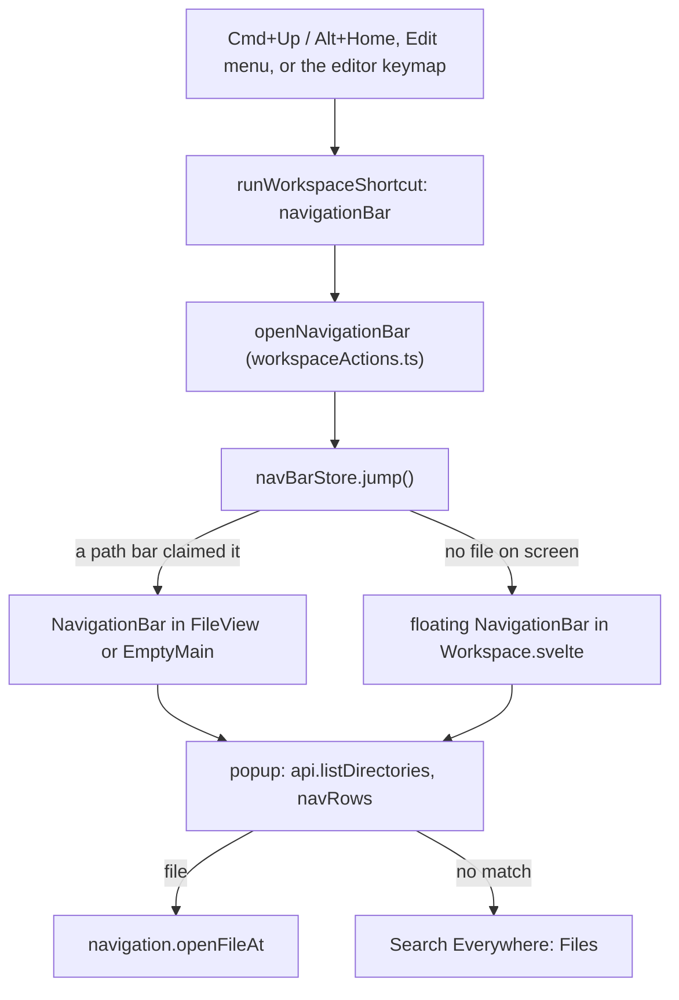

# How the Navigation Bar works

This chapter explains how the path above the code became a JetBrains-style Navigation Bar: crumbs with a popup per folder, keyboard moves through them, and a search in each list. The user side is in [Navigation Bar](../usage/Navigation-Bar.md).

## Why we need it

The path bar used to show the crumbs as plain text, so opening a neighbor file meant the mouse and the Files panel. JetBrains users move around a project with Cmd+Up and the arrow keys, and the user asked for the same.

## How it works

### The crumbs

`NavigationBar.svelte` draws the crumbs from `crumbsFor` in `navBarModel.ts`: a workspace crumb when there are several folders, the workspace folder, each folder down the path, and the file. The farthest crumb gets the largest `flex-shrink`, so the file name stays readable longest.

### Who answers the jump

Several bars can be mounted at once (one per tab, two editor groups, the welcome screen). The one that should answer the key gets `claimed` and calls `navBarStore.claim(owner)` with its own `Symbol`. `navBarStore.jump()` remembers the focused element, then either makes that bar `active` and bumps `jumpToken`, or sets `floating`. The active bar's effect sees the new token and opens its popup on `startIndex`: the file's folder, so the list shows the file's neighbors with the file selected.

`navBarStore.active` is the one bar that has the keyboard; any other bar resets itself. `close(restore)` puts the focus back, except after a click elsewhere or opening a file.

### Placement

The `fileToolbar` setting (**Settings > Appearance > File toolbar**: `"top"`, `"bottom"` or `"none"` shown as Hidden) and its `fileToolbarBreadcrumbs` switch decide which bars exist, and so which one claims the jump:

| Placement | Bars mounted | Cmd+Up goes to |
| --- | --- | --- |
| Top | `FileView`'s path bar, the welcome screen's strip (`EmptyMain.svelte`) | The claimed one; on the Log or a diff, the floating bar |
| Bottom | The same as Top, but `FileView`'s whole `.file-bar` moves under the code (`bar-bottom` sets CSS `order: 1`), and the welcome screen's strip to its foot | The claimed one; on the Log or a diff, the floating bar |
| Hidden, or the Breadcrumbs switch off | None | The floating bar |

The floating bar points at `navTarget()`: the file on screen in the focused group, else the active repository. `floatingAnchor()` puts it at the top left of `.editor-group.focused`, as JetBrains does with a hidden bar. `place()` opens a popup upward when there is under 200 px below the crumb, as in a bar under the code.

### The trail

Moving through popups builds a `trail` of crumbs that may leave the file's path. The model keeps the rules pure:

- `listedIndex`: the crumb whose contents a popup lists. A file lists its own folder.
- `selectedPathFor`: the entry to select, which is the next crumb, or the file itself.
- `enterItem`: Right or Enter on a folder keeps the crumbs up to the listed folder and adds the folder.
- `previousPopup`: Left goes to the folder above the listed one, skipping the file's crumb, which lists the same folder.

Closing resets `trail` to null, so the bar shows the file's path again.

### The popup

Each open reads the folder with `api.listDirectories`, as the Files panel does, so ignored entries, folders-first order and the 5000 entry cap match. A request id drops late answers. The workspace crumb lists the folders with `folderItems`.

`navRows` filters with `fuzzyMatch` from the Command Palette: letters in order, best score first, ties in listing order, and `highlight` marks the matched letters. With no match, the list offers **Search everywhere for "..."**, which closes the bar and calls `fileSearch.open("files", query)`.

The popup is moved to `<body>` with the `portal` action: the path bar is a CSS size container, which is the containing block of fixed elements inside it, so the bar's `overflow: hidden` would clip the popup.

### The key

`edit.navigationBar` is an Edit menu item with `Cmd+Up` on macOS and `Alt+Home` elsewhere, and a window command (`WINDOW_COMMANDS`), so it also works from the Files panel and the macOS terminal. Three details make it behave like JetBrains:

- **In the editor**, CodeMirror binds Cmd+Up to "start of file" and handles it first. `IN_EDITOR` in `commands/editorKeyPlan.ts` puts the command's key (default or custom) in front of the editor keymap, unless an editor command was moved onto that key.
- **In a text field**, `textFieldKeeps` in `workspaceShortcuts.ts` leaves the key alone, so the commit message box keeps moving its caret. xterm's hidden text area does not count as a text field.
- **While it is open**, `shortcutsBlocked` and `overlayOpen` include `navBarStore.isOpen`, so other popups and window keys wait. The MCP `close_dialog` tool knows it as `navigationBar`.

## Where the code lives

| File | What it does |
| --- | --- |
| `src/lib/navBar/navBarModel.ts` | Crumbs, the trail rules, popup items and filtering |
| `src/lib/navBar/navBarStore.svelte.ts` | Which bar answers the jump, the floating bar, focus restore |
| `src/lib/navBar/NavigationBar.svelte` | The crumbs, the popup and its keys |
| `src/lib/views/files/FileView.svelte` | Mounts the bar in the path bar (Top) or under the code (Bottom) and claims it for the tab on screen |
| `src/lib/navBar/navTarget.svelte.ts` | What the floating bar points at |
| `src/lib/views/EmptyMain.svelte` | The bar on top or at the foot of the welcome screen, and its **Navigation Bar** button |
| `src/lib/stores/settingsData.ts`, `views/SettingsDialog.svelte` | The `fileToolbar` setting and its Settings row |
| `src/lib/views/Workspace.svelte` | The floating bar, and the text field check for the key |
| `src/lib/ui/portal.ts` | Moves the popup to `<body>` |
| `src/lib/menu/menuSpec.ts`, `menuState.ts`, `menuActions.ts` | Edit > Jump to Navigation Bar |
| `src/lib/views/workspaceShortcuts.ts`, `workspaceActions.ts` | The window key, `textFieldKeeps`, the open guard |
| `src/lib/commands/editorKeyPlan.ts` | The key inside editors |
| `src/lib/help/shortcuts.ts` | The popup keys in the shortcuts window |

## Design decisions

**Lists open right away.** In JetBrains, Cmd+Up selects the last crumb and Down opens its list. Here the jump opens the file's folder at once, so typing a name works with one key less.

**A file crumb lists its folder**, with the file selected: a file has no contents of its own.

**Three placements, like JetBrains.** JetBrains editors offer breadcrumbs at the top, at the bottom, or hidden. Bottom moves the whole bar, so the file's tools stay next to its path. A hidden bar still answers the key, so the keyboard flow never depends on the layout.

**Read on every open, no cache.** A listing is one small backend call. Reading fresh means new files show up without watching, and nothing stays in memory after the bar closes.

**Cmd+Up in the editor.** JetBrains takes Cmd+Up in its editor too, and the user asked for the same feature. Cmd+Home still goes to the start of the file, and the key can be changed in Settings > Keyboard Shortcuts.

## Tests

- `src/lib/navBar/navBarModel.test.ts`: crumbs for one and several folders, nested repositories, paths outside the workspace, listed folders and selection, Left, entering items, workspace folders, filtering and highlights.
- `src/lib/commands/editorKeyPlan.test.ts`: the key in editors by default, with a custom key, removed, and when an editor command takes it.
- `settingsData.test.ts`: the `fileToolbar` default and parsing.
- `workspaceShortcuts.test.ts`, `registry.test.ts` and `menuState.test.ts`: Cmd+Up and Alt+Home, `textFieldKeeps`, the menu item.
- The popup position, the floating bar and focus handling need a check in the real app.

## Keeping in sync

- Changing the popup's keys: update `help/shortcuts.ts` and the [Navigation Bar](../usage/Navigation-Bar.md) page.
- The path bar layout is described in [How the path bar works](How-the-Path-Bar-Works.md).
- Retake `navigation-bar.png`, `navigation-bar-bottom.png`, `navigation-bar-hidden.png`, `empty-main.png` and `settings-appearance.png`. See [Docs and Screenshots](Docs-and-Screenshots.md).
