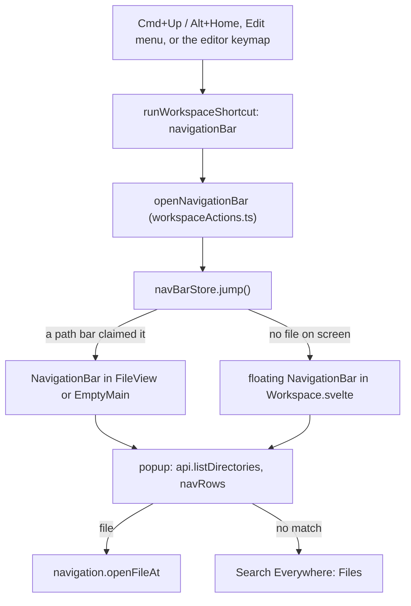

# How the Navigation Bar works

This chapter explains how the path above the code became a JetBrains-style Navigation Bar: crumbs with a popup per folder, keyboard moves through them, and a search in each list. The user side is in [Navigation Bar](../usage/Navigation-Bar.md).

## Why we need it

The path bar used to show the crumbs as plain text. To open a file next to the current one you had to reach for the mouse and the Files panel, or know its name for Search Everywhere. JetBrains users move around a project with Cmd+Up and the arrow keys instead, and the user asked for the same feature.

## How it works

### The crumbs

`NavigationBar.svelte` draws the crumbs from `crumbsFor` in `navBarModel.ts`: a workspace crumb when there are several folders, the workspace folder, each folder down the path, and the file. Repository roots are marked. Inside `FileView.svelte` it replaces the old static crumbs and keeps their shrinking rule: the farthest crumb gets the largest `flex-shrink`, so the file name stays readable longest.

### Who answers the jump

Several path bars can be mounted at once (one per tab, two groups in the split editor, and the welcome screen, `EmptyMain.svelte`, which shows the active repository's path when the first group has nothing open). The bar of the tab on screen in the focused group, or the welcome screen's while its group is focused, gets `claimed`, and calls `navBarStore.claim(owner)` with its own `Symbol`. `navBarStore.jump()` remembers the focused element, then either makes that bar `active` and bumps `jumpToken`, or sets `floating`. The active bar's effect sees the new token and opens its popup on `startIndex`: the file's folder, so the list shows the file's neighbors with the file selected.

`navBarStore.active` is the one bar that has the keyboard. A bar whose owner is no longer active resets itself, so clicking a crumb in the other group closes the first popup. `close(restore)` puts the focus back where it was, except after a click elsewhere or opening a file, which take the focus themselves.

### The trail

Moving through popups builds a `trail` of crumbs that may leave the file's path. The model keeps the rules pure:

- `listedIndex`: the crumb whose contents a popup lists. A file lists its own folder.
- `selectedPathFor`: the entry to select, which is the next crumb, or the file itself.
- `enterItem`: Right or Enter on a folder keeps the crumbs up to the listed folder and adds the folder.
- `previousPopup`: Left goes to the folder above the listed one, skipping the file's crumb, which lists the same folder.

Closing resets `trail` to null, so the bar shows the file's path again.

### The popup

Each open reads the folder with `api.listDirectories`, the same command the Files panel uses, so ignored entries, repository roots, folders-first order and the 5000 entry cap all match. A request id drops answers that arrive after the user moved on. The workspace crumb lists the workspace folders with `folderItems`, without a backend call.

`navRows` filters with `fuzzyMatch` from the Command Palette: letters in order, best score first, ties in listing order, and `highlight` marks the matched letters. With no match, the list offers **Search everywhere for "..."**, which closes the bar and calls `fileSearch.open("files", query)`.

The popup is moved to `<body>` with the `portal` action (`src/lib/ui/portal.ts`). The path bar is a CSS size container, and a size container is the containing block of fixed elements inside it, so a fixed popup would be clipped by the bar's `overflow: hidden`. `place()` puts it under the crumb and keeps it inside the window.

### The key

`edit.navigationBar` is an Edit menu item with `Cmd+Up` on macOS and `Alt+Home` elsewhere, and a window command (`WINDOW_COMMANDS`), so it also works from the Files panel and the macOS terminal. Three details make it behave like JetBrains:

- **In the editor**, CodeMirror binds Cmd+Up to "start of file" and handles it first. `IN_EDITOR` in `commands/editorKeyPlan.ts` puts the command's key (default or custom) in front of the editor keymap, unless an editor command was moved onto that key.
- **In a text field**, `textFieldKeeps` in `workspaceShortcuts.ts` leaves the key alone, so the commit message box keeps moving its caret. xterm's hidden text area does not count as a text field.
- **While it is open**, `shortcutsBlocked` and `overlayOpen` include `navBarStore.isOpen`, so other popups and window keys wait. The MCP `close_dialog` tool knows it as `navigationBar`.

## Where the code lives

| File | What it does |
| --- | --- |
| `src/lib/navBar/navBarModel.ts` | Crumbs, the trail rules, popup items and filtering |
| `src/lib/navBar/navBarStore.svelte.ts` | Which bar answers the jump, the floating bar, focus restore |
| `src/lib/navBar/NavigationBar.svelte` | The crumbs, the popup and its keys |
| `src/lib/views/files/FileView.svelte` | Mounts the bar in the path bar and claims it for the tab on screen |
| `src/lib/views/EmptyMain.svelte` | The bar on the welcome screen and its **Navigation Bar** button |
| `src/lib/views/Workspace.svelte` | The floating bar, and the text field check for the key |
| `src/lib/ui/portal.ts` | Moves the popup to `<body>` |
| `src/lib/menu/menuSpec.ts`, `menuState.ts`, `menuActions.ts` | Edit > Jump to Navigation Bar |
| `src/lib/views/workspaceShortcuts.ts`, `workspaceActions.ts` | The window key, `textFieldKeeps`, the open guard |
| `src/lib/commands/editorKeyPlan.ts` | The key inside editors |
| `src/lib/help/shortcuts.ts` | The popup keys in the shortcuts window |

## Design decisions

**Lists open right away.** In JetBrains, Cmd+Up selects the last crumb and Down opens its list. Here the jump opens the file's folder at once, so typing a name works with one key less.

**A file crumb lists its folder.** A file has no contents to list. Showing its neighbors with the file selected is what the user wants when they click a file name.

**Read on every open, no cache.** A listing is one small backend call. Reading fresh means new files show up without watching, and nothing stays in memory after the bar closes.

**Cmd+Up in the editor.** JetBrains takes Cmd+Up in its editor too, and the user asked for the same feature. Cmd+Home still goes to the start of the file, and the key can be changed in Settings > Keyboard Shortcuts.

## Tests

- `src/lib/navBar/navBarModel.test.ts`: crumbs for one and several folders, nested repositories, paths outside the workspace, listed folders and selection, Left, entering items, workspace folders, filtering and highlights.
- `src/lib/commands/editorKeyPlan.test.ts`: the key in editors by default, with a custom key, removed, and when an editor command takes it.
- `workspaceShortcuts.test.ts`, `registry.test.ts` and `menuState.test.ts`: Cmd+Up and Alt+Home, `textFieldKeeps`, the menu item.
- The popup position, the floating bar and focus handling need a check in the real app.

## Keeping in sync

- Changing the popup's keys: update `help/shortcuts.ts` and the [Navigation Bar](../usage/Navigation-Bar.md) page.
- The path bar layout is described in [How the path bar works](How-the-Path-Bar-Works.md).
- Retake `navigation-bar.png` and `empty-main.png`. See [Docs and Screenshots](Docs-and-Screenshots.md).
