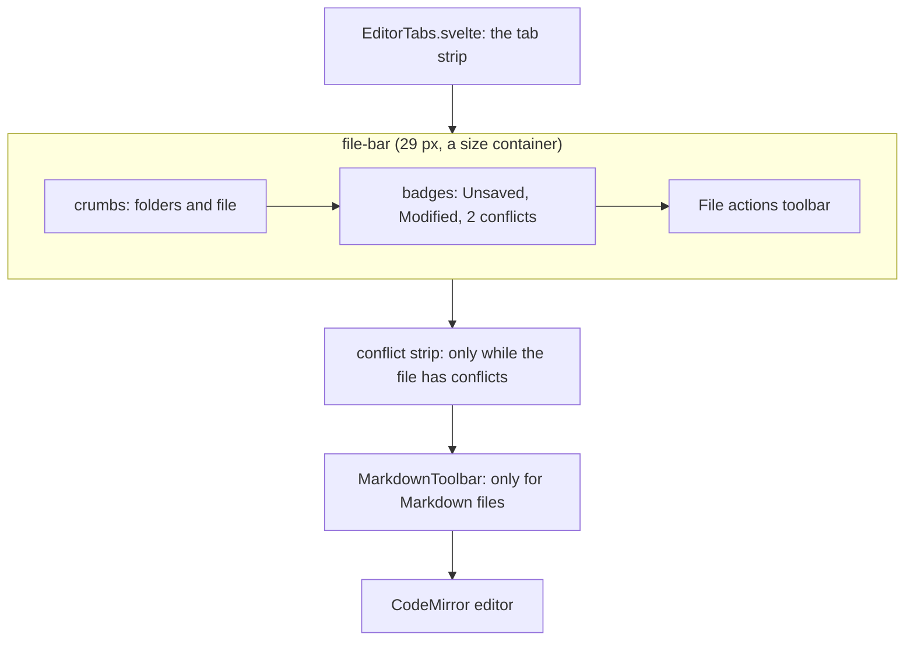

# How the path bar works

Every file tab has one slim bar between the tab strip and the code: the path and badges on the left, small icon buttons on the right. This page explains how it is built and how it collapses when the editor is narrow. The user side is in [Editor and Tabs](../usage/Editor-and-Tabs.md#the-path-bar); the rest of the editor is in [How the editor works](How-the-Editor-Works.md).

## Why we need it

The editor used to draw two rows above the code: a title row with the breadcrumbs, the badges and a copy button, and an actions row with the change arrows, the counter and a **Blame** button with a text label. Both rows wrapped, so together they took about 90 px, more in a narrow editor. On a laptop screen that is several lines of code lost on every tab.

JetBrains IDEs show the same information in one line: the path, then a few icon buttons at the right edge. The user asked for that look, so the code starts right under the tabs.

## How it works

`FileView.svelte` draws the bar as `.file-bar`, 28 px plus a 1 px border. It holds three parts:

- **`.crumbs`**: the workspace folder, then each folder down to the file, built by the `crumbs` derived value. Repository roots get the `folder-git` icon. The full absolute path is the tooltip.
- **Badges**: Unsaved, the git state (Modified, New file, Conflicted) and the number of conflict blocks. Each badge has a `title` with its text.
- **The `File actions` toolbar** (`role="toolbar"`): previous and next section (Shift+F7 and F7) with the counter, a divider, **Blame** (an icon button with `aria-label="Blame"` and `aria-pressed`), **Copy relative path**, and for Markdown files the view switch, a `radiogroup` named **Markdown view** with Editor Only, Editor and Preview, and Preview Only.

All buttons are 24 by 22 px, with a tooltip and an accessible name. The keyboard shortcuts did not change: F7 and Shift+F7 live in the editor keymap, and the view modes are also in **View > Markdown**.

Below the bar come only rows that are tools, and only when they apply:

- The **conflict strip** (`.conflict-bar`, toolbar **Conflict actions**) with Accept All Current, Accept All Incoming, Resolve in Merge Tool and Mark as Resolved. See [How conflict resolution works](How-Conflict-Resolution-Works.md).
- The **Markdown formatting row** (`MarkdownToolbar.svelte`, toolbar **Markdown**), 28 px high. See [How the Markdown editor works](How-the-Markdown-Editor-Works.md).
- For images and PDFs, the zoom and Reveal row of `MediaPreview.svelte`, made just as low.

### Collapsing when narrow

The bar never wraps and never overflows. `.file-bar` sets `container-type: inline-size`, so CSS container queries react to the editor's own width, not the window's:

| Bar width | What changes |
| --- | --- |
| 600 px or less | The counter (**2 of 5**) is hidden visually. Screen readers still read it. |
| 480 px or less | Badges become 8 px colored dots; the text stays for screen readers and the tooltip. |
| 320 px or less | The dividers between the buttons go. |

The breadcrumbs shorten all the time, as needed. The crumbs container may shrink, the badges and buttons may not. Inside it, each crumb gets a `flex-shrink` from `crumbShrink`: 10 to the power of its distance from the file, so the outermost folder gives up its width first, then the next one. Each folder keeps room for an ellipsis (`min-width: 1.4em`, plus the icon when it has one), and the file name shrinks last. `.crumbs` is aligned to its end, so whatever still does not fit is cut on the left, never the file name on the right.

## Where the code lives

| File | What it does |
| --- | --- |
| `src/lib/views/files/FileView.svelte` | The bar, the crumbs and `crumbShrink`, the badges, the actions, the view switch, the conflict strip and the container queries |
| `src/lib/views/files/MarkdownToolbar.svelte` | The Markdown formatting row |
| `src/lib/views/files/MediaPreview.svelte` | The image and PDF row |
| `scripts/screenshots.ts` | `editor-conflict-toolbar` clips `.file-bar` and the Conflict actions toolbar; `markdown-toolbar` clips the formatting row, the view switch and the Heading menu |

## Design decisions

**One bar, like JetBrains.** Text labels became icon buttons with tooltips, and the path shortens instead of wrapping. The code gains about 60 px on every tab, and the bar looks the same in every file.

**Tools keep their own row.** Conflict buttons and Markdown formatting are things you use, not information, and their text labels or many buttons would crowd the bar. They show only when they apply, and the conflict strip is tinted like the editor notifications in JetBrains, so it reads as a temporary state.

**The view switch moved into the bar.** It changes how the whole tab looks, like the JetBrains Markdown editor's switch at the top right, and it keeps the formatting row free for formatting.

**Collapse in a fixed order.** The counter is the least needed part (the change ticks beside the scrollbar show the same), so it goes first. Badges keep their color as dots. The file name and the buttons stay to the end, because they are what you came for.

**Container queries, not window media queries.** The editor's width depends on the sidebars and the Files panel, so only the bar's own width tells what fits.

## Bugs we fixed

**Toolbar buttons overlapped, and the path got hidden.**
- **The issue:** with many buttons and the Files panel open, the buttons overlapped, and part of the path disappeared.
- **Why it happened:** all actions shared one fixed row, and the crumbs scrolled sideways on one line.
- **The fix and why we chose it:** at first both rows wrapped, since the user wanted every option visible. That cost up to 90 px above the code, so the slim bar replaced them: every option is still there as an icon button, and the path shortens from the left instead of hiding.

## Tests

The bar is layout and has no pure logic of its own; `crumbShrink` is one line. It needs a visual check in light and dark, and at narrow editor widths (drag the Files panel wider): the counter hides first, then the badges become dots, and the file name stays readable. See [Testing](Testing.md).

## Keeping this page in sync

- Update this page, [Editor and Tabs](../usage/Editor-and-Tabs.md) and [How the editor works](How-the-Editor-Works.md) when a button, a badge or a breakpoint changes.
- Keep the `editor-conflict-toolbar` and `markdown-toolbar` selectors in `scripts/screenshots.ts` working.
- Retake `editor-tabs.png`, `editor-change-markers.png`, `editor-conflict-toolbar.png` and the `markdown-*.png` screenshots. See [Docs and Screenshots](Docs-and-Screenshots.md).
