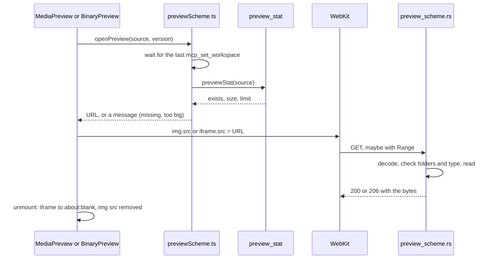

# How the Preview Scheme Works

The image and PDF previews, in a file tab and in a diff, load their files from a URL scheme of our own: `gmpreview`. This page covers the scheme: its URLs, what it may serve, range requests and memory. The viewers that use it are in [How the Image and PDF Preview Works](How-the-Image-and-PDF-Preview-Works.md).

## Why we need it

The first preview read the whole file through a command and made a `blob:` URL of it. Every byte crossed the IPC bridge (the channel between the web page and Rust) and sat in the page as a `Blob` while the preview was open: a 90 MB PDF meant 90 MB in the web view, and a diff of two versions twice that.

With a URL scheme, the page only sets `img.src` or `iframe.src`. WebKit asks Rust for the bytes itself and lets go when the element goes; no bytes enter JavaScript. WebKit's PDF viewer can also ask for a document piece by piece.

## How it works

### The URLs

`previewUrl` in `src/lib/views/files/previewSource.ts` builds them, and `parse_target` in `src-tauri/src/preview_scheme.rs` reads them. Each part is percent-encoded on its own with `encodeURIComponent`, so a `/` inside a path never splits it:

- `<base>worktree/<absolute file path>`: a file on disk.
- `<base>revision/<repository root>/<revision>/<repo-relative path>`: a file in git. The revision is `HEAD`, `index` (stage 0 of the index), a full commit id, or a full id with `^` for its first parent.

The base comes from Tauri's `convertFileSrc`: `gmpreview://localhost/` on macOS and Linux, `http://gmpreview.localhost/` on Windows. The backend only reads the path, so both work. A `?v=` number at the end is ignored by Rust; a new one makes WebKit load the file again after it changed on disk.

Short ids and branch names are refused on purpose: `Oid::from_str` pads a short id with zeros, and a branch name would change meaning when the branch moves.

### What it may serve

The scheme answers only for the folders open in the window. `App.svelte` sends them with `mcp_set_workspace` whenever the workspace changes; the command stores them in `AppState.preview_folders` (a `PreviewFolders`) as well as for MCP. Before the first call the list is empty and every request is refused. `openPreview` waits for the latest call, so a preview tab restored at start does not race it.

- **Work tree files** go through `checked_path` from `mcp/paths.rs`: the path must be absolute, `..` is refused, and symlinks are resolved before the folder check, so a link that leads out is outside. On Unix the file is opened with `O_NOFOLLOW`, so a symlink swapped in after the check is not followed.
- **Revisions** go through `checked_repo`: the repository must be inside a folder, or be the one a folder was opened in. The path must be relative and stay in the repository. Only regular files are served, never a committed symlink or a submodule.
- **Types**: only what `media::preview_mime` knows (PNG, JPEG, GIF, WebP, BMP, ICO, AVIF, PDF). The answer always says that type, with `X-Content-Type-Options: nosniff`.

A refusal is 403 (not allowed), 404 (not there) or 413 (too big), with an empty body, so no path or reason leaks into the page.

### Ranges

`parse_range` reads one `bytes=` range: `0-99`, `100-` or `-500` (the last 500 bytes). The answers:

- no `Range`: 200 with the whole file and `Content-Length`;
- a range inside the file: 206 with `Content-Range: bytes start-end/size`, at most `MAX_RANGE_BYTES` (4 MB); a longer or open range gets the first 4 MB and the client asks again;
- a range past the end or a broken one: 416 with `Content-Range: bytes */size`;
- another unit or several ranges: the whole file, as RFC 9110 allows.

Every answer has `Accept-Ranges: bytes` and `Cache-Control: no-store`, so WebKit keeps no copy in its cache.

### Memory

A work tree range is read with `seek` and `read` of just those bytes. Tauri sends a response body in one piece, so a request without a range holds the whole file once; that is why a whole PDF keeps the 100 MB limit while ranged requests of it have none. Images keep the 50 MB limit either way, since the decoded picture is several times bigger.

git stores blobs compressed, so there is no way to seek into one. A revision request reads the blob with git2, answers its range and drops it right away. The blob is in memory once per request, which is why revisions keep both limits. `preview_stat` gets a blob's size from the object header (`odb.read_header`) without inflating it.

The handler runs with `register_asynchronous_uri_scheme_protocol` and `spawn_blocking`, off the main thread, and caches nothing.

## Where the code lives

| File | What it does |
| --- | --- |
| `src-tauri/src/preview_scheme.rs` | `PreviewFolders`, `parse_target`, `parse_range`, `respond`, `stat`, the Tauri wrapper `http_response` |
| `src-tauri/src/media.rs` | `preview_mime` and the size limits |
| `src-tauri/src/commands/files.rs` | `preview_stat` |
| `src-tauri/src/commands/mcp.rs` | `mcp_set_workspace`, which also sets the preview folders |
| `src-tauri/src/lib.rs` | registers the scheme |
| `src-tauri/tauri.conf.json` | `gmpreview:` and `http://gmpreview.localhost` in `img-src` and `frame-src` |
| `src/lib/views/files/previewSource.ts` | the URL format and the special revisions |
| `src/lib/views/files/previewScheme.ts` | the base, `syncWorkspaceFolders`, `openPreview` |

## Design decisions

**A scheme, not bytes over IPC.** See "Why we need it". It also removed `blob:` from the CSP (Content Security Policy, the list of places the page may load from), which nothing else used.

**A stat command next to the scheme.** An `img` that fails only says "error". `preview_stat` tells missing from too big, so a diff side can say "Not in HEAD" or "Deleted". It shares `resolve` with the scheme. A `fetch` with HEAD would have needed CORS headers and `connect-src` for the scheme.

**The MCP folder list.** The window already sends the open folders for MCP. Reusing that call keeps one source of truth; the scheme keeps its own copy, so it works with MCP off.

**One testable function.** `respond` takes a method, a path and a `Range` value and returns status, headers and body. The Tauri closure only converts types, so everything that matters runs in plain unit tests.

## Tests

`src-tauri/src/preview_scheme/tests.rs` covers decoding, every URL form, the ranges, the 4 MB cap, a PDF over 100 MB that still streams, every refusal, `HEAD`, `index`, a commit and its parent in a real repository, blob ranges, `stat`, the folder registry and the Tauri wrapper with both URL forms. `src/lib/views/files/previewSource.test.ts` covers the URLs.

Whether WebKit's PDF viewer really asks for ranges from a custom scheme, and the CSP on each platform, need a check in the app.

## Keeping this page in sync

- Change `previewSource.ts` and `parse_target` together, with their tests.
- The screenshot script answers `http://gmpreview.localhost` from the demo itself (`previewResponse` in `scripts/screenshots.ts`), since the browser page has no scheme; keep it in step with the URL format.

## Bugs we fixed

None yet.
