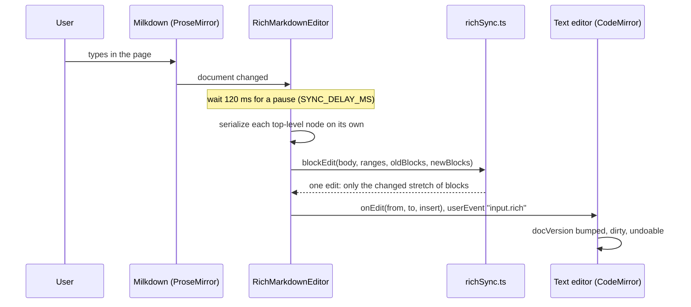

# How the Rich Markdown Editor Works

In Preview Only, a Markdown file is shown as a rich text editor: you type in the rendered page, like Typora. This page explains how those edits get back into the file without reformatting it. The rest of the Markdown support is in [How the Markdown Editor Works](How-the-Markdown-Editor-Works.md); the user side is [Markdown Editor](../usage/Markdown-Editor.md).

## Why we need it

People who write docs often prefer to edit the page as it looks, not the raw text. But a Markdown file is shared with other people and tools. If saving from a rich editor rewrote the whole file in its own style (other list markers, other emphasis, changed table padding), every edit would show up as a huge diff and annoy everyone in code review. So the rule is: **a block you did not touch keeps its exact text.**

## How it works

The rich editor is [Milkdown](https://milkdown.dev) (`@milkdown/kit`), built on ProseMirror and remark, with the CommonMark and GFM presets, history and clipboard. `RichMarkdownView.svelte` imports `src/lib/markdown/richEditor.ts` on first use, a lazy chunk of about 458 KB.

The CodeMirror text editor stays the real file. It is hidden but alive, so save, undo, the unsaved dot and diffs keep working.

### Block by block write-back

`richEditor.ts` measures and writes; the pure, tested diff logic (`splitFrontMatter`, `blockEdit`, `applyEdit`) lives in `richSync.ts`:

- On load, `topLevelRanges` asks the same remark parser for the position of every top-level block in the text, and `serializeBlocks` writes each top-level node of the editor document on its own. The two lists must have the same length.
- After an edit, `blockEdit` drops the equal blocks at the start and the end. Only the stretch in between is replaced (`applyEdit`), written in `STRINGIFY_OPTIONS` (the common GitHub style: `-` bullets, `*` emphasis, backtick fences). New blocks are joined with a blank line; removed blocks take their blank lines with them.
- After writing, the ranges are measured again. If a written block now reads back as more or fewer blocks, the editor reloads from the text.

On every parse, the remark plugin `gmImageDefaults` runs `dropNullImageFields` (`richSync.ts`): remark gives an image without a title `title: null`, which Milkdown's image node rejects, so the field is dropped and the default `""` applies. An empty title is written as none.

`splitFrontMatter` keeps a `---` YAML block at the top exactly as written and out of the editor, so it is never shown or rewritten.

### When it cannot keep the text

If the ranges and the blocks do not line up after loading (some raw HTML, unusual syntax), the editor turns read-only (`setReadOnly`) and the view shows "This file uses Markdown the rich editor cannot keep exactly. Edit it in the text editor." A parse error does the same with its message. This is safer than guessing and rewriting someone's file.

### Changes from elsewhere

`RichMarkdownView` watches `docVersion`. When the text changes outside the rich editor (Revert, a reload, the hidden text editor), `setSource` loads it again. That load is not added to Milkdown's history, because the text editor already has it.

`flush()` writes a pending edit at once. It runs before Cmd+S saves, before switching view modes, and when the view unmounts.

### Toolbar, keys and clicks

- The toolbar calls `onRichFormat(action)`, and `RichMarkdownEditor.run` maps each `RichAction` to a Milkdown command (`toggleStrongCommand`, `wrapInBulletListCommand`, `insertTableCommand` with 3 rows and 3 columns, `wrapInHeadingCommand`...). Task list wraps in a bullet list, then sets `checked: false`.
- Link (and Cmd+K) asks for an Address in a prompt and runs `toggleLinkCommand`.
- A click left of a task item's text calls `toggleTask`. A plain click on a link only places the caret; Cmd+click follows it through `classifyLink`.
- Cmd+S flushes, then saves through `FileView`.

### Images and diagrams

Custom node views (`$view`):

- **Images** use `classifyImage`, like the preview: data URLs show, local files load through `read_image_data_url` once near the screen, and remote ones are not loaded (`md-image-blocked`, tooltip "Remote images are not loaded").
- **Code blocks** with the language `mermaid` show the diagram under the code. It draws only near the screen (`NearScreen`), is freed when far, and redraws 400 ms after you stop typing in it. The SVG goes through `sanitizeSvg`, like the preview's diagrams.

## Where the code lives

| File | What it does |
| --- | --- |
| `src/lib/markdown/richEditor.ts` | Milkdown setup, sync, actions, node views |
| `src/lib/markdown/richSync.ts` | Block by block edits, front matter, the image parse fix-up |
| `src/lib/views/files/RichMarkdownView.svelte` | Mounting, link prompt, clicks, keys, notices |
| `src/lib/views/files/FileView.svelte` | `applyRichEdit`, `richScroll`, mode switches |
| `src/lib/markdown/body.css` | Page styles shared with the preview |
| `vite.config.js` | Milkdown entry points in `optimizeDeps` |

## Design decisions

**Edit the page, keep the file.** Rewriting only changed blocks costs a parse per edit, but keeps diffs small and honest.

**Read-only over a wrong rewrite.** A file the editor cannot round-trip is shown, not edited.

**Split mode keeps the read-only preview.** Editing on both sides at once would fight over the cursor, so only Preview Only is editable.

**Only while on screen.** The view mounts only for the active tab and frees Milkdown's document when hidden; the scroll position comes back through `initialScroll`. The Milkdown library itself stays in memory after first use (about 8 MB).

## Known gaps

- Diagrams do not redraw when the color theme changes; they pick up the new theme when drawn again (scroll away and back, or reopen the file).
- Leaving Preview Only shows the text from the top.

## Tests

- `src/lib/markdown/richSync.test.ts`: untouched blocks keep their text, edited blocks use the serializer's spelling, whole blocks are inserted and deleted with their blank lines, nothing changes when the blocks are equal, an empty file is filled, front matter is split off, and `dropNullImageFields` drops only an image's null fields.

The Milkdown glue in `richEditor.ts` needs a real DOM and is checked in the app.

## Keeping this page in sync

- Update this page when the stringify options, the sync delay or the read-only rule change.
- Retake `markdown-rich-editor.png` when the look changes.

## Bugs we fixed

**An image without a title made the editor read-only.**
- **The issue:** in Preview Only, any image like `` showed "This file uses Markdown the rich editor cannot keep exactly." and the page could not be edited.
- **Why it happened:** remark gives such an image `title: null`. Milkdown passes it to ProseMirror's `createAndFill`, which rejects it ("Expected value of type string for attribute title on type image, got null"). Milkdown logs the error and drops the image, so the editor has fewer blocks than the text.
- **The fix and why we chose it:** the `gmImageDefaults` remark plugin removes null image fields before parsing, so the schema default (`""`) applies. It also covers pasting, and write-back stays exact. Patching Milkdown's image runner would mean copying its code.

**Rich editor diagrams were not sanitized.**
- **The issue:** a mermaid diagram in Preview Only was inserted as raw SVG, while the split preview cleaned it.
- **Why it happened:** the code block view put the SVG it got from mermaid into the page directly, without the `sanitizeSvg` step that `previewDom.ts` has.
- **The fix and why we chose it:** the node view now passes the SVG through `sanitizeSvg`, the same instance the preview uses, because a document's diagram is untrusted input wherever it is shown.
