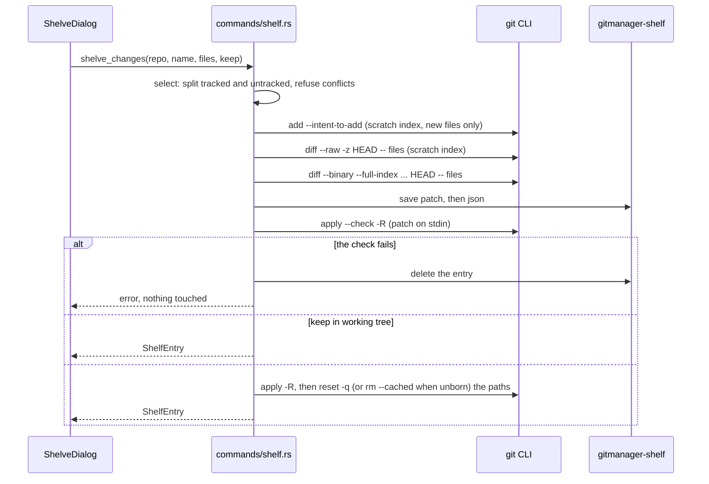
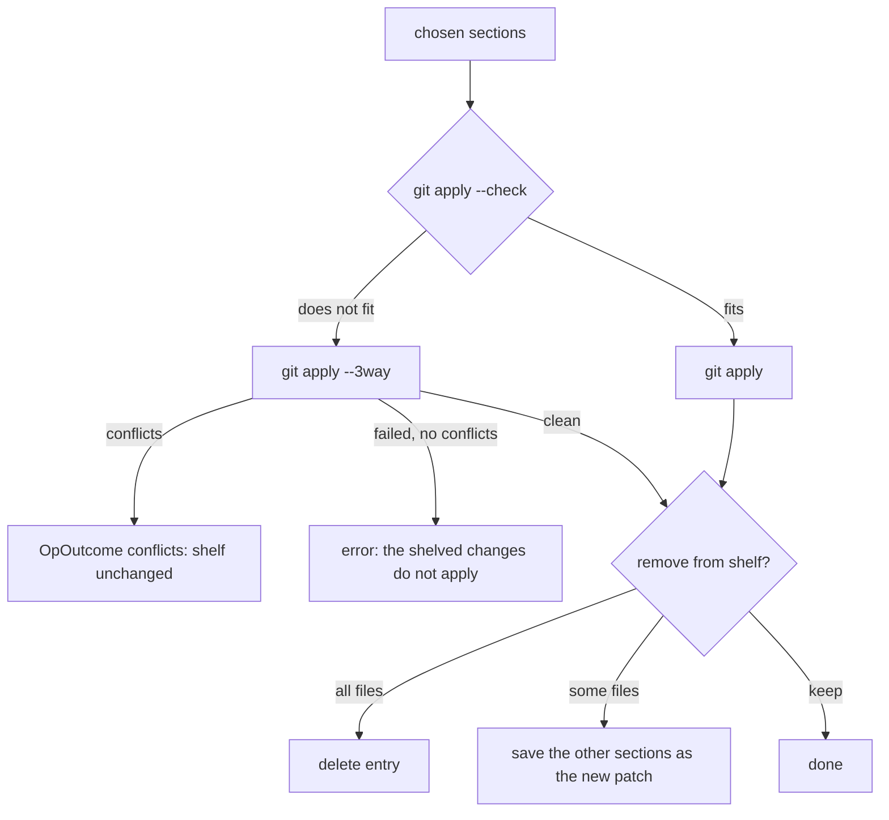

# How the Shelf Works

The shelf is JetBrains' Shelve Changes: chosen files are saved as a named patch and taken out of the work tree, then applied again later, in full or file by file. For the user side, see [Shelf](../usage/Shelf.md).

## Why we need it

Git's stash (see [How Stashes Work](How-Stashes-Work.md)) is all or nothing in our UI, has no names beyond a message, and hides its files. People coming from JetBrains expect to shelve a few files, keep a copy without reverting, see each shelved file's diff and unshelve only part of it. A patch on disk gives all of that with plain git commands, and it survives `git stash clear`.

## How it works

### Storage

`shelf/store.rs` keeps every shelved change list in `<common git dir>/gitmanager-shelf/`:

- `<id>.patch`: one `git diff --binary` patch, one section per file;
- `<id>.json`: `{ version, id, name, createdAt, branch, headCommit, files }`, each file with `path`, `oldPath`, `change`, `binary` and `oldId` (the blob it started from), in patch order.

The id is the time in milliseconds plus a counter (`1790765466000-0`), so ids sort by age. `check_id` refuses anything else from the UI, so a path can never leave the folder. Both files are written through a temporary file and a rename. `list` skips unreadable or orphaned entries but never deletes them. The folder is in the **common** git dir (`repo.commondir()`), so linked worktrees share one shelf.

### Shelving

Details that matter:

- **New files** join a scratch copy of the index (`<id>.index`, set through `GIT_INDEX_FILE`) as intent-to-add. That way one `git diff HEAD` includes them and pairs a delete plus an add into a rename, and the real index is never touched. The scratch file is removed when its guard drops.
- **Fixed patch flags** (`PATCH_FLAGS`): `--binary --full-index --no-color --no-ext-diff --no-textconv --src-prefix=a/ --dst-prefix=b/ --no-relative --find-renames --ignore-submodules=all`. The user's diff config can never produce a patch `git apply` cannot read back. The `--raw -z` listing uses the same rename detection, so its entries line up one to one with the patch sections; if they do not, shelving stops with "Could not read the changes to shelve".
- **An empty repository** diffs against the empty tree (`4b825dc...`), and reverting uses `git rm --cached` instead of `git reset`.
- **Saved, then checked, then reverted.** The work tree is touched only once the patch is on disk and `git apply --check -R` proved it takes the changes out exactly. Applies always pass `--whitespace=nowarn`, so `apply.whitespace=fix` cannot change content.

### Unshelving

`unshelve(repo, shelfId, filePaths, removeFromShelf)` loads the patch, splits it into sections (`shelf/patch.rs`), keeps the chosen ones and applies them:

Conflicts come back as `OpOutcome { conflicts: true }`, so `repoStore.runOp` opens the Conflicts dialog like any merge.

### Show Diff

`shelf_file_diff` rebuilds both sides in Rust. The original is the blob named in the section's `index` line (or `oldId`, or empty for an added file); `apply_hunks` applies the hunks to it to get the shelved side. When that blob is gone from the repository, `hunk_sides` builds the two sides from the hunks alone and the result says `partial`. Binary files come back as a binary diff. The tab is a pseudo tab (`gitTabPath({ kind: "shelf", ... })`) titled "Shelved: name" and shown by `ShelfDiffTab.svelte` with `DiffView` in read-only mode, labels Base and Shelved.

## Where the code lives

| File | What it does |
| --- | --- |
| `src-tauri/src/commands/shelf.rs` | `shelve_changes`, `list_shelf`, `unshelve`, `shelf_file_diff`, `rename_shelf`, `delete_shelf`; selection, scratch index, revert, apply |
| `src-tauri/src/shelf/store.rs` | Folder layout, `ShelfEntry`, ids, names, atomic writes |
| `src-tauri/src/shelf/patch.rs` | Splitting patches, reading ids and hunks, rebuilding sides |
| `src-tauri/src/git/cli.rs` | `run_with_env`, `run_bytes_with_env`, `run_with_stdin`, `run_raw` |
| `src/lib/shelf/ShelveDialog.svelte` | The Shelve Changes dialog |
| `src/lib/shelf/ShelfPanel.svelte` | The Shelf tab of the bottom panel |
| `src/lib/shelf/ShelfDiffTab.svelte` | The read-only "Shelved:" tab |
| `src/lib/shelf/shelfActions.svelte.ts` | Open dialog, Show Shelf, unshelve, rename, delete, `shelfState.version` |
| `src/lib/shelf/shelfModel.ts` | Default name, candidates, letters, selection |
| `src/lib/views/changes/repoMenu.ts`, `RepoSection.svelte` | The Stash submenu items and the file menu item |
| `src/lib/menu/menuSpec.ts`, `menuActions.ts` | Git > Uncommitted Changes items |

## Design decisions

**A patch, not a stash commit.** A patch can hold any subset of files, be applied in part, and be rewritten when part of it is unshelved. It also stays out of `refs/stash`, so git's own stash commands never touch it.

**Inside `.git`, not the work tree.** The shelf is never committed or pushed and needs no `.gitignore` entry. Being in the common dir, every worktree of a repository sees the same shelf.

**Save before revert.** If anything fails after the patch is written, the user's work is still on disk in one of two places. The reverse check before reverting means a patch that would not revert cleanly is deleted and the files stay untouched.

**Rebuild diffs in Rust.** Show Diff needs the original blob and the hunks, both of which the backend already has. The frontend gets an ordinary `FileDiff`.

**Unshelving does not stage.** Like JetBrains, the changes come back to the work tree only (a clean `git apply` without `--index`), so new files are untracked again. Shelving resets the index of its paths to HEAD, so the staged and unstaged split is not kept.

**Conflicts keep the shelf.** Removing a shelved change only after a clean apply means a conflicted unshelve can always be retried or undone.

**Submodules and nested repositories are excluded** (`--ignore-submodules=all`, `shelveCandidates`): they are other repositories, not changes of this one.

## Tests

- `src-tauri/src/commands/shelf.rs`: a round trip of every kind of change (modified, added, deleted, renamed, binary, staged and unstaged); keep in working tree; a partial unshelve keeps the other files; an unshelve onto changed lines stops with conflicts and keeps the shelf; refusing nothing, conflicts and escaping paths; shelving before the first commit; Show Diff rebuilding both sides; rename and delete; the raw listing parser.
- `src-tauri/src/shelf/store.rs`: ids are checked before touching files, names are trimmed and required, older JSON without optional fields still reads.
- `src-tauri/src/shelf/patch.rs`: splitting, ids, binary and hunks, missing final newlines, new files, CRLF line endings.
- `src/lib/shelf/shelfModel.test.ts`: default names, labels, candidates and the file selection.

## Keeping this page in sync

- Update this page when `commands/shelf.rs`, `shelf/` or `src/lib/shelf/` change, or if the storage format changes (bump `FORMAT_VERSION` and keep reading old files).
- Update [Shelf](../usage/Shelf.md) for any change to the dialog, the tab or the menus, and retake `shelf-shelve-dialog.png` and `shelf-panel.png`.
- The commands are listed in [Commands and Events](Commands-and-Events.md).

## Bugs we fixed

None yet.
