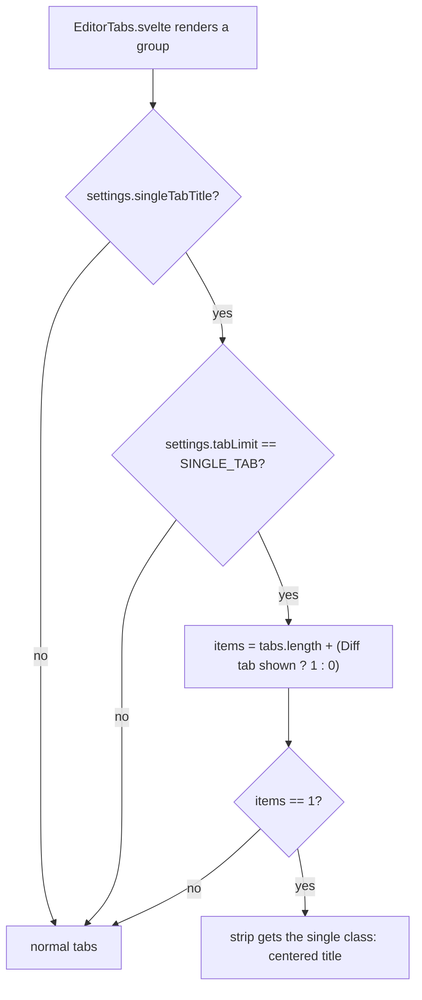

# How the single tab title works

This chapter explains how a tab strip with one tab turns into a centered title in single tab mode. The user side is in [Single Tab Title](../usage/Single-Tab-Title.md); the rest of the strip (drag, pin, wrap) is in [How tabs are arranged](How-Tabs-Are-Arranged.md).

## Why we need it

With one file open, the strip is a single tab on the left and empty space to the right. It looks unfinished, and the tab frame adds nothing when there is no other tab to tell it apart from. The user asked to move the lone tab to the center and show it like a name, and then to keep it to single tab mode (Settings > Editor > Tab limit > Single tab): there one file at a time is the point, while with other limits a lone tab is just a moment before the next file opens.

## How it works

### The rule, in tabs.ts

The decision is one pure function in `src/lib/stores/tabs.ts`:

```ts
showsTabAsTitle(enabled, tabLimit, tabCount, diffOpen)
```

It is true when the setting is on, `tabLimit` is `SINGLE_TAB` (from `tabLimit.ts`) and the strip holds exactly one item. The Diff tab of the Changes view counts as an item, because it sits in the same strip as the others.



### The strip

`EditorTabs.svelte` derives `single` from that function for its own group and adds the `single` class to the strip. Only the Diff tab counts in the primary group, since only that group shows it.

Nothing else in the markup changes. The title is the same `.tab` element with the same buttons and handlers, so the right-click menu, middle click, double-click to keep a preview, the dirty dot and the pin button all keep working with no extra code. The CSS does the rest:

- `justify-content: center` on the strip puts the tab in the middle.
- The tab loses its right border, its background and the accent line (`::before`).
- The tab can shrink (`flex: 0 1 auto`, `min-width: 0`), so a long name ends in an ellipsis instead of overflowing a centered strip, which would cut off its start with no way to scroll to it.
- The tab gets a left padding equal to the close button's width, so the name sits in the true middle, not 20 px to the left.
- The close button always shows, even when the tab is not the active one (for example while another view is open), so the lone file can be closed without hunting for it. A dirty tab still shows its dot until hover, like any tab.
- Under [Rounded panels](How-Rounded-Panels-Work.md), the pill background and outline are cleared too.

Dragging needs at least two tabs (`startDrag` returns null otherwise), so the title can never be dragged.

## Where the code lives

| File | What it does |
| --- | --- |
| `src/lib/stores/tabs.ts` | `showsTabAsTitle` |
| `src/lib/views/EditorTabs.svelte` | the `single` class and its styles |
| `src/lib/stores/settingsData.ts` | the `singleTabTitle` preference (on by default) |
| `src/lib/stores/settings.svelte.ts` | the reactive `singleTabTitle` field and saving it |
| `src/lib/views/SettingsDialog.svelte` | the Single tab title switch, shown under Tab limit only while Single tab is chosen |

## Design decisions

**A class, not a second component.** Rendering a separate title element would mean copying the tab's buttons, menu and handlers, and keeping both in sync. Styling the same element keeps every tab action working and costs nothing in memory.

**Only in single tab mode.** With no limit or a number limit, the strip grows and shrinks as files open, and a title that turns into a tab and back each time would jump around. In single tab mode the strip almost always holds one file, so the title is stable.

**On by default, under Tab limit.** The switch is a sub-row of Tab limit that shows only while Single tab is chosen, since it does nothing otherwise. Anyone who prefers a plain tab in single tab mode can turn it off.

**The Diff tab counts.** It shares the strip with the file tabs. Not counting it would show a title next to a Diff tab, which is two items again.

**Per group.** In a split editor each strip decides alone, so a group with one file still looks tidy next to a busy one.

## Tests

- `src/lib/stores/tabs.test.ts`: `showsTabAsTitle` (one tab, the setting off, other tab limits, the Diff tab counted, empty and full strips).
- `src/lib/stores/settingsData.test.ts`: the `singleTabTitle` default and validation.

The centered look, the always visible close button and the Rounded panels styles need a visual check in the app.

## Keeping this page in sync

- Update this page and [Single Tab Title](../usage/Single-Tab-Title.md) when the rule or the look changes.
- A new kind of item in the strip must be counted in the call to `showsTabAsTitle`.
- A new tab style (for example in Rounded panels) must be cleared for the `single` strip.
- See [Docs and Screenshots](Docs-and-Screenshots.md).
