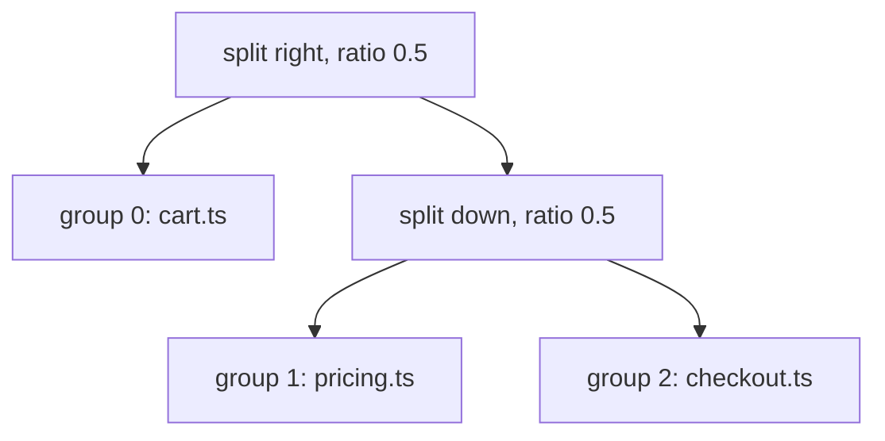
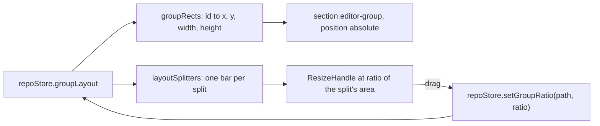

# How the split editor works

This chapter explains how editor groups are kept, split, drawn and saved. The user side is in [Split Editor](../usage/Split-Editor.md); a single strip of tabs (drag, pin, wrap) is in [How tabs are arranged](How-Tabs-Are-Arranged.md).

## Why we need it

Reading one file while writing another is everyday work: a test next to its code, a caller above its function. The first split editor had two groups side by side. The user asked for **Split Down** like JetBrains, and for the full JetBrains grid: any group can be split again, right or down, so one tall file can sit next to two stacked ones.

## How it works

### Groups and a split tree

`GroupsState` in `src/lib/stores/editorGroups.ts` holds two things:

- `groups`: every group's tabs and active tab, in **layout order** (left to right, then top to bottom). The first group also shows the Diff tab and the Log.
- `layout`: a binary tree from `src/lib/stores/groupLayout.ts`. A leaf is a group; a split divides its area `right` (side by side) or `down` (stacked) at `ratio`.

Every change goes through pure functions that keep the two in step (`withLayout` reorders `groups` after the tree):

- `splitGroup(state, shownTab, direction)` replaces the focused leaf with a split whose second side is a new group, and opens the tab there. Opening to the side (`openTarget` with `toSide`) uses the next group, or splits right when there is one group.
- `dropEmptyGroups` and `closeGroup` remove leaves with `keepInLayout`: a split that loses one side is replaced by the other, so the neighbour takes the room.
- `moveToOtherGroup` sends a tab to the next group in layout order, going round (`otherGroup`).
- `setGroupRatio` moves one splitter, named by its path from the root ("0" first side, "1" second side).
- `MAX_GROUPS` (8) stops splitting when the panes would get too small.

### Drawing the groups

`Workspace.svelte` does not nest the groups in the tree. It draws them as one flat keyed list and places each one absolutely with the rectangle `groupRects` computes (fractions of the editor area).

Edges that touch another group give up `--group-gap-half`, which is half the panel gap with [Rounded panels](How-Rounded-Panels-Work.md) and zero otherwise; without rounded panels a 1 px line parts the groups. Each bar is a zero-size box on the split line with a `ResizeHandle` centered on it: `panel="left"` for a right split (it reports the first side's width) and `panel="bottom"` for a down split (the second side's height). Each side keeps at least 120 px.

### Menus

The Window menu has Split Right (Cmd+\\), Split Down, Move Tab to Next Group, Focus First and Second Group (Cmd+1, Cmd+2), Focus Next and Previous Group and Close Group (`menuSpec.ts`, `menuActions.ts`, `menuState.ts`, reasons in `commands/registry.ts`). The tab menu in `EditorTabs.svelte` has Split Right and Split Down for file tabs. Its move item names the other group by `groupDirection` while there are two groups ("Move to Bottom Group") and says Move to Next Group with more.

### Saving the layout

`tabSession.ts` saves the first group inline, the others in `groups`, the tree in `layout` with group ids replaced by indexes, and the focused index. `sessionOf` drops groups without file tabs, trims the tree to match and numbers the rest again; it is used for saving, restoring and Remember unsaved changes. `parseGroupLayout` accepts a tree only when it holds every group exactly once; anything else falls back to `rowLayout` (side by side). Sessions from older versions with one `right` group are read as two groups side by side.

## Where the code lives

| File | What it does |
| --- | --- |
| `src/lib/stores/groupLayout.ts` | The tree: split, remove, ratios, rectangles, splitters, directions, parsing |
| `src/lib/stores/editorGroups.ts` | Groups and layout together: open, split, move, close, merge, restore |
| `src/lib/stores/repo.svelte.ts` | `split`, `setGroupRatio`, `moveTargetFor`, saving and restoring the session |
| `src/lib/stores/tabSession.ts` | The saved form and `sessionOf` |
| `src/lib/views/Workspace.svelte` | Placing groups and splitter bars |
| `src/lib/views/EditorTabs.svelte` | The tab menu's split and move items |
| `src/lib/views/workspaceActions.ts` | `splitEditor`, `moveEditorTab` (the keyboard follows the tab) |

## Design decisions

**A binary tree, like JetBrains.** Every split has two sides, so a ratio per split is all the sizing there is, and closing a group only has to promote its sibling.

**One flat list on the page.** Nesting the groups in the tree would re-mount a group's editors whenever a split above it appeared or went away, losing scroll, undo and unsaved views. Absolute placement keeps each group's DOM where it is.

**A new split always makes a new group.** The two-group version sent Split Right to the existing right group. With a grid, splitting the group you are in is what JetBrains and VS Code do.

**Ratios live in the layout.** The old global `editorSplitRatio` in `state.json` could only size one split. Each split now keeps its own ratio and is saved with the folder's tabs.

## Bugs we fixed

Split Right from a tab's menu once replaced the file on screen; see [How tabs are arranged](How-Tabs-Are-Arranged.md). The tab menu here only focuses the group before it splits.

## Tests

- `src/lib/stores/groupLayout.test.ts`: splitting, removing, ratios, rectangles, splitters, directions, side by side fallback and parsing.
- `src/lib/stores/editorGroups.test.ts`: splitting right and down into a grid, the group limit, a closed group's room, splitters and restoring a layout.
- `src/lib/stores/tabSession.test.ts`: saving and restoring groups and layouts, dropping empty groups, older sessions.

Dragging the bars and the look of a grid need a visual check in the app.

## Keeping this page in sync

- Update this page and [Split Editor](../usage/Split-Editor.md) when the group commands, the limit or the saved form change.
- Retake `split-editor-grid.png`. See [Docs and Screenshots](Docs-and-Screenshots.md).
