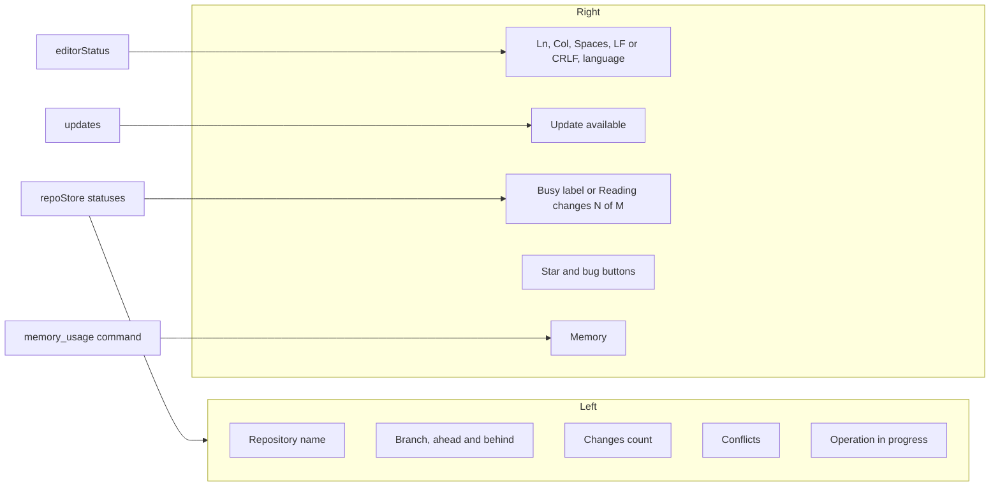
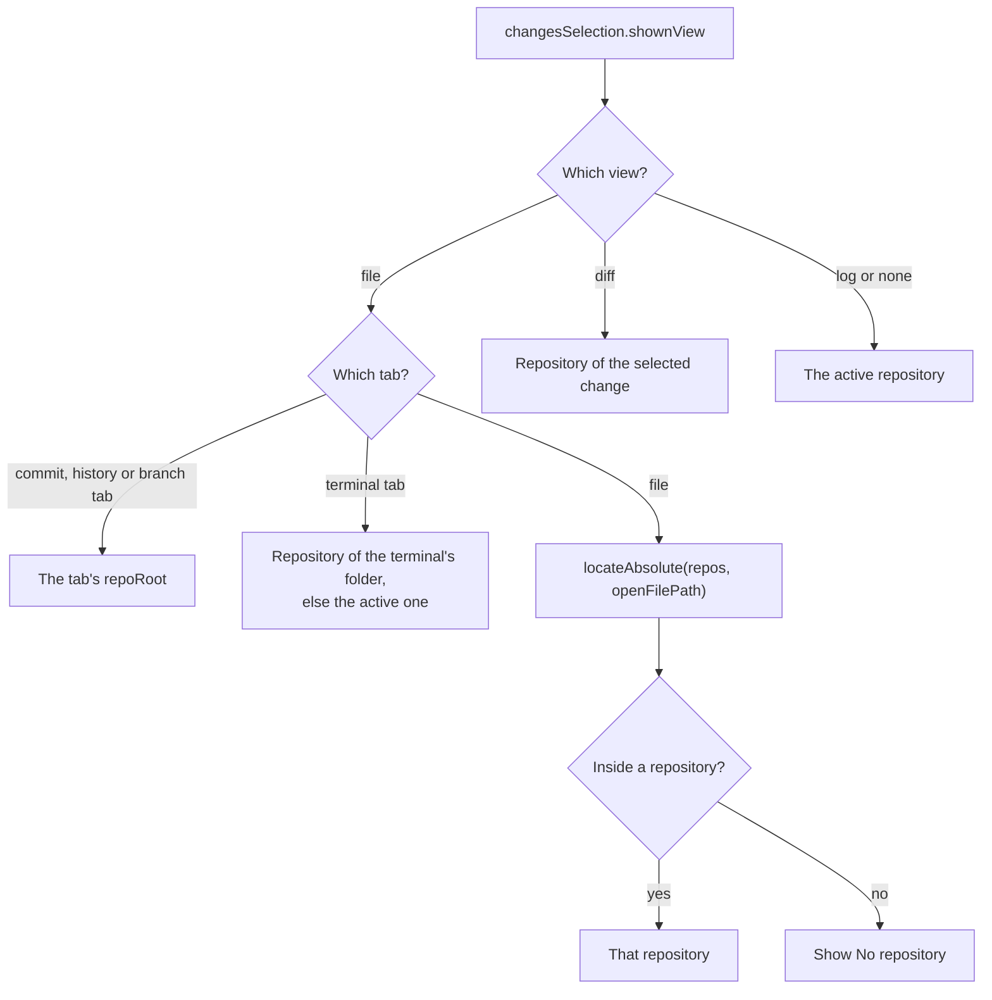
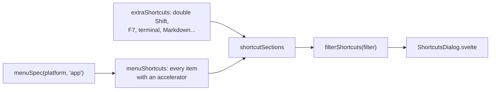

# How the status bar works

The status bar runs along the bottom of the window: on the left the repository of whatever is on screen, on the right the open file's cursor and format, update news, the running operation, help links and memory use. This page also covers the in-app Help > Keyboard Shortcuts window. For the user side, see [Status Bar and Help](../usage/Status-Bar-and-Help.md).

## Why we need it

In a workspace with many repositories, it is easy to lose track of which repository and branch a file belongs to. VS Code's status bar follows the active editor, and people expect the same.

Memory is a feature of this app (see [Architecture](Architecture.md)), so we show it honestly, counted the way Activity Monitor counts it. And when something goes wrong, reporting it should take one click, with the version already filled in.

## How it works

Everything is in `StatusBar.svelte`, which reads existing stores and one Tauri command.

### Following the screen

`contextRepo` decides which repository the left side describes:

Branch, ahead and behind, the changes count, conflicts and the operation come from `repoStore.statuses[contextRepo.root]`, with no extra git call. Clicking the repository or branch makes that repository active and opens Branches. Clicking changes opens the Changes panel, and clicking conflicts opens that repository's Conflicts dialog. Spaces opens Settings on the Editor section (`settings.openDialog("editor")`). Tabs that are not files (commit, history, branch and terminal tabs) are recognized with `parseCommitTabPath`, `parseGitTabPath`, `parseBranchTabPath` and `parseTerminalTabPath`, and `isPseudoTab` keeps them from showing "No repository".

While nothing else is busy, `repoStore.loadingChanges` shows "Reading changes 2 of 5" with a spinner (text from `loadingChangesText` in `stores/openingProgress.ts`), right after a folder opens. See [How workspaces work](How-Workspaces-Work.md).

The file details come from `editorStatus` (`stores/editorStatus.svelte.ts`). The visible `FileView` calls `editorStatus.report(info)` with line, column, selection, line endings, tab size and language (from `languageName` in `editor/setup.ts`). `report` ignores unchanged info, so the bar does not re-render, and the bar shows it only when its `filePath` matches the open tab.

### Memory

The memory item calls `memory_usage` every 5 seconds while the window is visible and shows the total, as Activity Monitor counts it, with a breakdown popover. How the number is measured, the debug memory log and the live recorder are in [How memory is measured](How-Memory-Is-Measured.md).

### Help links

The star button calls `updates.openRepository()`. The bug button opens a small menu with **Report a Bug** and **Request a Feature**. `bugReportUrl(version, platform)` in `update/releases.ts` builds a GitHub new-issue link for the `bug_report.yml` form with `version` and `platform` filled in. `updates.reportBug()` asks the backend with `api.osInfo()` (`os_info`: `sw_vers -productVersion` on macOS, `/etc/os-release` on Linux, "Windows" on Windows) and `osLabel` makes "macOS 15.4.1". WebKit freezes the macOS version in the user agent at 10.15.7, so `platformName(navigator.userAgent)` is only a fallback and gives just the family name, such as "macOS". The field ids in `.github/ISSUE_TEMPLATE/bug_report.yml` must match those parameter names. The same links are in Settings, About.

### The Keyboard Shortcuts window

Help > Keyboard Shortcuts sets `helpDialogs.shortcutsOpen`, and `App.svelte` loads `ShortcutsDialog.svelte` only then. Its rows come from `shortcutSections` in `help/shortcuts.ts`:

Menu rows are read from the menu bar's own data, so they cannot drift from the real keys. `formatKeys` writes an accelerator the platform's way ("⇧⌘E" on macOS, "Ctrl+Shift+E" elsewhere). Shortcuts no menu shows are listed by hand in `extraShortcuts`, and nothing checks them against the handlers. Two rows are off today: Bold (Cmd+B) says "In the Markdown editor and Preview" but works only in Preview Only, and Ctrl+PageDown and Ctrl+PageUp are listed on macOS, where nothing handles them. **Open Online Version** opens `SHORTCUTS_URL`, the wiki's [Keyboard Shortcuts](../usage/Keyboard-Shortcuts.md) page.

## Where the code lives

| File | What it does |
| --- | --- |
| `src/lib/views/StatusBar.svelte` | The bar: context repository, file details, update item, links, memory popover |
| `src/lib/stores/editorStatus.svelte.ts` | Cursor and file details of the visible editor |
| `src/lib/views/files/FileView.svelte` | Reports cursor details while it is the visible tab |
| `src/lib/editor/setup.ts` | `languageName` |
| `src/lib/stores/workspacePaths.ts` | `locateAbsolute` |
| `src/lib/stores/openingProgress.ts` | `loadingChangesText` |
| `src/lib/help/shortcuts.ts`, `ShortcutsDialog.svelte`, `helpDialogs.svelte.ts` | The Keyboard Shortcuts window |
| `src-tauri/src/commands/config.rs` | `memory_usage`, and `os_info`: the OS name and version |
| `src/lib/update/releases.ts` | `bugReportUrl`, `featureRequestUrl`, `osLabel`, `platformName` |
| `.github/ISSUE_TEMPLATE/bug_report.yml` | The bug form whose fields are pre-filled |

## Design decisions

**Build the shortcuts list from the menu.** A hand-written list goes stale; the menu's data is the truth.

**Reuse statuses, do not query.** The status of every repository is already in memory, so following the screen is only a `$derived`.

**Pre-fill, do not collect.** The bug link carries the version and OS in the URL, and the user sees and sends the form themselves. The app gathers no other data.

## Bugs we fixed

**The bar ignored the file on screen.**
- **The issue:** the status bar always showed the active repository, even while you read a file from another one.
- **Why it happened:** it read `repoStore.repo` directly.
- **The fix and why we chose it:** `contextRepo` follows the visible file tab or diff, like VS Code, and falls back to the active repository.

**Spaces opened the wrong Settings section.**
- **The issue:** the Spaces item says the tab size is in Settings, Editor, but clicking it opened Settings on Appearance.
- **Why it happened:** the Settings dialog always started on Appearance, and callers could only open it, not pick a section.
- **The fix and why we chose it:** `settings.openDialog(section)` records the section to show, and the dialog starts there. Spaces opens the Editor section, and every other way in still opens Appearance. One small entry point keeps all callers consistent.

**Bug reports named the wrong macOS version.**
- **The issue:** Report a Bug always filled in "macOS 10.15.7", whatever macOS you ran.
- **Why it happened:** the platform came from the web view's user agent, and WebKit freezes the macOS version there at 10.15.7.
- **The fix and why we chose it:** a small backend command, `os_info`, asks the system itself (`sw_vers` on macOS, `/etc/os-release` on Linux, just "Windows" on Windows). If it fails, the link falls back to the family name from the user agent, without the frozen version. A wrong version is worse than none.

## Tests

- `src/lib/help/shortcuts.test.ts`: macOS and other key spelling, every menu accelerator listed, the extra shortcuts and the filter.
- `src/lib/stores/openingProgress.test.ts`: the Reading changes text.
- `src/lib/editor/languageName.test.ts`: language names for common files, `Dockerfile` and unknown extensions.
- `src/lib/update/releases.test.ts`: the pre-filled bug link, `osLabel` and the user agent fallback.
- `src-tauri/src/commands/config.rs`: `reads_the_macos_product_version`, `reads_the_linux_distribution`.

`contextRepo` has no unit test; if it grows, move it into a pure function next to the component and test it.

## Keeping this page in sync

- Update this page when `StatusBar.svelte`, the shortcuts window or the issue link helpers change.
- Update [Status Bar and Help](../usage/Status-Bar-and-Help.md) for new items or clicks.
- Retake `status-bar.png`, `help-menu.png`, `settings-about.png` and `memory-log-settings.png` when they change (the shortcuts window shot, `menus-shortcuts-window.png`, belongs to [Menus](../usage/Menus.md)).
- A shortcut no menu shows goes in `extraShortcuts`, and on [Keyboard Shortcuts](../usage/Keyboard-Shortcuts.md).
- Related: [How Updates Work](How-Updates-Work.md), [How Workspaces Work](How-Workspaces-Work.md).
