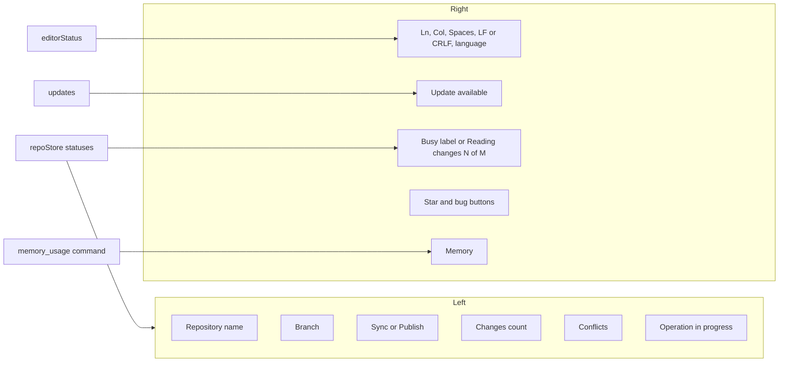
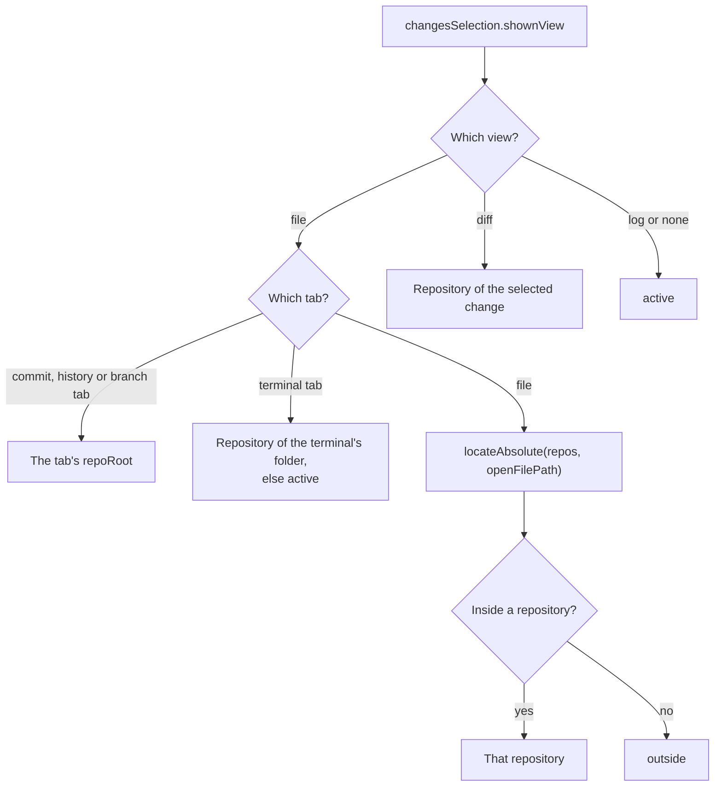
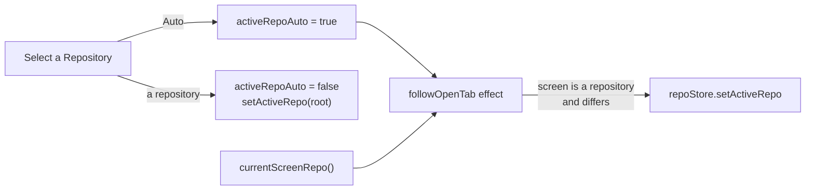
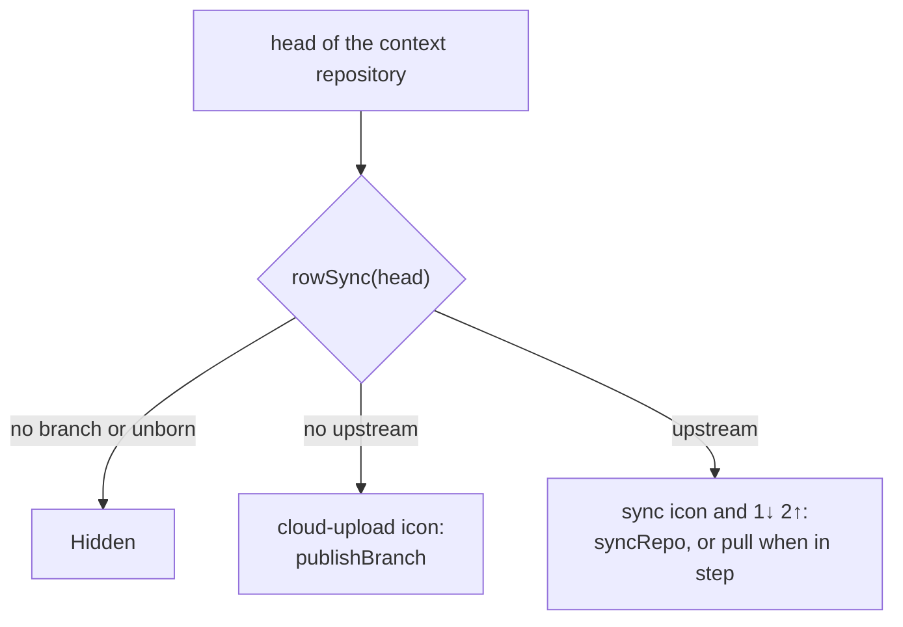

# How the status bar works

The status bar runs along the bottom of the window: on the left the active repository (which, with Auto, follows the open tab), on the right the open file's cursor and format, update news, the running operation, help links and memory use. The Help > Keyboard Shortcuts window is in [Menu Keys and Routing](Menu-Keys-and-Routing.md). For the user side, see [Status Bar and Help](../usage/Status-Bar-and-Help.md).

## Why we need it

In a workspace with many repositories, it is easy to lose track of which repository and branch a file belongs to, and which one the sidebars act on. VS Code's status bar has a repository picker with an **Auto** entry that makes the active repository follow the active editor, and people expect the same.

Memory is a feature of this app (see [Architecture](Architecture.md)), so we show it honestly, counted the way Activity Monitor counts it. And when something goes wrong, reporting it should take one click, with the version already filled in.

## How it works

Everything is in `StatusBar.svelte`, which reads existing stores and one Tauri command.

### Following the screen

`screenRepo` in `views/repoSelection.ts` (pure, tested) decides which repository the screen shows. It returns a repository, `outside` (a file tab in no repository) or `active` (nothing ties the screen to one):

### The repository picker and Auto

Clicking the repository name calls `openRepoPicker()` in `views/repoSelection.svelte.ts`. It opens `dialogs.pick` with `repoPickItems`: **Auto** first, then every repository under "Repositories" with its branch and folder. The choice is `activeRepoAuto` in `state.json` (true by default), saved by `settings.setActiveRepoAuto`.

`followOpenTab()` runs one `$effect`, set up by `Workspace.svelte`. While Auto is on and the screen shows a repository, it makes that repository active. It does not track the active repository itself, so picking one another way (the header menu, Set as Active Repository) holds until the tab changes. It waits while the merge tool or the Conflicts dialog is open, since `setActiveRepo` would close them.

The left side reads the same answer: with Auto it describes the screen's repository (or says **No repository** for `outside`), without Auto it always describes `repoStore.repo`. Branch, ahead and behind, the changes count, conflicts and the operation come from `repoStore.statuses[contextRepo.root]`, with no extra git call. Clicking the branch opens the Branches popup for that repository. The branch name is capped at 200 px with an ellipsis, and its button may shrink, so a long name never pushes the other items out of the bar. Clicking changes opens the Changes panel, and clicking conflicts opens that repository's Conflicts dialog. Spaces opens Settings on the Editor section (`settings.openDialog("editor")`).

### Sync

After the branch comes VS Code's Synchronize Changes item. It is the same button as the Sync button of a repository row in Changes, so both use `rowSync`, `rowSyncBadge` and `rowSyncTooltip` from `views/changes/sync.ts` and run `syncFromRow` from `views/changes/repoActions.ts`:

The icon spins while the click runs. The button is disabled while another operation is busy or a merge, rebase, cherry-pick or revert is in progress.

While nothing else is busy, `repoStore.loadingChanges` shows "Reading changes 2 of 5" with a spinner (text from `loadingChangesText` in `stores/openingProgress.ts`), right after a folder opens. See [How workspaces work](How-Workspaces-Work.md).

The file details come from `editorStatus` (`stores/editorStatus.svelte.ts`). The visible `FileView` calls `editorStatus.report(info)` with line, column, selection, line endings, tab size and language (from `languageName` in `editor/setup.ts`). `report` ignores unchanged info, so the bar does not re-render, and the bar shows it only when its `filePath` matches the open tab.

### Memory

The memory item calls `memory_usage` every 5 seconds while the window is visible and shows the total, as Activity Monitor counts it, with a breakdown popover. How the number is measured, the debug memory log and the live recorder are in [How memory is measured](How-Memory-Is-Measured.md).

### Help links

The star button calls `updates.openRepository()`. The bug button opens a small menu with **Report a Bug** and **Request a Feature**. `bugReportUrl(version, platform)` in `update/releases.ts` builds a GitHub new-issue link for the `bug_report.yml` form with `version` and `platform` filled in. `updates.reportBug()` asks the backend with `api.osInfo()` (`os_info`: `sw_vers -productVersion` on macOS, `/etc/os-release` on Linux, "Windows" on Windows) and `osLabel` makes "macOS 15.4.1". WebKit freezes the macOS version in the user agent at 10.15.7, so `platformName(navigator.userAgent)` is only a fallback and gives just the family name, such as "macOS". The field ids in `.github/ISSUE_TEMPLATE/bug_report.yml` must match those parameter names. The same links are in Settings, About.

## Where the code lives

| File | What it does |
| --- | --- |
| `src/lib/views/StatusBar.svelte` | The bar: context repository, file details, update item, links, memory popover |
| `src/lib/views/changes/sync.ts` | `rowSync`, the badge and tooltip of the Sync item (shared with Changes) |
| `src/lib/views/repoSelection.ts` | `screenRepo` and `repoPickItems` (pure) |
| `src/lib/views/repoSelection.svelte.ts` | `currentScreenRepo`, the Auto effect `followOpenTab` and `openRepoPicker` |
| `src/lib/stores/editorStatus.svelte.ts` | Cursor and file details of the visible editor |
| `src/lib/views/files/FileView.svelte` | Reports cursor details while it is the visible tab |
| `src/lib/editor/setup.ts` | `languageName` |
| `src/lib/stores/workspacePaths.ts` | `locateAbsolute` |
| `src/lib/stores/openingProgress.ts` | `loadingChangesText` |
| `src-tauri/src/commands/config.rs` | `memory_usage`, and `os_info`: the OS name and version |
| `src/lib/update/releases.ts` | `bugReportUrl`, `featureRequestUrl`, `osLabel`, `platformName` |
| `.github/ISSUE_TEMPLATE/bug_report.yml` | The bug form whose fields are pre-filled |

## Design decisions

**Reuse statuses, do not query.** The status of every repository is already in memory, so following the screen is only a `$derived`.

**Auto by default, like VS Code.** Most people expect the sidebars to act on the file they are looking at. Pinning one repository stays one click away, and the choice is remembered in `state.json` because it is a habit, not a preference to edit by hand.

**Pre-fill, do not collect.** The bug link carries the version and OS in the URL, and the user sees and sends the form themselves. The app gathers no other data.

## Bugs we fixed

The status bar and Help bugs and their fixes are in [Status Bar Bugs We Fixed](Status-Bar-Bugs-We-Fixed.md).

## Tests

- `src/lib/views/changes/sync.test.ts`: the Sync item's kind, badge and tooltip.
- `src/lib/views/repoSelection.test.ts`: the screen's repository for file, commit, terminal and diff tabs, outside and active, and the picker items with Auto and the selected mark.
- `src/lib/stores/settingsData.test.ts`: `activeRepoAuto` is validated and defaults to true.
- `src/lib/stores/openingProgress.test.ts`: the Reading changes text.
- `src/lib/editor/languageName.test.ts`: language names for common files, `Dockerfile` and unknown extensions.
- `src/lib/update/releases.test.ts`: the pre-filled bug link, `osLabel` and the user agent fallback.
- `src-tauri/src/commands/config.rs`: `reads_the_macos_product_version`, `reads_the_linux_distribution`.

## Keeping this page in sync

- Update this page when `StatusBar.svelte`, `repoSelection.ts` or the issue link helpers change.
- Update [Status Bar and Help](../usage/Status-Bar-and-Help.md) for new items or clicks.
- Retake `status-bar.png`, `help-menu.png` and `settings-about.png` when they change (the shortcuts window shot, `menus-shortcuts-window.png`, belongs to [Menus](../usage/Menus.md)).
- Record bug fixes in [Status Bar Bugs We Fixed](Status-Bar-Bugs-We-Fixed.md).
- Related: [How Updates Work](How-Updates-Work.md), [How Workspaces Work](How-Workspaces-Work.md), [How Memory Is Measured](How-Memory-Is-Measured.md).
