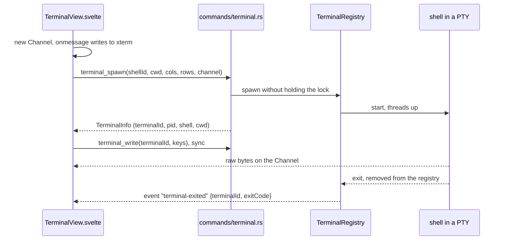
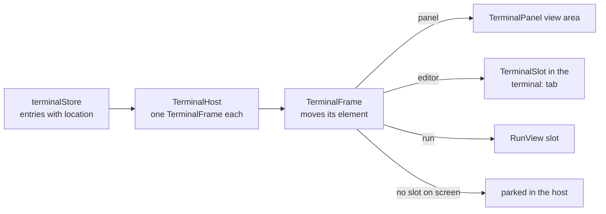

# How the terminal works

The integrated terminal runs real shells in pseudo terminals (PTYs: the kernel device that makes a program think it talks to a terminal window) and draws them with xterm.js, like VS Code. The user side is in [Terminal](../usage/Terminal.md).

## Why we need it

People run git commands, dev servers and tests next to their code, and VS Code and JetBrains users expect a terminal in the window. Prompts, colors, `vim` and Ctrl+C need a real PTY, not a simple output view.

## How it works

### Backend: one PTY and three threads per terminal

`src-tauri/src/terminal.rs` starts the shell with `portable-pty`. Each terminal gets three threads:

- **writer**: writes keystrokes from an unbounded queue in order, so a full PTY buffer never blocks the caller;
- **reader**: reads output in 16 KB chunks;
- **waiter**: waits for the shell, then up to 500 ms for the last output (a `nohup x &` job can keep the PTY open), then reports the exit once.

`TerminalRegistry` (in `AppState`) maps terminal ids to `PtyProcess` values; a terminal leaves it when its shell exits.

The commands are `terminal_shells`, `terminal_spawn`, `terminal_write`, `terminal_resize`, `terminal_close` and `terminal_close_all` (arguments in [Commands and Events](Commands-and-Events.md)). Small and big output chunks take different routes, so the last chunk can arrive after `terminal-exited`; the store waits 250 ms before it closes a terminal that exited with code 0. `exitCode` is null when the shell was killed.

**Shells.** `shell_profiles` reads `/etc/shells`, keeps executable files, removes duplicates by real path and puts the login shell (`$SHELL`, else the passwd entry, for apps opened from Finder) first. zsh, bash and fish start with `-l`, so `PATH` matches Terminal.app. Windows shells are in [Platforms and Signing](Platforms-and-Signing.md).

**Environment.** The app's environment plus `TERM=xterm-256color`, `COLORTERM=truecolor`, `TERM_PROGRAM=GitManager`, `TERM_PROGRAM_VERSION` (the app version), and `LANG=en_US.UTF-8` when `LANG` is empty (apps opened from Finder have none).

**Killing.** SIGHUP to the shell's process group and the foreground job's group, then SIGKILL after 2 s. At app exit, `shutdown` hangs up every shell, waits up to 300 ms and kills the rest.

### Frontend: a store, a host and moving frames

`terminalStore.svelte.ts` keeps the `TerminalEntry` list (backend id, name, shell, folder, exit state and `location`: `"panel"`, `"editor"` or `"run"`) and the panel state, never xterm objects.

`TerminalHost.svelte` mounts every terminal's `TerminalView` once, for its whole life. Its `TerminalFrame` moves the element with `appendChild` into the place that shows it, so moving a terminal never restarts the shell or loses the scrollback.

`TerminalView` loads xterm with `import()` (its own chunk, see `xterm.ts`), shows "Loading terminal..." then "Starting zsh...", sets the Channel's `onmessage` before calling `terminalSpawn`, and buffers typing until the shell is ready. A `ResizeObserver` refits the grid and calls `terminalResize` only when the size in cells changes.

**Editor tabs.** A terminal tab uses the pseudo path `terminal:<key>` (`terminalTabs.ts`), like commit tabs ([How commit tabs work](How-Commit-Tabs-Work.md)). `isPseudoTab` in `stores/pseudoTabs.ts` keeps it out of file lookups and the Back and Forward history. `repoStore.onTabsClosed` tells the store when tabs close, so closing a terminal tab kills its shell. `panelAfterLeave` picks the terminal the panel shows next and hides the panel with its last one.

**Keys.** `terminalKeyAction` in `keys.ts` sends each key to the shell, the app, or the view's own copy, paste, clear and select all. Ctrl+` and Ctrl+Shift+` always reach the app (`event.code === "Backquote"`). App keys return false without `preventDefault`, so `workspaceShortcuts.ts` runs them.

**The list.** With several terminals, `TerminalPanel.svelte` shows a list beside the view, as wide as `terminalListWidth` in `state.json` (default 180 px, at least 120). `maxListWidth` in `terminals.ts` caps it so the terminal keeps `MIN_TERMINAL_VIEW_WIDTH` (240 px) in a narrow panel; the saved width stays as dragged.

**Settings.** `terminalDisplayOptions` in `options.ts` maps preferences to xterm options and `applyChangedOptions` writes only the changed ones, because each write redraws. `buildTerminalFontFamily` in `fonts.ts` adds the Nerd Font fallbacks, and `theme.ts` reads the `--term-*` tokens again on a theme change. Every key is in [How Settings Work](How-Settings-Work.md).

## Where the code lives

| File | What it does |
| --- | --- |
| `src-tauri/src/terminal.rs` | Shells, `spawn_pty`, `PtyProcess`, `TerminalRegistry` |
| `src-tauri/src/commands/terminal.rs` | The `terminal_*` commands and the exit event |
| `src/lib/terminal/terminalStore.svelte.ts` | Entries, panel state, moves, exits |
| `src/lib/terminal/TerminalView.svelte` | xterm, spawn, input, resize, menus |
| `src/lib/terminal/TerminalHost.svelte`, `TerminalFrame.svelte`, `TerminalSlot.svelte`, `TerminalPanel.svelte` | Placing the views, the panel |
| `src/lib/terminal/terminals.ts`, `terminalTabs.ts`, `keys.ts`, `options.ts`, `fonts.ts`, `theme.ts` | Pure helpers |

## Design decisions

**Kill Terminal does not ask.** CLAUDE.md asks us to confirm destructive actions, but the app cannot tell whether anything runs in a shell, so the question would come every time and teach people to click through it. The user chose VS Code's behavior on 2026-10-01. Closing a Run tab with a running script does ask, because there we know a process runs.

**Hiding keeps shells running**, so a dev server survives a hidden panel.

**`terminal_write` and `terminal_resize` are sync.** Async commands may run out of order and scramble keystrokes. Both only queue bytes or resize, so they are cheap.

**Raw bytes, not strings.** xterm joins a UTF-8 character split between two chunks; decoding each chunk ourselves would break it.

**A clean exit closes, an error stays**, with "[Process exited with code N]", like VS Code.

## Tests

- `src-tauri/src/terminal.rs`: shell detection, start folder, environment, real processes (output, exit code, input, resize), killing, registry cleanup and shutdown.
- `src/lib/terminal/terminals.test.ts`, `terminalTabs.test.ts`, `keys.test.ts`, `options.test.ts`, `fonts.test.ts`, `theme.test.ts`, `src/lib/views/files/reveal.test.ts` and `src/lib/views/workspaceShortcuts.test.ts`.

Typing, colors and Cmd+V need a manual check.

## Keeping this page in sync

- Update this page and [Commands and Events](Commands-and-Events.md) when a command, the event, the store or the placing of views changes.
- Update [Terminal](../usage/Terminal.md) for visible changes and retake `terminal-panel.png`, `terminal-shell-menu.png`, `terminal-list.png`, `terminal-editor-tab.png` and `terminal-settings.png` ([Docs and Screenshots](Docs-and-Screenshots.md)).

## Bugs we fixed

**The window froze while a terminal started.**
- **The issue:** typing in a terminal, or resizing the window, could hang while another terminal was starting.
- **Why it happened:** `TerminalRegistry::spawn` held the registry lock for the whole shell start. `terminal_write` and `terminal_resize` are sync commands on the main thread, and they waited for that lock.
- **The fix and why we chose it:** `spawn` now starts the shell without the lock and takes it only to insert the terminal. A shell that exits before it was added is noted in `exited_early` and removed right after the insert (`shells_that_exit_at_once_never_stay_in_the_registry`). Keeping slow work out of the lock was safer than making the keystroke commands async, which could reorder input.
