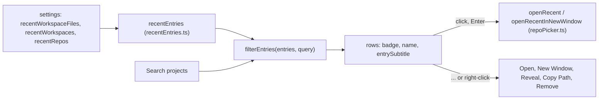

# How the welcome screen works

This chapter explains the welcome screen: its pages, the recent project list and where its data comes from. The user side is in [Welcome Screen](../usage/Welcome-Screen.md); opening a folder after a click is in [How workspaces work](How-Workspaces-Work.md).

## Why we need it

The first welcome screen was a small card with an Open Folder button, a row of links and two plain lists of recent workspaces and folders. People who come from JetBrains IDEs know a richer screen: a sidebar with Projects, Customize and Learn, a search over recent projects, and a colored badge per project that is quicker to spot than a path. The user asked for that layout.

## How it works

`App.svelte` shows `Welcome.svelte` whenever no workspace is open. The component has three pages, picked in its sidebar and kept in a local `section` state (they are not saved: the screen always opens on Projects).

### Projects

The list is the same one the header's folder menu and File > Open Recent use: `recentEntries` in `recentEntries.ts` merges workspace files, multi-folder workspaces and single folders into `RecentEntry` values. Nothing is open on this screen, so it passes `null` for the open workspace and every entry is listed.

The sizes follow the JetBrains screen: a 240 px sidebar with 36 px items, 32 px search field and buttons, and 56 px project rows with 36 px badges. Text sizes are relative to `--ui-size`, so Interface font size still scales the screen.

The pure helpers live in `welcomeModel.ts`:

- `projectInitials(name)` takes the first letters of the first two words (split at spaces, dashes, underscores, dots and camelCase), or two letters of a single word.
- `badgeColor(key)` hashes the entry's path to one of five colors, so a project keeps its color from run to run.
- `entrySubtitle` writes the paths with the home folder as `~` (`shortPath`).
- `filterEntries` keeps entries where every word of the query appears in the name or a path.
- `moveSelection` moves the picked row with Up, Down, Home and End.

The search field keeps the keyboard focus. Its key handler moves the selection (Home and End only while the query is empty, so they still move the text cursor), opens on Enter (Cmd+Enter for a new window), clears on Esc and removes on Delete. Hovering a row picks it too, so the keyboard and the mouse share one selection.

The badges are solid like JetBrains' ones: a gradient from the theme's bright to its normal terminal color (`--term-bright-blue` to `--term-blue` and so on), darkened a little towards `--term-black`, with `--accent-text` letters. Every color theme defines those tokens, so the badges match the theme. Yellow is left out, since white letters do not read on it.

With no recent projects (and no state.json error to report), Projects shows a centered greeting with three large buttons instead of an empty list.

### Customize and Learn

Customize calls the same settings methods as the Settings window (`setTheme`, `setColorTheme`, `setPreference`) and reuses `ColorThemePicker.svelte` for the mode in use, so both places always agree. Learn calls what the Help menu calls: `updates.open(WIKI_URL)`, `helpDialogs.openShortcuts()` and `updates.whatsNewOpen`. Those dialogs are mounted in `App.svelte`, so they also open from this screen. Star on GitHub, Report a Bug and Request a Feature sit at the foot of the sidebar on every page and call `openRepository`, `reportBug` and `requestFeature` in `updates.svelte.ts`; `reportBug` fills in the version and system ([Contributing](Contributing.md)).

## Where the code lives

| File | What it does |
| --- | --- |
| `src/lib/views/Welcome.svelte` | The sidebar, the three pages, the project rows and their menu |
| `src/lib/views/welcomeModel.ts` | Initials, badge colors, subtitles, search and keyboard selection |
| `src/lib/views/recentEntries.ts` | The recent list shared with the folder menu and Open Recent |
| `src/lib/views/repoPicker.ts` | Opening a pick or a recent entry, in this window or a new one |
| `src/lib/views/settings/ColorThemePicker.svelte` | The color theme list, shared with Settings |
| `src/lib/ui/icons.ts` | The `book` and `keyboard` icons of Learn |

## Design decisions

**One list, not two.** JetBrains shows one list of recent projects. Workspaces and folders are both "a project" to the user, and one list makes search and the arrow keys simple.

**Theme colors, not fixed ones.** Fixed badge colors would clash with some of the many color themes. The terminal palette is defined by every theme and already chosen to work on its background.

**Search keeps the focus.** As in JetBrains, you can type a name and press Enter without touching the mouse.

**Customize is a short list.** It holds what people change before their first folder. Everything else stays in Settings, one click away through All settings.

## Bugs we fixed

**The welcome screen did not fit a short window.**
- **The issue:** in a short window the old card was cut off at the top and bottom.
- **Why it happened:** `align-items: center` on a `100vh` screen with `overflow: hidden` pushes a taller card past both edges.
- **The fix and why we chose it:** the card centered with `margin: auto` and let its lists scroll. The JetBrains layout keeps the idea: the screen is the window's height, and only the project list and the Customize and Learn pages scroll.

## Tests

- `src/lib/views/welcomeModel.test.ts`: initials, stable badge colors, keys, paths and subtitles, search and the arrow keys.
- `src/lib/views/recentEntries.test.ts`: the order of the recent list.

The look of the pages and the badges in each theme need a visual check in the app.

## Keeping this page in sync

- Update this page and [Welcome Screen](../usage/Welcome-Screen.md) when a page, a button or a key changes.
- Retake `welcome.png`. See [Docs and Screenshots](Docs-and-Screenshots.md).
