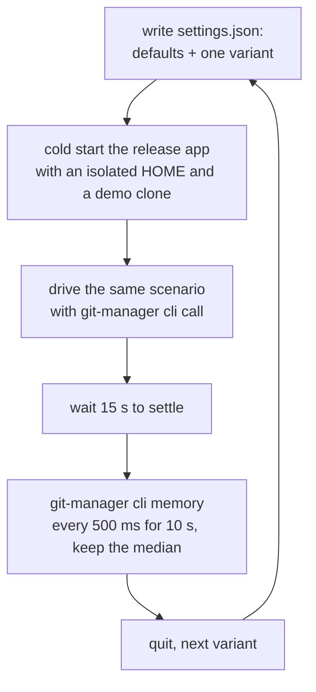

# Measuring Setting Memory

Some settings make Git Manager use clearly more memory when they are on. Settings shows a small mark beside each of them, such as **+70 MB**, and its tooltip says when the memory is used. This page explains where those numbers come from and how to measure them again. The user side is in [Memory Use](../usage/Memory-Use.md#settings-that-use-more-memory).

## Why we need it

Memory is a feature of Git Manager (see [Architecture](Architecture.md)), but most settings cost almost nothing. A user who wants to save memory should know which few switches matter and roughly how much, without guessing. Hints written from a guess were wrong before: GPU acceleration said "a few MB per terminal" while it costs about 70 MB.

## How a number is measured

Each setting is measured as an A/B pair on the release app, with nothing else changed.

- **Cold start every run.** Settings are written before launch, so every run starts from the same state. `HOME` points at a scratch folder, so the user's `~/.gitmanager` is never touched.
- **The same scenario.** The main scenario opens `SettingsDialog.svelte` at line 1500, scrolls the editor with `scroll_view`, opens a terminal with `new_terminal` and prints `seq 1 120000` in it. Markdown runs open a Markdown file instead, and terminal runs open one or three terminals.
- **Round robin, three rounds.** Variants take turns, so a slow drift over time hits all of them alike. The result is the median of three runs, compared with the baseline of the same scenario.
- **Two numbers.** The script records the total and the **Web content** process. The Graphics process swings by 100 MB or more between runs on the built-in display, so a difference counts only when the total and Web content agree, or when it repeats in every round.
- **The window stays in front.** WebKit pauses a hidden or locked window, so the script brings the app forward before every call and waits while the screen is locked.

## Results

Measured on 2026-10-03 on the built-in 3024 x 1964 display, release build, median of three rounds:

| Setting | Total | Web content | Why |
| --- | --- | --- | --- |
| GPU acceleration, 1 terminal | +71 MB | +21 MB | A WebGL context and its glyph textures, mostly in the Graphics process |
| GPU acceleration, 3 terminals | +92 MB | +41 MB | About 10 MB for each extra terminal |
| Scrollback 50,000 / 100,000 (full) | +91 / +175 MB | +90 / +177 MB | About 2 KB per line: xterm keeps 12 bytes per cell, about 180 columns wide |
| Scrollback 1,000 (full) | -17 MB | -17 MB | Compared with the default 5,000 |
| Blame gutter | +35 MB | +39 MB | A 236 pixel column drawn beside every line on screen |
| Syntax highlighting, 3,000 line Svelte file | +38 MB | +40 MB | The grammars, syntax trees and colored text spans |
| The same, 43,700 line TypeScript file | +36 MB | +35 MB | Hardly more for a much longer file |
| The same, 10 tabs (Svelte, TypeScript, Rust) | +38 MB | +33 MB | 3,017 instead of 8,517 page elements |
| Render whitespace: All | +9 MB | +9 MB | A mark for every space and tab |
| 10 file tabs instead of 1 | +40 MB | +39 MB | Every tab keeps its editor mounted |
| Markdown Editor and preview instead of Editor only, plain file | +34 MB | +32 MB | The rendered page beside the code (`CHANGELOG.md`) |
| The same with four mermaid diagrams | +137 MB | +131 MB | The mermaid library and the drawn diagrams (`Architecture.md`) |

Recent Files was measured on 2026-10-04 the same way, with its own scenario: open the same 30 files with a tab limit of 1, then sample. Keeping the list cost +1 MB of Web content (total -0.1 MB). With the popup open on top it was +20 MB total and +17 MB Web content, and after closing it nothing was left (it measured lower than with the popup never opened).

Syntax highlighting was measured on 2026-10-04 with three scenarios, each with a tab limit of none: `SettingsDialog.svelte` scrolled through, a 43,700 line TypeScript file (every `.ts` file of `src/lib` joined) scrolled through, and 10 source files opened as tabs. The cost hardly grows with the file, so most of it is the grammar code and parser, not one tree per file. All runs were cold starts, so the number is what a restart saves.

The file icon numbers come from their own test with 2,400 changed files (see [How File Icons Work](How-File-Icons-Work.md)).

Everything else stayed within about 10 MB in both directions, which is the noise: the editor features, the minimap, word wrap, current line blame, Git Console, terminal find, file links, Unicode 11 widths, icons from patched fonts and editor font ligatures. Terminal font ligatures use about 80 MB **less**, because they turn GPU drawing off.

## Where the code lives

| File | What it does |
| --- | --- |
| `src/lib/views/settings/memoryCost.ts` | `MEMORY_COSTS`: the amount and the tooltip sentence of each setting |
| `src/lib/views/settings/MemoryFlag.svelte` | The mark beside a setting's name; nothing is drawn for a setting without a cost |
| `src/lib/views/SettingsDialog.svelte` | Puts `<MemoryFlag setting="..." />` in the label of each measured row |

## Design decisions

**Only measured costs get a mark.** A mark on every setting would be noise, and a guessed number is worse than none. A setting gets an entry only when the difference was clearly larger than the noise in every round.

**A quiet mark for a switch that saves little.** A feature with its own on/off switch, such as Recent Files, gets a `minor` entry even when its cost is within the noise. The switch exists for memory too, so it should say honestly that it saves almost nothing. The mark is gray instead of orange, and its tooltip starts with "Memory" instead of "Uses more memory".

**Amounts are rough on purpose.** The cost depends on the display size, the file and the terminal width, so the mark shows one rounded number, and the tooltip says what it grows with.

**The numbers live in one table.** The hints in Settings and the usage pages repeat the same numbers, so changing `memoryCost.ts` is a reminder to update them.

## Tests

`src/lib/views/settings/memoryCost.test.ts` checks that every entry names a real setting, that each amount is short and in MB, that each tooltip is a full sentence without an em-dash, and how the tooltip is built.

## Keeping this page in sync

- Measure again after a change that can move memory: a new renderer, a new addon, a CodeMirror upgrade or a new view. Update `memoryCost.ts`, this table, the hints in `SettingsDialog.svelte`, [Memory Use](../usage/Memory-Use.md) and the settings usage pages together.
- A new setting that might cost memory needs its own A/B pair before it gets a mark.
- See [How Memory Is Measured](How-Memory-Is-Measured.md) for the readout and `git-manager cli memory`.
